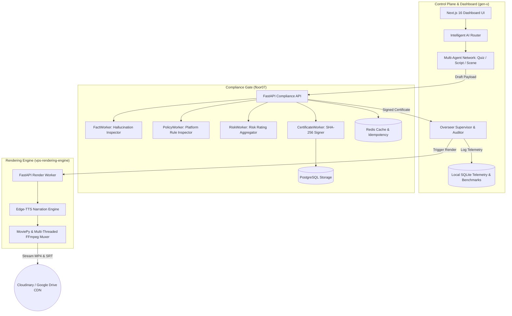

# 🏛️ Architecture & System Blueprint — FactoryOS Monorepo

Welcome to the enterprise architectural documentation for **FactoryOS (AI Operating System for Automated Content Generation)**.

FactoryOS is an enterprise-grade microservice monorepo designed for end-to-end automated content generation, compliance vetting, self-healing quality enforcement, and high-performance video rendering.

---

## 1. 🗺️ Monorepo Service Map & Architecture

FactoryOS is composed of 4 decoupled top-level microservices/modules that communicate securely over HTTPS/REST protocols:

```
aishorts/
├── 🚀 gen-v/                 # Control Plane Dashboard & Multi-Agent Orchestrator (Next.js 16 / TypeScript)
├── 🛡️ floor07/               # Quality & Compliance Gate (Python / FastAPI / PostgreSQL / Redis)
├── ⚙️ vps-rendering-engine/   # Headless Compute Worker (Python / FFmpeg / MoviePy / Edge-TTS)
├── 📚 factoryos-akb/         # Enterprise Architecture Knowledge Base & Architectural Decisions
├── 📖 docs/                  # Monorepo Documentation Hub (Architecture, Deployment, API, ADRs)
└── 🔧 scripts/               # Operational Tooling (Setup, Deployment, Migrations, Maintenance)
```

---

## 2. 🏛️ Service Boundaries & System Architecture



---

## 3. 🔄 System Lifecycles

### 3.1 Request Lifecycle (User & Scheduled Triggers)
1. **Request Ingestion**: User submits a topic via the Next.js control plane (`app/api/jobs/route.ts`) or the automated cron scheduler (`auto_scheduler.py`).
2. **Capability Binding**: The `Intelligent AIRouter` inspects configured capability providers (Gemini, Groq, OpenRouter, Ollama) and binds the optimal LLM model to the requested generation task.
3. **Agent Execution**: Domain-specific agents (`scriptAgent`, `quizGeneratorAgent`, `sceneAgent`) draft the structured script, scene timeline, and quiz questions.

### 3.2 Guardian & Quality Vetting Lifecycle
1. **Guardian Assessment**: `quizGuardianAgent` executes grounding algorithms and strict factual checks against local evidence vectors.
2. **Compliance Vetting**: Draft content is forwarded to `floor07` (FastAPI compliance gate).
3. **Multi-Worker Inspection**:
   - `FactWorker` rates hallucination risk.
   - `PolicyWorker` checks YouTube/TikTok community standards.
   - `RiskWorker` calculates weighted risk score (`LOW`, `MEDIUM`, `HIGH`, `CRITICAL`).
4. **Certificate Signing**: Approved content receives a SHA-256 cryptographic compliance certificate from `CertificateWorker` persisted in PostgreSQL.
5. **Self-Healing Fallback**: If rejected, the `LocalRepairEngine` automatically refines prompts and re-executes generation up to maximum retry thresholds.

### 3.3 Production & Overseer Lifecycle
1. **Job Registration**: Approved content payload is registered into the `ProductionStateMachine`.
2. **Overseer Supervision**: The `Overseer` supervisor validates state transitions (`PENDING` → `SCHEDULED` → `RENDERING` → `COMPLETED`), enforcing strict idempotency and process crash resilience.
3. **Outbox Guarantee**: Rendered jobs are enqueued into an outbox pattern for idempotent delivery to external storage (Google Drive / Cloudinary).

### 3.4 Rendering Lifecycle
1. **Worker Dispatch**: Render request payload is sent to `vps-rendering-engine`.
2. **TTS Synthesis**: Script dialogue is converted to high-fidelity audio via `edge-tts`.
3. **FFmpeg Compilation**: MoviePy and raw multi-threaded FFmpeg command chains overlay theme backgrounds (`assets/backgrounds/`), audio effects (`bgm.wav`, `ding.wav`), and burnt SRT subtitles.
4. **Delivery Sync**: Completed MP4 artifacts and subtitle files are uploaded directly to target CDN locations.

---

## 4. 🔒 Security & Compliance Model

- **Cryptographic Grounding**: Every published video artifact is anchored by a SHA-256 signature generated by `floor07`.
- **API Request Idempotency**: Redis key-locking ensures zero duplicate render triggers even under high concurrency or retries.
- **Local-First Privacy**: Support for local offline LLM providers (Ollama / LM Studio) guarantees confidential content generation without external network calls when needed.

---

## 5. 🛠️ Operational & Development Tooling

- **`docs/`**: Central enterprise documentation repository containing architecture blueprints, API contracts, deployment instructions, and ADRs.
- **`scripts/`**: Operational scripts for environment setup, database migrations, container deployments, and system diagnostics.
