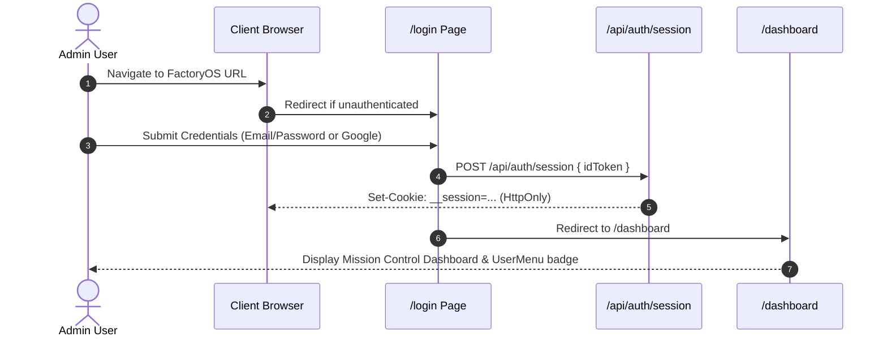
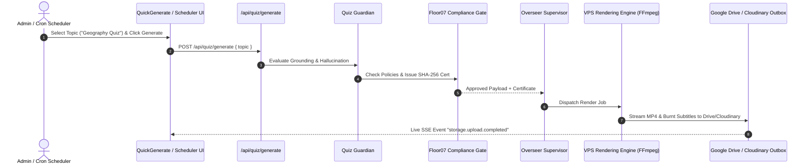

# 🔄 End-to-End User & Operational Flow — FactoryOS v1

This document maps out the operational workflows and user journeys within the FactoryOS Control Center.

---

## 1. 🔑 Admin Authentication & Session Entry Flow

---

## 2. 🎬 Video Generation & Quality Pipeline Flow

