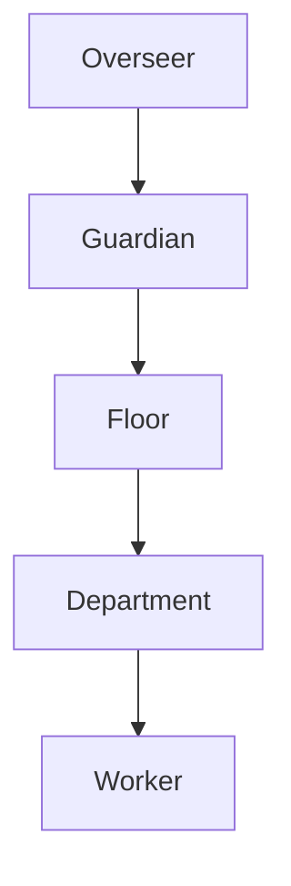

# AKB-000 — Architecture Documentation Standard (ADS)

> **Classification:** Architecture Standard
> **Status:** Draft for ARB Review
> **Review:** Architecture Review Board (ARB)
> **Version:** 0.1
> **Owner:** Chief Architect
> **Reviewers:** ARB, Principal Engineers, Platform Engineering Lead, Technical Writer
> **Approvers:** Chief Architect, CTO, ARB Chair
> **Confidentiality:** Internal
> **Lifecycle:** Living Document
> **Supersedes:** None (foundational)
> **Superseded By:** None
> **Maturity:** Reference
> **Document Type:** STANDARD

---

## Change History

| Version | Date | Author | Summary | Reviewer | Approver |
|---|---|---|---|---|---|
| 0.1 | 2026-07-18 | Chief Architect (Panel) | Initial draft; established AKB conventions, document template, identifier scheme, review workflow, fitness functions. | ARB | Pending |

---

## Table of Contents

1. Purpose
2. Scope
3. Why This Exists
4. AKB Folder Hierarchy
5. Document Types
6. Naming Conventions
7. Identifier Scheme
8. Document Template
9. Document Classification Metadata
10. Change History Convention
11. Viewpoints (ISO/IEC/IEEE 42010)
12. Quality Attribute Mapping
13. "Why This Exists" Blocks
14. Architecture Fitness Functions
15. Decision References (ADR Linking)
16. Supersedes / Superseded By
17. Architecture Maturity Levels
18. Review Metrics
19. Versioning
20. Review Workflow
21. RFC Workflow
22. Traceability Rules
23. Diagram Standards
24. Markdown Conventions
25. Review Checklist
26. Definition of Done for Architecture Documents
27. Glossary
28. References
29. Cross-References

---

## 1. Purpose

> **Viewpoint:** Executive, Platform
> **Quality Attributes Influenced:**

| Attribute | Rating | Rationale |
|---|---|---|
| Maintainability | ★★★★★ | Standardized structure makes documents navigable and editable. |
| Consistency | ★★★★★ | Uniform conventions across all AKB entries. |
| Auditability | ★★★★☆ | Change history and traceability enable audit. |
| Usability | ★★★★☆ | Predictable structure aids readers. |

> **Why This Exists:**
> | Question | Answer |
> |---|---|
> | Why does this section exist? | To state the purpose of AKB-000. |
> | What decision does it support? | The decision to govern documentation as a first-class architectural concern. |
> | Who reads it? | All AKB contributors. |

AKB-000 defines the standards by which all FactoryOS Architecture Knowledge Base (AKB) documents are created, reviewed, versioned, and maintained. It is the "constitution for the AKB itself."

---

## 2. Scope

> **Viewpoint:** Executive, Platform
> **Quality Attributes Influenced:**

| Attribute | Rating | Rationale |
|---|---|---|
| Maintainability | ★★★★★ | Bounded scope prevents documentation sprawl. |
| Consistency | ★★★★★ | Clear scope enables consistent application. |

> **Why This Exists:**
> | Question | Answer |
> |---|---|
> | Why does this section exist? | To bound what AKB-000 governs and what it does not. |
> | What decision does it support? | The decision to separate documentation governance from architectural decisions. |
> | Who reads it? | All AKB contributors. |

AKB-000 governs:
- Document types and their hierarchy within the AKB.
- Naming conventions and identifier schemes.
- Document templates, classification metadata, and change history.
- ISO/IEC/IEEE 42010 viewpoints and quality attribute mapping.
- Architecture fitness functions and enforcement.
- ADR linking, supersedes/superseded-by, and maturity levels.
- Review workflow, RFC workflow, and Definition of Done.
- Diagram and Markdown conventions.

AKB-000 does **not** govern:
- Specific architectural decisions (those are in ADRs and EA documents).
- Implementation detail (those are in SDS and TS documents).
- Operational procedures (those are in RUNBOOKS and PLAYBOOKS).

---

## 3. Why This Exists

> **Viewpoint:** Executive
> **Quality Attributes Influenced:**

| Attribute | Rating | Rationale |
|---|---|---|
| Maintainability | ★★★★★ | A stated rationale prevents future drift. |
| Usability | ★★★★☆ | Explains the document's reason for being. |

> **Why This Exists:**
> | Question | Answer |
> |---|---|
> | Why does this section exist? | To articulate the rationale for AKB-000 before the repository grows. |
> | What decision does it support? | The decision to invest in documentation governance early. |
> | Who reads it? | CTO, VP Eng, Chief Architect, ARB. |

| Question | Answer |
|---|---|
| **Why does AKB-000 exist?** | Without a documentation standard, the AKB degrades into an inconsistent collection of ad-hoc documents. AKB-000 prevents that by defining the rules before the content. |
| **What decision does it support?** | The decision to treat architecture documentation as a governed, versioned, reviewable artifact — not as folklore. |
| **Who reads it?** | Every architect, engineer, and technical writer who contributes to the AKB. |

---

## 4. AKB Folder Hierarchy

> **Viewpoint:** Platform, Developer
> **Quality Attributes Influenced:**

| Attribute | Rating | Rationale |
|---|---|---|
| Maintainability | ★★★★★ | Type-based separation scales better than flat structure. |
| Usability | ★★★★☆ | Predictable folder placement aids discovery. |
| Evolvability | ★★★★☆ | New document types can be added without restructuring. |

> **Why This Exists:**
> | Question | Answer |
> |---|---|
> | Why does this section exist? | To define the physical structure of the AKB repository. |
> | What decision does it support? | The decision to organize by document type, not by topic. |
> | Who reads it? | All AKB contributors. |

The AKB is organized by document type, not by topic. This separation scales better than a single flat directory and mirrors how large engineering organizations structure their architecture repositories.

```
FactoryOS AKB/
│
├── EA/          # Executive Architecture — foundational, cross-cutting
├── RA/          # Reference Architecture — canonical patterns, C4 models
├── SA/          # Solution Architecture — specific solutions built on RA
├── TS/          # Technical Specifications — detailed technical specs
├── ADR/         # Architecture Decision Records — individual decisions
├── RFC/         # Requests for Comments — proposals for review
├── SDS/         # Software Design Specifications — component-level design
├── OPS/         # Operations — SLOs, runbooks, playbooks
├── SEC/         # Security — threat models, security architecture
├── TST/         # Testing — test strategy, architecture tests
├── GOV/         # Governance — policies, standards, compliance
├── API/         # API specifications — contracts, OpenAPI, schemas
├── SCHEMA/      # Data schemas — data models, ontologies
├── PLAYBOOKS/   # Playbooks — incident response, operational procedures
├── RUNBOOKS/    # Runbooks — step-by-step operational guides
├── STANDARDS/   # Standards — documentation, coding, process standards
├── POLICIES/    # Policies — governance, security, operational policies
└── GLOSSARY/    # Glossary — shared terminology
```

### 4.1 Folder Placement Rules

| Document Type | Folder | Prefix | Example |
|---|---|---|---|
| Executive Architecture | `EA/` | `EA-` | `EA-001-Vision-and-Mission.md` |
| Reference Architecture | `RA/` | `RA-` | `RA-001-Provider-Abstraction.md` |
| Solution Architecture | `SA/` | `SA-` | `SA-001-ShortsFactory-Solution.md` |
| Technical Specification | `TS/` | `TS-` | `TS-001-Durable-Execution-Substrate.md` |
| Architecture Decision Record | `ADR/` | `ADR-` | `ADR-034-Durable-Engine-Selection.md` |
| Request for Comments | `RFC/` | `RFC-` | `RFC-001-Knowledge-Graph-Data-Model.md` |
| Software Design Specification | `SDS/` | `SDS-` | `SDS-001-Overseer-Design.md` |
| Operations | `OPS/` | `OPS-` | `OPS-001-SLO-Catalogue.md` |
| Security | `SEC/` | `SEC-` | `SEC-001-Threat-Model.md` |
| Testing | `TST/` | `TST-` | `TST-001-Architecture-Test-Strategy.md` |
| Governance | `GOV/` | `GOV-` | `GOV-001-ARB-Charter.md` |
| API | `API/` | `API-` | `API-001-Overseer-API.md` |
| Schema | `SCHEMA/` | `SCHEMA-` | `SCHEMA-001-Event-Bus-Schema.md` |
| Playbook | `PLAYBOOKS/` | `PB-` | `PB-001-Provider-Outage.md` |
| Runbook | `RUNBOOKS/` | `RB-` | `RB-001-Factory-Deployment.md` |
| Standard | `STANDARDS/` | `STD-` | `STD-001-Documentation-Standard.md` |
| Policy | `POLICIES/` | `POL-` | `POL-001-Governance-Policy.md` |
| Glossary | `GLOSSARY/` | `GLOSSARY-` | `GLOSSARY-001-FactoryOS-Terms.md` |

> **Note:** AKB-000 itself is filed under `STANDARDS/` as `STD-001` but is also referenced as `AKB-000` for its foundational role. Both identifiers are valid; the `AKB-000` identifier is used in cross-references to emphasize its constitutional status.

---

## 5. Document Types

> **Viewpoint:** Executive, Platform
> **Quality Attributes Influenced:**

| Attribute | Rating | Rationale |
|---|---|---|
| Maintainability | ★★★★★ | Clear type definitions prevent misfiling. |
| Consistency | ★★★★★ | Each type has a distinct purpose and review body. |

> **Why This Exists:**
> | Question | Answer |
> |---|---|
> | Why does this section exist? | To define what kinds of documents exist in the AKB. |
> | What decision does it support? | The decision to separate concerns by document type. |
> | Who reads it? | All AKB contributors. |

| Type | Purpose | Audience | Review Body |
|---|---|---|---|
| **EA** (Executive Architecture) | Foundational, cross-cutting architecture intent. | CTO, VP Eng, Chief Architect, ARB | ARB |
| **RA** (Reference Architecture) | Canonical patterns, C4 models, interface contracts. | Architects, Principal Engineers | ARB |
| **SA** (Solution Architecture) | Specific solutions built on the RA. | Architects, Engineers | ARB (for cross-cutting); Lead Architect (for local) |
| **TS** (Technical Specification) | Detailed technical specs for a component or subsystem. | Engineers, SRE | Lead Architect |
| **ADR** (Architecture Decision Record) | A single architectural decision, its rationale, status, and consequences. | All | ARB |
| **RFC** (Request for Comments) | A proposal for review before becoming an ADR or spec. | All | Open (peer review) |
| **SDS** (Software Design Specification) | Component-level design. | Engineers | Lead Engineer |
| **OPS** (Operations) | SLOs, error budgets, operational configuration. | SRE, Platform Eng | SRE Architect |
| **SEC** (Security) | Threat models, security architecture. | Security, Architects | Security Architect + ARB |
| **TST** (Testing) | Test strategy, architecture tests, fitness functions. | Engineers, SRE | Lead Engineer |
| **GOV** (Governance) | Policies, standards, compliance mappings. | ARB, Architects | ARB |
| **API** (API Specification) | Contracts, OpenAPI, gRPC schemas. | Engineers, Integrators | Lead Architect |
| **SCHEMA** (Data Schema) | Data models, ontologies, event schemas. | Engineers, Data Architects | Lead Architect |
| **PLAYBOOK** | Incident response, operational procedures. | SRE, On-call | SRE Architect |
| **RUNBOOK** | Step-by-step operational guides. | SRE, Operators | SRE Architect |
| **STANDARD** | Documentation, coding, process standards. | All | ARB |
| **POLICY** | Governance, security, operational policies. | All | ARB |
| **GLOSSARY** | Shared terminology. | All | Chief Architect |

---

## 6. Naming Conventions

> **Viewpoint:** Developer, Platform
> **Quality Attributes Influenced:**

| Attribute | Rating | Rationale |
|---|---|---|
| Maintainability | ★★★★★ | Consistent naming aids discovery. |
| Consistency | ★★★★★ | Uniform naming across the AKB. |

> **Why This Exists:**
> | Question | Answer |
> |---|---|
> | Why does this section exist? | To define how AKB files and identifiers are named. |
> | What decision does it support? | The decision to enforce a single naming convention. |
> | Who reads it? | All AKB contributors. |

### 6.1 File Naming

```
<PREFIX>-<NUMBER>-<TITLE-IN-KEBAB-CASE>.md
```

**Rules:**
- Prefix is uppercase (e.g., `EA`, `ADR`, `RFC`).
- Number is zero-padded to 3 digits (e.g., `001`, `034`).
- Title is in kebab-case (lowercase, hyphen-separated).
- File extension is `.md`.
- No spaces, no underscores in filenames.

**Examples:**
- `EA-001-Vision-and-Mission.md`
- `ADR-034-Durable-Engine-Selection.md`
- `RFC-001-Knowledge-Graph-Data-Model.md`

### 6.2 Multi-Package Documents

Large documents (e.g., EA-001) may be split into packages:

```
<PREFIX>-<NUMBER>-<TITLE>/
├── Package-A-<Scope>.md
├── Package-B-<Scope>.md
├── Package-C-<Scope>.md
├── Package-D-<Scope>.md
└── Package-E-<Scope>.md
```

**Rules:**
- The directory name matches the document name (without `.md`).
- Packages are lettered A, B, C, D, E...
- Each package file is named `Package-<LETTER>-<SCOPE>.md`.
- A README.md in the parent AKB directory indexes all documents.

### 6.3 Identifier Naming

| Identifier Class | Format | Example |
|---|---|---|
| Objectives (Strategic) | `SO-<N>` | `SO-1` |
| Objectives (Business) | `BO-<N>` | `BO-1` |
| Objectives (Engineering) | `EO-<N>` | `EO-1` |
| Objectives (Research) | `RO-<N>` | `RO-1` |
| Success Criteria | `SC-<N>` | `SC-1` |
| Reference Success Criteria | `SC-R<N>` | `SC-R1` |
| KPIs | `KPI-<CATEGORY><N>` | `KPI-R1` |
| Stakeholders | `SH-<N>` | `SH-1` |
| Drivers (Architectural) | `AD-<N>` | `AD-1` |
| Drivers (Business) | `BD-<N>` | `BD-1` |
| Drivers (Technical) | `TD-<N>` | `TD-1` |
| Assumptions | `A-<N>` | `A-1` |
| Context Assumptions | `A-CTX-<N>` | `A-CTX-1` |
| Constraints | `CON-<N>` | `CON-1` |
| Risks | `R-<N>` | `R-1` |
| Principles | `P-<N>` | `P-1` |
| Anti-Principles | `AP-<N>` | `AP-1` |
| Challenges | `C-<N>` | `C-1` |
| Failure Modes | `F-<N>` | `F-1` |
| Non-Scope Items | `N-<N>` | `N-1` |
| Outcomes | `O-<N>` | `O-1` |
| Open Questions | `OQ-<N>` | `OQ-1` |
| Tensions | `T-<N>` | `T-1` |
| Milestones | `M<N>` | `M0` |
| Fitness Functions | `FF-<N>` | `FF-1` |
| Viewpoints | `VP-<NAME>` | `VP-Executive` |

**Rules:**
- Identifiers are unique within a document.
- Identifiers are zero-padded to the document's maximum width (e.g., if a document has 20 risks, `R-01`..`R-20` or `R-1`..`R-20` — pick one and be consistent).
- Identifiers are never reused, even if the item is deleted or descoped.

---

## 7. Identifier Scheme

> **Viewpoint:** Developer
> **Quality Attributes Influenced:**

| Attribute | Rating | Rationale |
|---|---|---|
| Consistency | ★★★★★ | Uniform identifiers enable cross-referencing. |
| Auditability | ★★★★☆ | Unique identifiers enable traceability. |

> **Why This Exists:**
> | Question | Answer |
> |---|---|
> | Why does this section exist? | To define how documents and cross-references are identified. |
> | What decision does it support? | The decision to use a single, global identifier scheme. |
> | Who reads it? | All AKB contributors. |

### 7.1 Document Identifiers

| Format | Example | Scope |
|---|---|---|
| `<TYPE>-<NNN>` | `EA-001`, `ADR-034` | Global within type |
| `AKB-<NNN>` | `AKB-000` | Foundational documents only |

### 7.2 Cross-Document Referencing

When referencing an identifier from another document, use the format:

```
[<DOC-ID> §<SECTION>] <IDENTIFIER>
```

**Example:**
```
[EA-001 §27] A-1
[ADR-034] Decision: Use Temporal as durable execution engine
```

---

## 8. Document Template

> **Viewpoint:** Developer, Platform
> **Quality Attributes Influenced:**

| Attribute | Rating | Rationale |
|---|---|---|
| Consistency | ★★★★★ | A template enforces uniform structure. |
| Usability | ★★★★★ | Predictable structure aids readers. |
| Maintainability | ★★★★★ | Template-driven documents are easier to maintain. |

> **Why This Exists:**
> | Question | Answer |
> |---|---|
> | Why does this section exist? | To provide the canonical template for all AKB documents. |
> | What decision does it support? | The decision to mandate a single template. |
> | Who reads it? | All AKB authors. |

Every AKB document shall follow this template. Sections may be omitted if not applicable, but the order shall be preserved.

```markdown
# <DOC-ID> — <Title>

> **Classification:** <Classification>
> **Status:** <Status>
> **Review:** <Review Body>
> **Version:** <Version>
> **Owner:** <Owner>
> **Reviewers:** <Reviewers>
> **Approvers:** <Approvers>
> **Confidentiality:** <Confidentiality>
> **Lifecycle:** <Lifecycle>
> **Supersedes:** <Predecessor or None>
> **Superseded By:** <Successor or None>
> **Maturity:** <Maturity Level>
> **Document Type:** <Type>

---

## Change History

| Version | Date | Author | Summary | Reviewer | Approver |
|---|---|---|---|---|---|
| <version> | <date> | <author> | <summary> | <reviewer> | <approver> |

---

## Table of Contents

1. Section...
2. Section...

---

## 1. <Section Name>

> **Viewpoint:** <Viewpoint>
> **Quality Attributes:** <Attributes with ratings>
> **Why This Exists:** <Purpose block>

<Content>

---

## N. Glossary

<Terms>

---

## N+1. References

<References>

---

## N+2. Cross-References

| Reference | Relationship |
|---|---|
| <ID> | <Relationship> |
```

---

## 9. Document Classification Metadata

> **Viewpoint:** Executive, Platform
> **Quality Attributes Influenced:**

| Attribute | Rating | Rationale |
|---|---|---|
| Auditability | ★★★★★ | Metadata enables governance and audit. |
| Consistency | ★★★★★ | Uniform metadata across documents. |
| Governance | ★★★★★ | Classification drives review and access control. |

> **Why This Exists:**
> | Question | Answer |
> |---|---|
> | Why does this section exist? | To define the governance metadata every document must carry. |
> | What decision does it support? | The decision to treat documents as governed artifacts. |
> | Who reads it? | ARB, document owners, compliance. |

Every AKB document header shall contain the following metadata block:

| Field | Description | Allowed Values |
|---|---|---|
| **Classification** | The document's classification. | `Architecture Specification`, `Architecture Standard`, `Architecture Decision`, `Technical Specification`, `Governance Policy`, `Operational Guide`, `Reference` |
| **Status** | The document's lifecycle status. | `Draft`, `Draft for ARB Review`, `In Review`, `Approved`, `Superseded`, `Deprecated`, `Rejected` |
| **Review** | The review body responsible. | `ARB`, `Lead Architect`, `SRE Architect`, `Security Architect`, `Lead Engineer`, `Open (Peer Review)` |
| **Version** | Semantic version (MAJOR.MINOR). | `0.1`, `1.0`, `1.1`, `2.0` |
| **Owner** | The accountable owner. | Role or named individual. |
| **Reviewers** | Those who must review. | Roles or named individuals. |
| **Approvers** | Those who must approve. | Roles or named individuals. |
| **Confidentiality** | Access classification. | `Public`, `Internal`, `Confidential`, `Restricted` |
| **Lifecycle** | Document lifecycle type. | `Living Document`, `Snapshot`, `Historical` |
| **Supersedes** | Predecessor document. | `<DOC-ID>` or `None` |
| **Superseded By** | Successor document. | `<DOC-ID>` or `None` |
| **Maturity** | Architecture maturity level. | `Concept`, `Experimental`, `Reference`, `Implemented`, `Verified`, `Production` |
| **Document Type** | The AKB folder type. | `EA`, `RA`, `SA`, `TS`, `ADR`, `RFC`, `SDS`, `OPS`, `SEC`, `TST`, `GOV`, `API`, `SCHEMA`, `PLAYBOOK`, `RUNBOOK`, `STANDARD`, `POLICY`, `GLOSSARY` |

---

## 10. Change History Convention

> **Viewpoint:** Executive, Platform
> **Quality Attributes Influenced:**

| Attribute | Rating | Rationale |
|---|---|---|
| Auditability | ★★★★★ | History is the audit trail. |
| Maintainability | ★★★★☆ | History aids understanding of evolution. |

> **Why This Exists:**
> | Question | Answer |
> |---|---|
> | Why does this section exist? | To define how document evolution is recorded. |
> | What decision does it support? | The decision to never delete history. |
> | Who reads it? | ARB, auditors, future maintainers. |

Every AKB document shall include a Change History table immediately after the metadata block. History is never deleted.

| Column | Description |
|---|---|
| **Version** | The version number introduced by this change. |
| **Date** | ISO 8601 date (YYYY-MM-DD). |
| **Author** | The author of the change. |
| **Summary** | A one-line summary of the change. |
| **Reviewer** | The reviewer (or `Pending`). |
| **Approver** | The approver (or `Pending`). |

**Rules:**
- Every material change increments the version.
- Minor edits (typos, formatting) do not require a version increment but should be noted.
- A new row is added for every version; existing rows are never modified.
- If a document is superseded, the final row records the supersession.

---

## 11. Viewpoints (ISO/IEC/IEEE 42010)

> **Viewpoint:** Executive, Platform
> **Quality Attributes Influenced:**

| Attribute | Rating | Rationale |
|---|---|---|
| Usability | ★★★★★ | Viewpoints direct content to the right audience. |
| Consistency | ★★★★☆ | Standard viewpoints enable cross-document comparison. |
| Auditability | ★★★★☆ | Viewpoint coverage is auditable. |

> **Why This Exists:**
> | Question | Answer |
> |---|---|
> | Why does this section exist? | To define the standard viewpoints for FactoryOS architecture descriptions. |
> | What decision does it support? | The decision to align with ISO/IEC/IEEE 42010 viewpoint-based description. |
> | Who reads it? | All AKB authors and reviewers. |

ISO/IEC/IEEE 42010 is centered around viewpoints — perspectives from which an architecture is described. FactoryOS defines the following standard viewpoints:

| Viewpoint | ID | Concerns | Primary Audience |
|---|---|---|---|
| **Executive** | `VP-Executive` | Strategic intent, business value, cost, risk, roadmap. | CTO, VP Eng, Chief Architect, Product Leadership |
| **Platform** | `VP-Platform` | Substrate structure, scalability, provider independence, durability. | Platform Engineers, Architects |
| **Operations** | `VP-Operations` | SLOs, observability, self-healing, runbooks, incident response. | SRE, Operations |
| **Security** | `VP-Security` | Threat model, isolation, governance, audit, compliance. | Security, Compliance |
| **Developer** | `VP-Developer` | APIs, SDKs, contracts, developer experience, extensibility. | Engineers, Integrators |
| **AI** | `VP-AI` | Model orchestration, capability abstraction, provider routing, multi-modal coordination. | AI Engineers |

### 11.1 Viewpoint Annotation

Every major section in an AKB document shall declare its viewpoint(s):

```markdown
> **Viewpoint:** Executive, Platform
```

A section may have multiple viewpoints if it serves multiple audiences.

### 11.2 Viewpoint Coverage

Each document should state which viewpoints it covers. A complete architecture description addresses all six viewpoints across the document set.

---

## 12. Quality Attribute Mapping

> **Viewpoint:** Platform, Developer
> **Quality Attributes Influenced:**

| Attribute | Rating | Rationale |
|---|---|---|
| Maintainability | ★★★★★ | Quality mapping surfaces trade-offs explicitly. |
| Consistency | ★★★★☆ | Uniform attributes enable comparison. |

> **Why This Exists:**
> | Question | Answer |
> |---|---|
> | Why does this section exist? | To define the quality attributes and rating scale for section-level mapping. |
> | What decision does it support? | The decision to make trade-offs visible per section. |
> | Who reads it? | Architects, reviewers. |

Every major section shall declare which quality attributes it influences, with a rating indicating the strength of influence.

### 12.1 Quality Attributes

| Attribute | ID | Description |
|---|---|---|
| **Performance** | `QA-PERF` | Latency, throughput, response time. |
| **Scalability** | `QA-SCALE` | Horizontal scale, load handling. |
| **Reliability** | `QA-REL` | Fault tolerance, durability, MTTR. |
| **Availability** | `QA-AVAIL` | Uptime, error budgets. |
| **Security** | `QA-SEC` | Confidentiality, integrity, isolation. |
| **Maintainability** | `QA-MAINT` | Changeability, documentation, onboarding. |
| **Observability** | `QA-OBS` | Tracing, metrics, logging. |
| **Cost Efficiency** | `QA-COST` | Resource utilization, budget control. |
| **Vendor Neutrality** | `QA-VENDOR` | Provider independence, portability. |
| **Governance** | `QA-GOV` | Policy enforcement, audit, compliance. |
| **Evolvability** | `QA-EVOL` | Versioning, backward compatibility, extensibility. |
| **Usability** | `QA-USE` | Developer experience, operator experience. |

### 12.2 Rating Scale

| Rating | Meaning |
|---|---|
| ★★★★★ | Primary influence — the section is load-bearing for this attribute. |
| ★★★★☆ | Strong influence — the section materially affects this attribute. |
| ★★★☆☆ | Moderate influence — the section has some effect. |
| ★★☆☆☆ | Minor influence — the section touches this attribute lightly. |
| ★☆☆☆☆ | Negligible influence — the section barely affects this attribute. |
| — | No influence. |

### 12.3 Annotation Format

```markdown
**Quality Attributes Influenced:**

| Attribute | Rating | Rationale |
|---|---|---|
| Performance | ★★★★☆ | <why> |
| Security | ★★★☆☆ | <why> |
| Maintainability | ★★★★★ | <why> |
```

---

## 13. "Why This Exists" Blocks

> **Viewpoint:** Executive, Developer
> **Quality Attributes Influenced:**

| Attribute | Rating | Rationale |
|---|---|---|
| Usability | ★★★★★ | Purpose blocks aid navigation. |
| Maintainability | ★★★★☆ | Explicit purpose reduces drift. |

> **Why This Exists:**
> | Question | Answer |
> |---|---|
> | Why does this section exist? | To mandate purpose blocks for every major section. |
> | What decision does it support? | The decision to make every section self-justifying. |
> | Who reads it? | All AKB readers. |

Every major section (§1, §2, ... §N) in an AKB document shall begin with a "Why This Exists" block answering three questions:

| Question | Answer |
|---|---|
| **Why does this section exist?** | The purpose of the section. |
| **What decision does it support?** | The decision(s) this section informs. |
| **Who reads it?** | The primary audience for this section. |

**Format:**

```markdown
## N. <Section Name>

> **Viewpoint:** <Viewpoint>
> **Quality Attributes:** <Attributes>
>
> **Why This Exists:**
> | Question | Answer |
> |---|---|
> | Why does this section exist? | <answer> |
> | What decision does it support? | <answer> |
> | Who reads it? | <answer> |
```

---

## 14. Architecture Fitness Functions

> **Viewpoint:** Platform, Developer, Operations
> **Quality Attributes Influenced:**

| Attribute | Rating | Rationale |
|---|---|---|
| Governance | ★★★★★ | Fitness functions enforce governance automatically. |
| Reliability | ★★★★☆ | Enforced constraints improve reliability. |
| Maintainability | ★★★★☆ | Automated checks reduce manual review burden. |
| Evolvability | ★★★★☆ | Fitness functions catch regressions during evolution. |

> **Why This Exists:**
> | Question | Answer |
> |---|---|
> | Why does this section exist? | To define how architectural intentions are enforced, not just stated. |
> | What decision does it support? | The decision to make constraints executable. |
> | Who reads it? | Architects, engineers, SRE, CI/CD owners. |

Architecture fitness functions are automated checks that verify the architecture's intentions are honored in implementation. They transform "must" statements into enforceable assertions.

### 14.1 Principle

Every constraint, principle, or "must" statement in an AKB document should have a corresponding fitness function where feasible. If a fitness function is not feasible, the document shall state how compliance is verified manually.

### 14.2 Fitness Function Specification

| Field | Description |
|---|---|
| **ID** | `FF-<N>` |
| **Name** | Human-readable name. |
| **Verifies** | The constraint, principle, or objective being verified. |
| **Type** | `CI`, `Architecture Test`, `Review Gate`, `Runtime Check`, `Static Analysis` |
| **Trigger** | When the check runs (e.g., `on PR`, `on merge`, `nightly`, `on deploy`). |
| **Pass Condition** | The assertion that must hold. |
| **Fail Action** | What happens on failure (e.g., `block PR`, `alert`, `page`). |
| **Owner** | The role responsible for maintaining the check. |
| **Maturity** | `Concept`, `Implemented`, `Verified`, `Production` |

### 14.3 Fitness Function Template

```markdown
| Field | Value |
|---|---|
| **ID** | FF-1 |
| **Name** | Provider Independence Check |
| **Verifies** | CON-1 (no single provider is load-bearing) |
| **Type** | Static Analysis |
| **Trigger** | On PR |
| **Pass Condition** | No provider-specific SDK import appears in the substrate layer. |
| **Fail Action** | Block PR; require ADR exception. |
| **Owner** | Platform Eng Lead |
| **Maturity** | Concept |
```

### 14.4 Fitness Function Registry

Each AKB document that introduces constraints shall include a Fitness Function Registry table listing all fitness functions for that document. The registry is the enforcement contract.

---

## 15. Decision References (ADR Linking)

> **Viewpoint:** Executive, Platform, Developer
> **Quality Attributes Influenced:**

| Attribute | Rating | Rationale |
|---|---|---|
| Auditability | ★★★★★ | ADR links make decisions traceable. |
| Maintainability | ★★★★☆ | Links prevent orphaned open questions. |
| Evolvability | ★★★★☆ | ADRs record evolution. |

> **Why This Exists:**
> | Question | Answer |
> |---|---|
> | Why does this section exist? | To ensure every open question eventually becomes an ADR. |
> | What decision does it support? | The decision that "everything eventually becomes an ADR." |
> | Who reads it? | Architects, ARB, engineers. |

### 15.1 Principle

Every open question, research objective, or unresolved decision in an AKB document shall link to a future ADR. This ensures that "everything eventually becomes an ADR."

### 15.2 Linking Format

```markdown
| ID | Open Question | Owner | Resolution Path | Future ADR | Target |
|---|---|---|---|---|---|
| OQ-1 | Which durable execution engine? | Distributed Systems Architect | ADR | ADR-034 | M2 |
```

### 15.3 ADR Number Allocation

ADR numbers are allocated sequentially. When an open question is assigned a future ADR number, that number is reserved. The ADR is created when the decision is made.

### 15.4 ADR Status Tracking

| Status | Meaning |
|---|---|
| **Proposed** | The ADR is drafted but not yet reviewed. |
| **In Review** | The ADR is under ARB review. |
| **Approved** | The ADR is approved and binding. |
| **Rejected** | The ADR is rejected; the decision is not adopted. |
| **Superseded** | The ADR is superseded by a later ADR. |
| **Deprecated** | The ADR is no longer relevant but not formally superseded. |

---

## 16. Supersedes / Superseded By

> **Viewpoint:** Executive, Platform
> **Quality Attributes Influenced:**

| Attribute | Rating | Rationale |
|---|---|---|
| Evolvability | ★★★★★ | Linked documents make evolution traceable. |
| Auditability | ★★★★☆ | Supersession chains are auditable. |

> **Why This Exists:**
> | Question | Answer |
> |---|---|
> | Why does this section exist? | To define how document evolution is linked. |
> | What decision does it support? | The decision to never delete, only supersede. |
> | Who reads it? | ARB, auditors, maintainers. |

### 16.1 Principle

Every AKB document shall declare its predecessor (`Supersedes`) and successor (`Superseded By`). This creates a linked list of document evolution.

### 16.2 Rules

- `Supersedes: None` for foundational documents.
- `Superseded By: None` for current documents.
- When a document is superseded, its `Superseded By` field is updated to point to the successor.
- The successor's `Supersedes` field points to the predecessor.
- Superseded documents retain their content; they are not deleted.
- The Change History of the superseded document records the supersession.

### 16.3 Example

```
EA-001 v1.0 (Approved)
  Supersedes: None
  Superseded By: EA-001 v2.0

EA-001 v2.0 (Approved)
  Supersedes: EA-001 v1.0
  Superseded By: None
```

---

## 17. Architecture Maturity Levels

> **Viewpoint:** Executive, Platform, Operations
> **Quality Attributes Influenced:**

| Attribute | Rating | Rationale |
|---|---|---|
| Reliability | ★★★★☆ | Maturity gates prevent premature production. |
| Governance | ★★★★★ | Maturity levels are governance gates. |
| Evolvability | ★★★★☆ | Maturity progression guides evolution. |

> **Why This Exists:**
> | Question | Answer |
> |---|---|
> | Why does this section exist? | To define the maturity progression for architectural concepts. |
> | What decision does it support? | The decision to gate production on verified maturity. |
> | Who reads it? | ARB, architects, SRE, engineering leads. |

Every AKB document and every architectural concept within a document shall declare a maturity level.

| Level | Description | Gate |
|---|---|---|
| **Concept** | The idea is articulated but not designed. | EA document drafted. |
| **Experimental** | A prototype or proof-of-concept exists. | Prototype deployed in a non-production environment. |
| **Reference** | The design is specified and reviewed. | RA or EA document approved by ARB. |
| **Implemented** | The design is implemented in code. | Code merged; CI passes. |
| **Verified** | The implementation is verified against success criteria. | SC and KPI targets met; fitness functions pass. |
| **Production** | The implementation is running in production. | Deployed; SLOs met for one full quarter. |

### 17.1 Maturity Progression

Maturity progresses linearly: `Concept → Experimental → Reference → Implemented → Verified → Production`. A concept may skip `Experimental` if the design is sufficiently mature, but may not skip `Reference` (design must be reviewed before implementation).

### 17.2 Maturity Regression

Maturity may regress if:
- A production system is found to violate its design (regresses to `Implemented` or `Concept`).
- A verified system fails its SLOs (regresses to `Implemented`).
- Regression requires an ADR documenting the cause and remediation.

---

## 18. Review Metrics

> **Viewpoint:** Executive, Platform
> **Quality Attributes Influenced:**

| Attribute | Rating | Rationale |
|---|---|---|
| Governance | ★★★★★ | Metrics enable ARB dashboarding. |
| Observability | ★★★★☆ | Metrics make document health observable. |
| Auditability | ★★★★☆ | Metrics support audit. |

> **Why This Exists:**
> | Question | Answer |
> |---|---|
> | Why does this section exist? | To define the metrics the ARB uses to assess document and portfolio health. |
> | What decision does it support? | The decision to make AKB health measurable. |
> | Who reads it? | ARB, Chief Architect, CTO. |

Every AKB document that undergoes ARB review shall include a Review Metrics block for ARB dashboarding.

| Metric | Description | Target |
|---|---|---|
| **Coverage** | Percentage of required sections present. | 100% |
| **Consistency** | Percentage of cross-references valid. | 100% |
| **Open Risks** | Count of risks with status `Open`. | Trend ↓ |
| **Resolved Risks** | Count of risks with status `Resolved`. | Trend ↑ |
| **Open ADRs** | Count of ADRs with status `Proposed` or `In Review`. | Trend ↓ |
| **Closed ADRs** | Count of ADRs with status `Approved` or `Superseded`. | Trend ↑ |
| **Open Questions** | Count of open questions unresolved. | Trend ↓ |
| **Fitness Functions** | Count of fitness functions defined. | Trend ↑ |
| **Fitness Functions Passing** | Count of fitness functions passing. | = Fitness Functions |
| **Traceability** | Percentage of objectives traceable to challenges. | 100% |

### 18.1 Metrics Template

```markdown
## Review Metrics

| Metric | Value | Target | Status |
|---|---|---|---|
| Coverage | 100% | 100% | ✅ |
| Consistency | 100% | 100% | ✅ |
| Open Risks | 20 | Trend ↓ | ⚠ |
| Resolved Risks | 0 | Trend ↑ | — |
| Open ADRs | 0 | Trend ↓ | — |
| Closed ADRs | 0 | Trend ↑ | — |
| Open Questions | 15 | Trend ↓ | ⚠ |
| Fitness Functions | 12 | Trend ↑ | ✅ |
| Fitness Functions Passing | 0 | = FF count | ⚠ |
| Traceability | 100% | 100% | ✅ |
```

---

## 19. Versioning

> **Viewpoint:** Platform, Developer
> **Quality Attributes Influenced:**

| Attribute | Rating | Rationale |
|---|---|---|
| Evolvability | ★★★★★ | Semantic versioning supports evolution. |
| Auditability | ★★★★☆ | Version history is auditable. |

> **Why This Exists:**
> | Question | Answer |
> |---|---|
> | Why does this section exist? | To define how AKB documents are versioned. |
> | What decision does it support? | The decision to use semantic versioning for documents. |
> | Who reads it? | All AKB contributors. |

### 19.1 Semantic Versioning for Documents

AKB documents use `MAJOR.MINOR` versioning:

| Change | Version Impact |
|---|---|
| Material change to intent, scope, or decisions. | MAJOR (e.g., 1.0 → 2.0) |
| Addition of detail, clarification, or non-material change. | MINOR (e.g., 1.0 → 1.1) |
| Typo, formatting, or non-substantive edit. | No version increment (note in Change History). |

### 19.2 Version Lifecycle

| Version Range | Status |
|---|---|
| `0.x` | Draft (pre-approval) |
| `1.0` | First approved version |
| `1.x` | Approved with minor revisions |
| `2.0` | Major revision (requires new ARB approval) |

### 19.3 Supersession Versioning

When a document is superseded, the successor starts at `1.0` (not continuing the predecessor's version). The predecessor's final version is frozen.

---

## 20. Review Workflow

> **Viewpoint:** Executive, Platform
> **Quality Attributes Influenced:**

| Attribute | Rating | Rationale |
|---|---|---|
| Governance | ★★★★★ | Workflow is the governance process. |
| Auditability | ★★★★★ | Review states are auditable. |
| Consistency | ★★★★☆ | Uniform workflow across documents. |

> **Why This Exists:**
> | Question | Answer |
> |---|---|
> | Why does this section exist? | To define the lifecycle of an AKB document from draft to approval. |
> | What decision does it support? | The decision to gate documents on ARB review. |
> | Who reads it? | Document owners, ARB, reviewers. |

### 20.1 Review States

```
Draft → Draft for ARB Review → In Review → Approved
                                        ↓
                                    Rejected
                                        ↓
                                    Revised → Draft for ARB Review
```

### 20.2 Review Process

| Step | Action | Owner |
|---|---|---|
| 1 | Author drafts the document. | Document Owner |
| 2 | Author sets Status to `Draft for ARB Review`. | Document Owner |
| 3 | ARB reviews against the Review Checklist (§25). | ARB |
| 4 | ARB returns one of: `Approved`, `Approved with conditions`, `Rejected`. | ARB |
| 5 | If `Approved with conditions`, author addresses conditions and resubmits. | Document Owner |
| 6 | If `Rejected`, author revises and resubmits. | Document Owner |
| 7 | If `Approved`, Status becomes `Approved`; version becomes `1.0` (if first approval). | ARB Chair |
| 8 | Change History is updated with the approval. | Document Owner |

### 20.3 Review Cadence

| Document Type | Cadence |
|---|---|
| EA | Annual review, or upon material change. |
| RA | Annual review, or upon material change. |
| ADR | One-time review (unless superseded). |
| RFC | Open review period (minimum 2 weeks). |
| TS, SDS | Upon material change. |
| OPS, SEC, TST | Quarterly review. |
| STANDARD, POLICY | Annual review. |

---

## 21. RFC Workflow

> **Viewpoint:** Platform, Developer
> **Quality Attributes Influenced:**

| Attribute | Rating | Rationale |
|---|---|---|
| Evolvability | ★★★★☆ | RFCs enable proposal-driven evolution. |
| Usability | ★★★★☆ | Open review improves proposals. |

> **Why This Exists:**
> | Question | Answer |
> |---|---|
> | Why does this section exist? | To define how proposals are reviewed before formalization. |
> | What decision does it support? | The decision to separate proposal (RFC) from decision (ADR). |
> | Who reads it? | All contributors. |

RFCs (Requests for Comments) are proposals that precede ADRs or specifications. They enable open peer review before formalization.

### 21.1 RFC Lifecycle

```
Draft → Open for Comment → Resolved → ADR or Specification
                           ↓
                       Withdrawn
```

### 21.2 RFC Process

| Step | Action | Owner |
|---|---|---|
| 1 | Author drafts the RFC. | RFC Author |
| 2 | RFC is published in `RFC/` with Status `Open for Comment`. | RFC Author |
| 3 | Comment period (minimum 2 weeks). | All |
| 4 | Author resolves comments; updates the RFC. | RFC Author |
| 5 | RFC is resolved: becomes an ADR, a specification, or is withdrawn. | RFC Author + ARB |
| 6 | If becoming an ADR, the ADR is created with `Supersedes: RFC-<NNN>`. | ARB |

### 21.3 RFC vs ADR

| Aspect | RFC | ADR |
|---|---|---|
| Purpose | Propose, discuss, refine. | Record a decision. |
| Status | `Open for Comment` → `Resolved` / `Withdrawn`. | `Proposed` → `Approved` / `Rejected`. |
| Review | Open (peer review). | ARB. |
| Reversibility | Can be withdrawn. | Can be superseded, not withdrawn. |

---

## 22. Traceability Rules

> **Viewpoint:** Executive, Platform
> **Quality Attributes Influenced:**

| Attribute | Rating | Rationale |
|---|---|---|
| Auditability | ★★★★★ | Traceability is the audit backbone. |
| Governance | ★★★★☆ | Traceability enforces justification. |
| Maintainability | ★★★★☆ | Traceability aids impact analysis. |

> **Why This Exists:**
> | Question | Answer |
> |---|---|
> | Why does this section exist? | To define how architectural elements are traced to their drivers. |
> | What decision does it support? | The decision that nothing in the AKB is unjustified. |
> | Who reads it? | ARB, auditors, architects. |

### 22.1 Traceability Principle

Every architectural element shall be traceable to a driver, and every driver shall be traceable to a challenge or business need. This is the primary evidence that the architecture is justified.

### 22.2 Traceability Chain

```
Challenge → Driver → Objective → Success Criterion → KPI → Outcome
                                              ↓
                                         Fitness Function
                                              ↓
                                         ADR
```

### 22.3 Traceability Matrix

Every EA and RA document shall include a Traceability Matrix demonstrating the full chain. The matrix is the architectural argument.

### 22.4 Traceability Enforcement

| Rule | Enforcement |
|---|---|
| Every objective traces to a driver. | Review Gate (ARB checklist). |
| Every KPI traces to an objective. | Review Gate (ARB checklist). |
| Every constraint has a fitness function (where feasible). | CI / Architecture Test. |
| Every ADR references the driver/objective it addresses. | Review Gate (ARB checklist). |

---

## 23. Diagram Standards

> **Viewpoint:** Platform, Developer
> **Quality Attributes Influenced:**

| Attribute | Rating | Rationale |
|---|---|---|
| Usability | ★★★★★ | Standard diagrams aid comprehension. |
| Maintainability | ★★★★☆ | Text-rendered diagrams are versionable. |

> **Why This Exists:**
> | Question | Answer |
> |---|---|
> | Why does this section exist? | To define how diagrams are created and included. |
> | What decision does it support? | The decision to use text-rendered diagrams (Mermaid/PlantUML). |
> | Who reads it? | All AKB authors. |

### 23.1 Diagram Types

| Type | Standard | When to Use |
|---|---|---|
| **C4 Model** | C4 v2.0 (Context, Container, Component, Code) | System structure. |
| **Sequence Diagram** | Mermaid `sequenceDiagram` or PlantUML | Interaction flows. |
| **State Diagram** | Mermaid `stateDiagram-v2` or PlantUML | State machines. |
| **Deployment Diagram** | C4 Deployment or PlantUML | Infrastructure. |
| **Entity-Relationship** | Mermaid `erDiagram` or PlantUML | Data models. |
| **Flowchart** | Mermaid `flowchart` or PlantUML | Decision flows, processes. |

### 23.2 Diagram Conventions

- Diagrams are rendered from text (Mermaid or PlantUML), not images.
- Diagrams are versioned with the document.
- Every diagram has a caption and a number (`Figure N: <Title>`).
- Diagrams use the terminology defined in the Glossary.
- C4 diagrams use the standard C4 color palette.

### 23.3 Diagram Inclusion

````markdown
**Figure 1: Overseer Component View (C4 Level 3)**


````

---

## 24. Markdown Conventions

> **Viewpoint:** Developer
> **Quality Attributes Influenced:**

| Attribute | Rating | Rationale |
|---|---|---|
| Consistency | ★★★★★ | Uniform formatting improves readability. |
| Usability | ★★★★☆ | Conventions reduce cognitive load. |

> **Why This Exists:**
> | Question | Answer |
> |---|---|
> | Why does this section exist? | To define Markdown formatting rules for the AKB. |
> | What decision does it support? | The decision to standardize on GitHub-flavored Markdown. |
> | Who reads it? | All AKB authors. |

### 24.1 Formatting

| Element | Convention |
|---|---|
| **Headers** | `#` for title, `##` for sections, `###` for subsections. |
| **Tables** | GitHub-flavored Markdown tables. |
| **Code blocks** | Fenced with language annotation: ` ```python `. |
| **Inline code** | Backtick-wrapped: `code`. |
| **Emphasis** | `**bold**` for strong emphasis; `*italic*` for light emphasis. |
| **Links** | `[text](path)` for internal links; `[text](url)` for external. |
| **Blockquotes** | `>` for metadata blocks, callouts, and notes. |
| **Horizontal rules** | `---` between major sections. |
| **Lists** | `-` for unordered; `1.` for ordered. |

### 24.2 Callouts

| Type | Format | Usage |
|---|---|---|
| **Note** | `> **Note:** <text>` | Additional context. |
| **Warning** | `> **⚠ Warning:** <text>` | Cautions. |
| **Assumption** | `> **[ASSUMPTION]** <text>` | Explicit assumptions. |
| **Decision** | `> **Decision:** <text>` | Architectural decisions. |

### 24.3 Code Blocks

Code blocks shall include a language annotation for syntax highlighting:

````markdown
```typescript
const x: number = 1;
```
````

---

## 25. Review Checklist

> **Viewpoint:** Executive, Platform
> **Quality Attributes Influenced:**

| Attribute | Rating | Rationale |
|---|---|---|
| Governance | ★★★★★ | The checklist is the governance gate. |
| Auditability | ★★★★★ | Checklist results are auditable. |
| Consistency | ★★★★★ | Uniform checks across documents. |

> **Why This Exists:**
> | Question | Answer |
> |---|---|
> | Why does this section exist? | To define the gate every AKB document must pass. |
> | What decision does it support? | The decision to make review objective and repeatable. |
> | Who reads it? | ARB, reviewers. |

The review checklist is the gate every AKB document must pass. It is derived from the standards in this document.

### 25.1 Document Quality

| # | Criterion | Verification |
|---|---|---|
| RC-Q1 | Document follows the template (§8). | Visual inspection. |
| RC-Q2 | Classification metadata is complete (§9). | Visual inspection. |
| RC-Q3 | Change History is present and current (§10). | Visual inspection. |
| RC-Q4 | Viewpoints are declared per section (§11). | Visual inspection. |
| RC-Q5 | Quality attributes are mapped per section (§12). | Visual inspection. |
| RC-Q6 | "Why This Exists" blocks are present (§13). | Visual inspection. |
| RC-Q7 | Fitness functions are defined for constraints (§14). | Registry inspection. |
| RC-Q8 | Open questions link to future ADRs (§15). | Table inspection. |
| RC-Q9 | Supersedes/Superseded By are declared (§16). | Metadata inspection. |
| RC-Q10 | Maturity level is declared (§17). | Metadata inspection. |
| RC-Q11 | Review metrics are present (§18). | Metrics block inspection. |
| RC-Q12 | Versioning follows the convention (§19). | Change History inspection. |
| RC-Q13 | Traceability matrix is present (§22). | Matrix inspection. |
| RC-Q14 | Diagrams follow standards (§23). | Diagram inspection. |
| RC-Q15 | Markdown conventions are followed (§24). | Visual inspection. |

### 25.2 Architectural Soundness

| # | Criterion | Verification |
|---|---|---|
| RC-S1 | Every objective traces to a driver. | Traceability matrix. |
| RC-S2 | Every KPI traces to an objective. | Traceability matrix. |
| RC-S3 | Every constraint has a fitness function (or manual verification is stated). | Fitness function registry. |
| RC-S4 | Every assumption is labelled and has a validation method. | Assumption table. |
| RC-S5 | Every risk has an owner and mitigation. | Risk catalogue. |
| RC-S6 | Every recommendation states trade-offs. | Section review. |
| RC-S7 | No marketing language. | Section review. |
| RC-S8 | RFC 2119 conformance language is used. | Text search. |
| RC-S9 | No product names in normative text. | Text search. |
| RC-S10 | Glossary terms are consistent. | Terminology check. |

### 25.3 Decision

| Outcome | Condition |
|---|---|
| **Approved** | All RC-Q and RC-S items pass. |
| **Approved with conditions** | ≤ 3 items fail with remediation plan. |
| **Rejected** | > 3 items fail, or any RC-S item fails. |

---

## 26. Definition of Done for Architecture Documents

> **Viewpoint:** Executive, Platform, Developer
> **Quality Attributes Influenced:**

| Attribute | Rating | Rationale |
|---|---|---|
| Governance | ★★★★★ | DoD is the completion gate. |
| Maintainability | ★★★★☆ | DoD prevents incomplete documents. |

> **Why This Exists:**
> | Question | Answer |
> |---|---|
> | Why does this section exist? | To define when an AKB document is complete. |
> | What decision does it support? | The decision to make completeness objective. |
> | Who reads it? | Document owners, ARB. |

A document is "Done" when all of the following are true:

| # | Criterion |
|---|---|
| DoD-1 | The document follows the template (§8). |
| DoD-2 | All metadata fields are populated (§9). |
| DoD-3 | Change History is current (§10). |
| DoD-4 | Every major section has a Viewpoint, Quality Mapping, and Why This Exists block. |
| DoD-5 | Every constraint has a fitness function or manual verification statement (§14). |
| DoD-6 | Every open question links to a future ADR (§15). |
| DoD-7 | Supersedes/Superseded By are declared (§16). |
| DoD-8 | Maturity level is declared (§17). |
| DoD-9 | Review metrics are present (§18). |
| DoD-10 | Traceability matrix is present and complete (§22). |
| DoD-11 | Glossary is present (if terms are introduced). |
| DoD-12 | References are present. |
| DoD-13 | Cross-references are valid. |
| DoD-14 | The document has passed ARB review (or is `Draft for ARB Review`). |
| DoD-15 | No open TODOs, TBDs, or placeholder text. |

---

## 27. Glossary

| Term | Definition |
|---|---|
| **AKB** | Architecture Knowledge Base — the curated repository of architecture documents. |
| **ADS** | Architecture Documentation Standard — this document (AKB-000). |
| **ADR** | Architecture Decision Record — a single architectural decision. |
| **ARB** | Architecture Review Board — the governance body for architecture. |
| **DoD** | Definition of Done — the criteria for a document to be considered complete. |
| **Fitness Function** | An automated check that verifies an architectural intention. |
| **Maturity Level** | The progression stage of an architectural concept (Concept → Production). |
| **RFC** | Request for Comments — a proposal for open review. |
| **Viewpoint** | A perspective from which an architecture is described (ISO 42010). |
| **Quality Attribute** | A measurable property of a system (performance, security, etc.). |

---

## 28. References

| Reference | Usage |
|---|---|
| ISO/IEC/IEEE 42010:2022 | Viewpoints, architecture description. |
| arc42 v9 | Documentation template, ADR recommendation. |
| C4 Model v2.0 | Diagram standards. |
| RFC 2119 | Conformance language. |
| ThoughtWorks Technology Radar — Fitness Functions | Architecture fitness functions concept. |
| AWS Well-Architected Framework | Quality pillars. |
| Google SRE Book | SLOs, error budgets. |

---

## 29. Cross-References

| Reference | Relationship |
|---|---|
| [EA-001](./EA-001-Vision-and-Mission/) | First document governed by this standard. |
| [README](./README.md) | AKB index. |

---

## Review Metrics

| Metric | Value | Target | Status |
|---|---|---|---|
| Coverage | 100% | 100% | ✅ |
| Consistency | 100% | 100% | ✅ |
| Open Risks | 0 | Trend ↓ | ✅ |
| Resolved Risks | 0 | Trend ↑ | — |
| Open ADRs | 0 | Trend ↓ | — |
| Closed ADRs | 0 | Trend ↑ | — |
| Open Questions | 0 | Trend ↓ | ✅ |
| Fitness Functions | 0 | Trend ↑ | — |
| Fitness Functions Passing | 0 | = FF count | — |
| Traceability | 100% | 100% | ✅ |

---

> **End of AKB-000.** This document is the constitution of the FactoryOS Architecture Knowledge Base. Every future document — from EA-002 through Guardian specs and Worker SDKs — shall follow this standard.