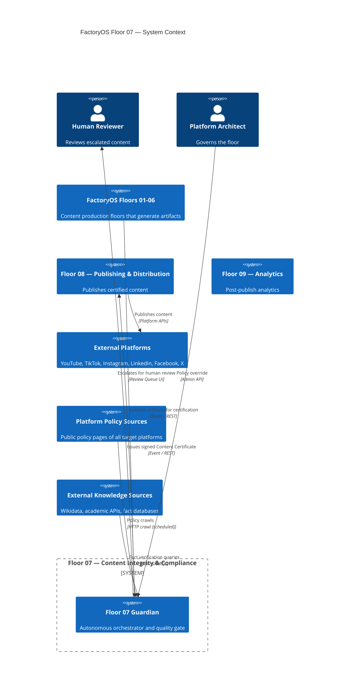
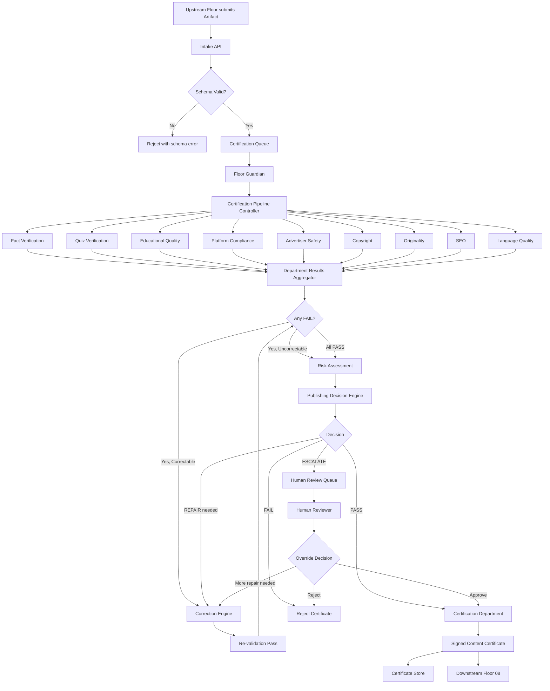
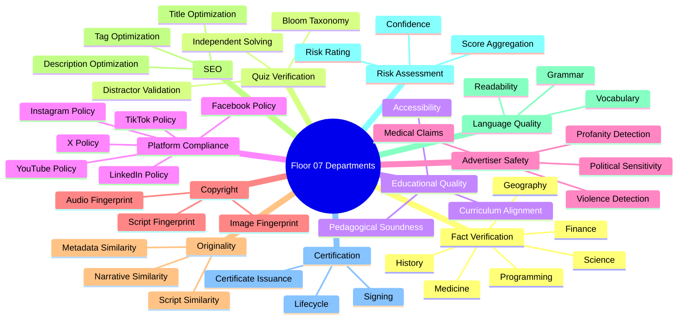
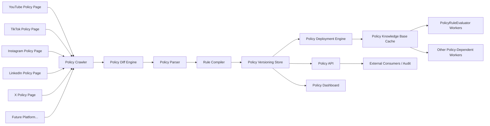

# RA-007 — Content Integrity & Compliance Floor (Floor 07)
## Package B — Floor Architecture, Departments, Workers & Policy Intelligence

> **Classification:** Reference Architecture
> **Status:** Draft for ARB Review
> **Review:** Architecture Review Board (ARB)
> **Version:** 0.1
> **Owner:** Chief Platform Architect
> **Reviewers:** ARB, Distinguished Software Architect, AI Safety Engineer, Security Architect, Platform Governance Architect, SRE Architect, Knowledge Graph Architect
> **Approvers:** Chief Architect, CTO, ARB Chair
> **Confidentiality:** Internal
> **Lifecycle:** Living Document
> **Supersedes:** None
> **Superseded By:** None
> **Maturity:** Concept
> **Document Type:** RA
> **Floor:** 07

---

## Change History

| Version | Date | Author | Summary | Reviewer | Approver |
|---|---|---|---|---|---|
| 0.1 | 2026-07-19 | Architecture Review Board (Panel) | Initial draft — Package B: Floor Architecture, Department Architecture, Worker Specifications, Policy Intelligence System. | ARB | Pending |

---

## Table of Contents

9. Complete Floor Architecture
10. Department Architecture
11. Worker Specifications
12. Policy Intelligence System

---

## 9. Complete Floor Architecture

> **Viewpoint:** VP-Platform, VP-Developer
> **Quality Attributes Influenced:**

| Attribute | Rating | Rationale |
|---|---|---|
| Scalability | ★★★★★ | The floor architecture defines how horizontal scaling is achieved. |
| Reliability | ★★★★★ | The architecture defines the durability and self-healing structure. |
| Governance | ★★★★★ | The architecture enforces the quality gate through structured pipelines. |
| Observability | ★★★★☆ | Every component has built-in instrumentation. |

> **Why This Exists:**
> | Question | Answer |
> |---|---|
> | Why does this section exist? | To define the complete structural architecture of Floor 07 and all its components. |
> | What decision does it support? | Infrastructure design, deployment topology, and component interface decisions. |
> | Who reads it? | Chief Platform Architect, Platform Engineers, SRE Architect, AI Infrastructure Architect. |

### 9.1 C4 Level 1 — System Context



### 9.2 C4 Level 2 — Container Diagram

```mermaid
C4Container
    title Floor 07 — Container Architecture

    System_Boundary(floor07, "Floor 07 — Content Integrity & Compliance") {

        Container(guardian, "Floor Guardian", "Durable Workflow Engine", "Orchestrates all certification pipelines; routes artifacts to departments; issues certificates")
        Container(intake_api, "Intake API", "REST / gRPC", "Receives artifacts from upstream floors; validates schema; queues for certification")
        Container(cert_pipeline, "Certification Pipeline Controller", "Workflow Orchestrator", "Manages full pipeline state: Validate -> Correct -> Re-validate -> Risk -> Certify")

        Container_Boundary(departments, "Eleven Certification Departments") {
            Container(dept_fact, "Fact Verification Dept.", "Workers + KB", "Verifies factual claims")
            Container(dept_quiz, "Quiz Verification Dept.", "Workers + Solver", "Validates quizzes independently")
            Container(dept_edu, "Educational Quality Dept.", "Workers + Curriculum KB", "Assesses pedagogical quality")
            Container(dept_platform, "Platform Compliance Dept.", "Workers + Policy Engine", "Checks platform policy compliance")
            Container(dept_adv, "Advertiser Safety Dept.", "Workers + Classifier", "Detects unsafe content for advertisers")
            Container(dept_copy, "Copyright Dept.", "Workers + Fingerprint DB", "Detects copyright risk")
            Container(dept_orig, "Originality Dept.", "Workers + Similarity DB", "Measures content originality")
            Container(dept_seo, "SEO Dept.", "Workers + SEO KB", "Validates and improves SEO signals")
            Container(dept_lang, "Language Quality Dept.", "Workers + Grammar Engine", "Grammar, readability, accessibility")
            Container(dept_risk, "Risk Assessment Dept.", "Workers + Aggregator", "Aggregates all scores into risk rating")
            Container(dept_cert, "Certification Dept.", "Workers + HSM", "Issues signed Content Certificates")
        }

        Container(correction_engine, "Correction Engine", "AI + Rules", "Auto-repairs correctable failures")
        Container(policy_intel, "Policy Intelligence System", "Crawler + Parser + KB + Versioning", "Manages all platform policy as versioned data")
        Container(human_review, "Human Review System", "Queue + UI + Audit", "Manages human escalation, overrides, and appeals")
        Container(cert_store, "Certificate Store", "Append-Only DB", "Stores all issued certificates immutably")
        Container(audit_log, "Audit Log Service", "Append-Only Event Log", "Tamper-evident audit trail for all decisions")
        Container(kb_cache, "Knowledge Base Cache", "Redis / In-Memory", "Cached policy rules, fact KB, SEO KB")
        Container(queue, "Certification Queue", "Distributed Message Queue", "Partitioned queue for artifact processing")
        Container(dlq, "Dead Letter Queue", "DLQ Service", "Holds failed items for inspection and retry")
        Container(observability, "Observability Stack", "Logs + Metrics + Traces", "OpenTelemetry pipeline; dashboards; alerting")
        Container(floor_api, "Floor 07 API Gateway", "REST / MCP / Event", "External-facing API for all inter-floor communication")
    }

    Rel(intake_api, queue, "Enqueues artifact", "Event")
    Rel(queue, guardian, "Dispatches to Guardian", "Event")
    Rel(guardian, cert_pipeline, "Initiates pipeline", "Workflow call")
    Rel(cert_pipeline, dept_fact, "Routes to department", "Worker dispatch")
    Rel(cert_pipeline, dept_quiz, "Routes to department", "Worker dispatch")
    Rel(cert_pipeline, dept_edu, "Routes to department", "Worker dispatch")
    Rel(cert_pipeline, dept_platform, "Routes to department", "Worker dispatch")
    Rel(cert_pipeline, dept_adv, "Routes to department", "Worker dispatch")
    Rel(cert_pipeline, dept_copy, "Routes to department", "Worker dispatch")
    Rel(cert_pipeline, dept_orig, "Routes to department", "Worker dispatch")
    Rel(cert_pipeline, dept_seo, "Routes to department", "Worker dispatch")
    Rel(cert_pipeline, dept_lang, "Routes to department", "Worker dispatch")
    Rel(cert_pipeline, correction_engine, "Requests correction", "Sync call")
    Rel(cert_pipeline, dept_risk, "Risk aggregation", "Worker dispatch")
    Rel(cert_pipeline, dept_cert, "Certificate issuance", "Worker dispatch")
    Rel(dept_cert, cert_store, "Stores certificate", "Write")
    Rel(cert_pipeline, human_review, "Escalates", "Queue insert")
    Rel(policy_intel, kb_cache, "Populates policy cache", "Write")
    Rel(dept_platform, kb_cache, "Reads rules", "Read")
    Rel(cert_pipeline, audit_log, "Logs every decision", "Append")
    Rel(guardian, dlq, "Routes failed items", "Event")
    Rel(guardian, observability, "Emits telemetry", "OTLP")
    Rel(floor_api, intake_api, "Incoming artifacts", "REST/Event")
```



### 9.3 Floor Component Inventory

| Component | Type | Role | Scaling Model |
|---|---|---|---|
| **Floor Guardian** | Durable Workflow Orchestrator | Master controller of all pipelines | Active-active, HA cluster |
| **Intake API** | REST/gRPC service | Receives and validates artifact submissions | Horizontal, stateless |
| **Certification Pipeline Controller** | Workflow DAG | Manages pipeline state machine per artifact | One instance per artifact workflow; backed by durable engine |
| **Eleven Departments** | Worker pools | Execute domain-specific validation | Per-department horizontal scaling |
| **Correction Engine** | AI + Rules service | Auto-repairs failures | Horizontal, stateless |
| **Policy Intelligence System** | Crawl + Parse + Store + Serve | Keeps policy current | Distributed crawler + HA KB |
| **Human Review System** | Queue + Web UI | Human escalation and override | HA queue + stateless UI |
| **Certificate Store** | Append-only database | Immutable certificate storage | Distributed, append-only |
| **Audit Log Service** | Append-only event log | Tamper-evident audit trail | Append-only, replicated |
| **Knowledge Base Cache** | In-memory cache | Low-latency rule/fact lookup | Distributed cache, multi-replica |
| **Certification Queue** | Distributed message queue | Partitioned artifact intake | Partitioned, rebalancing |
| **Dead Letter Queue** | DLQ | Failed item retention | Persistent queue |
| **Observability Stack** | OpenTelemetry pipeline | Full-floor telemetry | Centralized sink; per-worker push |
| **Floor 07 API Gateway** | REST / MCP / Event | Inter-floor contract | Horizontal, stateless |

### 9.4 Floor Data Flow (High Level)



---

## 10. Department Architecture

> **Viewpoint:** VP-Platform, VP-Developer
> **Quality Attributes Influenced:**

| Attribute | Rating | Rationale |
|---|---|---|
| Governance | ★★★★★ | Each department enforces a specific governance dimension. |
| Scalability | ★★★★☆ | Departments are independently scalable; no cross-department blocking. |
| Maintainability | ★★★★☆ | Each department is a bounded context; changes are localized. |

> **Why This Exists:**
> | Question | Answer |
> |---|---|
> | Why does this section exist? | To define the eleven certification departments, their rationale, structure, and responsibilities. |
> | What decision does it support? | Department build vs. buy, team assignment, and interface contract decisions. |
> | Who reads it? | Platform Engineers, AI Safety Engineer, Platform Governance Architect, SRE. |

### 10.1 Why Eleven Departments?

Each department exists because the certification domain it covers is:
1. **Distinct** — its failures cannot be detected by any other department.
2. **Consequential** — its failures have real business, legal, or user impact.
3. **Automatable** — it can be independently validated by workers without human intervention in the common case.



### 10.2 Department Profiles

#### Department 01 — Fact Verification

| Field | Value |
|---|---|
| **Why it exists** | AI-generated educational content contains factual errors (hallucinations, outdated information, context collapse). This department independently verifies every material claim before publication. |
| **Consequence of absence** | Factually incorrect educational content reaches learners, causing reputational damage, educational harm, and potential legal liability. |
| **Sub-domains** | Science, Programming, History, Mathematics, Medicine, Finance, Geography, Technology, General Knowledge |
| **Workers** | ClaimExtractor, ClaimVerifier, HallucinationDetector, ConfidenceScorer, ConflictResolver, SourceRanker |
| **Knowledge Bases** | Wikidata, Wikipedia API, arXiv, PubMed, WolframAlpha, curated FactoryOS Fact KB |
| **Output** | Per-claim verification result: VERIFIED / UNVERIFIED / CONFLICTED / HALLUCINATED + confidence score |
| **Escalation trigger** | Any claim with confidence < 0.85, or any HALLUCINATED result |
| **Pipeline position** | Early — runs in parallel with other departments from artifact intake |

#### Department 02 — Quiz Verification

| Field | Value |
|---|---|
| **Why it exists** | AI-generated quizzes frequently have incorrect answers, ambiguous questions, poor distractors, or misaligned difficulty. A quiz with a wrong correct answer is an educational failure. |
| **Consequence of absence** | Learners receive incorrect answers as "correct," eroding trust and causing harm. |
| **Sub-domains** | Question answerability, distractor quality, answer correctness, difficulty calibration, curriculum alignment, Bloom's Taxonomy, duplicate detection |
| **Workers** | QuizSolver, DistractorValidator, BloomClassifier, DifficultyEstimator, CurriculumAligner, DuplicateDetector, ExplanationVerifier, AmbiguityDetector |
| **Solving method** | Independent multi-model solving: at least 2 different AI models solve each question independently. Disagreement = escalation. |
| **Output** | Per-question: CORRECT / INCORRECT / AMBIGUOUS / DUPLICATE + Bloom level + difficulty score + curriculum label |
| **Escalation trigger** | Any INCORRECT or AMBIGUOUS result; any question where the two models disagree |
| **Pipeline position** | Early — runs in parallel; does not depend on other departments |

#### Department 03 — Educational Quality

| Field | Value |
|---|---|
| **Why it exists** | Platform compliance does not guarantee educational quality. Content may be policy-compliant but pedagogically unsound, inaccessible, or developmentally inappropriate. |
| **Consequence of absence** | Content reaches learners that is technically compliant but educationally harmful or ineffective. |
| **Sub-domains** | Curriculum alignment, Bloom's Taxonomy depth, pedagogical structure, accessibility (reading level, vocabulary), cognitive load, engagement quality |
| **Workers** | CurriculumAligner, BloomAnalyzer, PedagogyScorer, AccessibilityChecker, CognitiveLoadEstimator, EngagementQualityScorer |
| **Knowledge Bases** | Common Core, CSTA standards, national curriculum databases, Bloom's Taxonomy ontology |
| **Output** | Educational Quality Score (0.0-1.0); pass/fail per dimension; remediation recommendations |
| **Escalation trigger** | Educational Quality Score < 0.70 |
| **Pipeline position** | Mid-pipeline — runs after Fact Verification completes |

#### Department 04 — Platform Compliance

| Field | Value |
|---|---|
| **Why it exists** | Every target platform has published, evolving content policies. Violations result in account strikes, removals, demonetization, and bans. |
| **Consequence of absence** | Published content violates platform terms of service, resulting in immediate removal and account penalties. |
| **Platforms supported** | YouTube, Instagram, TikTok, LinkedIn, Facebook, X (Twitter), and future platforms via plugin |
| **Sub-domains** | Community guidelines, content rating, thumbnail guidelines, title/description rules, chapter markers, end screen policy, ad suitability rules |
| **Workers** | PolicyRuleEvaluator (per platform), ThumbnailPolicyChecker, TitlePolicyChecker, DescriptionPolicyChecker, MetadataPolicyChecker, PlatformProfileRouter |
| **Policy source** | Policy Intelligence System (Department 12) — versioned, auto-updated rule sets |
| **Output** | Per-platform: COMPLIANT / NON_COMPLIANT / MARGINAL + violated rule IDs + policy versions |
| **Escalation trigger** | Any NON_COMPLIANT result; MARGINAL result on primary platform |
| **Pipeline position** | Mid-pipeline — runs in parallel with Advertiser Safety |

#### Department 05 — Advertiser Safety

| Field | Value |
|---|---|
| **Why it exists** | Advertisers fund the platform. Content that fails Brand Safety standards causes advertiser withdrawal, demonetization, and commercial collapse. |
| **Consequence of absence** | Unsafe content receives limited or zero ads, destroying commercial viability. |
| **Detection categories** | Violence, Profanity, Medical claims, Financial claims, Political sensitivity, Adult content, Hate speech, Harassment, Clickbait, Spam indicators, Scam indicators, Controversial topics |
| **Workers** | ViolenceClassifier, ProfanityDetector, MedicalClaimDetector, FinancialClaimDetector, PoliticalSensitivityScorer, AdultContentClassifier, HateClassifier, HarassmentClassifier, ClickbaitScorer, ScamDetector |
| **Scoring model** | Composite Brand Safety Score (0.0-1.0) across all categories; weighted by category severity |
| **Output** | Brand Safety Score; per-category: SAFE / UNSAFE / REVIEW_REQUIRED + evidence fragments |
| **Escalation trigger** | Brand Safety Score < 0.80; any UNSAFE in Violence, Adult, Hate categories |
| **Pipeline position** | Mid-pipeline — runs in parallel with Platform Compliance |

#### Department 06 — Copyright

| Field | Value |
|---|---|
| **Why it exists** | AI models reproduce copyrighted content in scripts, narrations, and structure. Undetected copyright violations result in DMCA strikes, lawsuits, and platform removal. |
| **Consequence of absence** | Published content contains copyrighted material, resulting in legal action and platform strikes. |
| **Detection types** | Verbatim text reproduction, paraphrased reproduction, structural template infringement, audio fingerprint matches, image copyright, lyric reproduction |
| **Workers** | TextFingerprintChecker, AudioFingerprintChecker, ImageCopyrightChecker, ParaphraseDetector, LicenseVerifier, AttributionChecker |
| **Databases** | Content ID fingerprint DB, licensed content registries, Creative Commons catalog, known copyright claim DB |
| **Output** | Copyright Risk Score (0.0-1.0); per-match: CLEAR / AT_RISK / BLOCKED + source identification |
| **Escalation trigger** | Copyright Risk Score > 0.30; any BLOCKED result |
| **Pipeline position** | Mid-pipeline — can run in parallel with all other departments |

#### Department 07 — Originality

| Field | Value |
|---|---|
| **Why it exists** | Publishing near-duplicate content across the same channel trains platform algorithms to suppress the channel. Originality is a platform health signal. |
| **Consequence of absence** | Channel becomes algorithmically suppressed due to repetitive content; engagement drops and reach collapses. |
| **Dimensions** | Script similarity, narrative arc similarity, template similarity, thumbnail composition similarity, title/description similarity, publishing schedule diversity, structural pattern repetition |
| **Workers** | ScriptSimilarityChecker, NarrativeSimilarityChecker, TemplateSimilarityChecker, MetadataSimilarityChecker, ThumbnailSimilarityChecker, ChannelDiversityScorer, StructuralPatternDetector |
| **Databases** | Channel-wide content vector store; published artifact embeddings; template registry |
| **Output** | Originality Score (0.0-1.0); per-dimension similarity score; closest match artifact IDs |
| **Escalation trigger** | Originality Score < 0.60; any dimension with similarity > 0.90 to a recently published artifact |
| **Pipeline position** | Mid-pipeline — runs after content vectors are available |

#### Department 08 — SEO

| Field | Value |
|---|---|
| **Why it exists** | Even compliant, accurate content that is unfindable has zero reach. SEO quality directly determines whether content achieves its educational mission. |
| **Consequence of absence** | Content is published but never discovered; production cost wasted; educational impact nullified. |
| **Dimensions** | Title: keyword density, length, click-through optimization; Description: keyword richness, hook quality, call-to-action; Tags: relevance, count, specificity; Chapters: timing, keyword inclusion; Thumbnail: text readability, emotional trigger, contrast |
| **Workers** | TitleSEOAnalyzer, DescriptionSEOAnalyzer, TagAnalyzer, ChapterOptimizer, ThumbnailSEOScorer, KeywordDensityChecker, SearchIntentAligner |
| **Knowledge Bases** | Platform-specific SEO signal databases; keyword trend data; title performance history |
| **Output** | SEO Score (0.0-1.0); per-dimension score; recommended improvements |
| **Escalation trigger** | SEO Score < 0.65 (improvement recommended, not blocked unless critical) |
| **Pipeline position** | Can run in parallel; SEO improvements fed to Correction Engine |

#### Department 09 — Language Quality

| Field | Value |
|---|---|
| **Why it exists** | Grammar errors, poor readability, vocabulary mismatches, and accessibility failures directly reduce content quality and trust. |
| **Consequence of absence** | Grammatically incorrect, confusing, or inaccessible content damages brand and educational trust. |
| **Dimensions** | Grammar correctness, spelling, punctuation, sentence structure, readability score (Flesch-Kincaid), vocabulary grade level, accessibility (WCAG-aligned), tone consistency |
| **Workers** | GrammarChecker, SpellChecker, ReadabilityScorer, VocabularyGradeChecker, ToneConsistencyChecker, AccessibilityChecker |
| **Output** | Language Quality Score (0.0-1.0); per-issue: error location, category, severity, suggested correction |
| **Escalation trigger** | Language Quality Score < 0.70; grammar errors in title or first 30 words of description |
| **Pipeline position** | Early — runs on text components immediately at intake |

#### Department 10 — Risk Assessment

| Field | Value |
|---|---|
| **Why it exists** | Individual department scores need to be aggregated into a single, actionable risk rating that drives the publishing decision. No single department has global context. |
| **Consequence of absence** | Without aggregation, multiple marginal scores could pass individually while representing a collectively unacceptable risk profile. |
| **Inputs** | All department scores and results |
| **Aggregation model** | Weighted risk matrix; critical dimensions (Platform Compliance, Copyright, Advertiser Safety, Fact Verification) carry higher weight |
| **Workers** | ScoreAggregator, WeightedRiskCalculator, ConfidenceIntervalEstimator, RiskNarrativeGenerator |
| **Output** | Risk Rating: LOW / MEDIUM / HIGH / CRITICAL; confidence interval; risk narrative |
| **Escalation trigger** | HIGH or CRITICAL rating; aggregate confidence < 0.80 |
| **Pipeline position** | Late-pipeline — runs after all department results are available |

#### Department 11 — Certification

| Field | Value |
|---|---|
| **Why it exists** | The act of certification must be a separate, signed step — not embedded in other departments. Separation of concerns ensures the certificate is an independent attestation, not a side effect of validation. |
| **Consequence of absence** | Without a dedicated certification step, there is no authoritative attestation of compliance; the publishing layer cannot trust the output. |
| **Responsibilities** | Issue Content Certificate, sign with HSM-backed private key, store in Certificate Store, publish certificate event to downstream, manage certificate lifecycle (revocation, expiry) |
| **Workers** | CertificateGenerator, CertificateSigner, CertificateStorer, CertificateRevocationManager |
| **Signing model** | Ed25519 asymmetric signing; keys managed by HSM (Hardware Security Module); key rotation quarterly |
| **Output** | Signed Content Certificate (see Package D, Section 21 for schema) |
| **Pipeline position** | Final step — executes only after all departments and risk assessment complete |

---

## 11. Worker Specifications

> **Viewpoint:** VP-Platform, VP-Developer
> **Quality Attributes Influenced:**

| Attribute | Rating | Rationale |
|---|---|---|
| Reliability | ★★★★★ | Worker specifications define failure modes, recovery, and health. |
| Scalability | ★★★★☆ | Worker lifecycle and autoscaling design is defined here. |
| Observability | ★★★★☆ | Every worker's metrics and health checks are specified here. |

> **Why This Exists:**
> | Question | Answer |
> |---|---|
> | Why does this section exist? | To provide implementation-ready specifications for every worker on Floor 07. |
> | What decision does it support? | Worker implementation, deployment, and SRE decisions. |
> | Who reads it? | Platform Engineers, SRE Architect, AI Infrastructure Architect. |

### 11.1 Worker Template

All workers on Floor 07 conform to the following specification template:

| Field | Description |
|---|---|
| **Mission** | The single purpose of this worker. |
| **Inputs** | What the worker receives as input (artifact fields, context). |
| **Outputs** | What the worker produces (result objects, events). |
| **Dependencies** | External services, APIs, KBs this worker depends on. |
| **Tools** | AI models, rule engines, APIs this worker invokes. |
| **Memory** | What state the worker holds; what it reads from cache/store. |
| **Lifecycle** | How the worker starts, processes, checkpoints, and terminates. |
| **Retries** | Retry policy: max attempts, backoff, conditions. |
| **Recovery** | How the worker recovers from partial failure. |
| **Metrics** | Metrics the worker emits. |
| **Health Checks** | Liveness and readiness probe definitions. |
| **Failure Modes** | Known failure scenarios and their handling. |
| **Ownership** | Team responsible for this worker. |

### 11.2 Representative Worker Specifications

#### Worker: ClaimExtractor (Dept. 01 — Fact Verification)

| Field | Specification |
|---|---|
| **Mission** | Extract all verifiable factual claims from the artifact's script, narration, and on-screen text, producing a structured claim list for downstream verification. |
| **Inputs** | Script text, narration transcript, on-screen text overlays, artifact metadata (topic, domain). |
| **Outputs** | Structured claim list: `[{claim_id, claim_text, claim_type, domain, source_position, verifiability_score}]` |
| **Dependencies** | Artifact Store (read), Fact KB domain taxonomy. |
| **Tools** | LLM (claim extraction prompt): primary = GPT-4o class; fallback = Claude 3.5 Sonnet; offline = local Mistral 7B. |
| **Memory** | Stateless between invocations. Reads domain taxonomy from Policy Cache at startup. |
| **Lifecycle** | 1. Receive artifact ID from pipeline controller. 2. Load artifact from store. 3. Extract claims using LLM. 4. Validate claim schema. 5. Emit structured claim list. 6. Checkpoint result. 7. Signal completion to controller. |
| **Retries** | Max 3 attempts. Backoff: 5s, 15s, 30s. Retry on: LLM timeout, LLM error, schema validation failure. No retry on: invalid artifact ID. |
| **Recovery** | If LLM fails all retries, fall back to rule-based extraction (regex + NLP). If rule-based also fails, emit EXTRACTION_FAILED signal with partial results and confidence = 0.0. |
| **Metrics** | `claims_extracted_total`, `extraction_latency_seconds`, `llm_provider_used`, `fallback_triggered_total`, `claims_per_domain_breakdown` |
| **Health Checks** | Liveness: responds to HTTP GET /health within 5s. Readiness: LLM client responsive, Policy Cache connected. |
| **Failure Modes** | F-01: LLM hallucination in claim extraction (mitigation: schema validation rejects malformed claims). F-02: Domain misclassification (mitigation: confidence threshold; ambiguous claims forwarded to ConflictResolver). F-03: Artifact too large (mitigation: chunking strategy; max 50k tokens per call). |
| **Ownership** | AI Infrastructure Architect |

#### Worker: ClaimVerifier (Dept. 01 — Fact Verification)

| Field | Specification |
|---|---|
| **Mission** | Independently verify each claim against multiple authoritative knowledge sources, producing a verified/unverified/conflicted result with confidence score and evidence. |
| **Inputs** | Structured claim from ClaimExtractor; domain label; artifact topic context. |
| **Outputs** | `{claim_id, status: VERIFIED|UNVERIFIED|CONFLICTED|HALLUCINATED, confidence: 0.0-1.0, sources: [{source_name, source_url, excerpt, credibility_score}], evidence_summary}` |
| **Dependencies** | Wikidata API, Wikipedia API, WolframAlpha API, PubMed API (for medical), arXiv API (for science), FactoryOS Fact KB, Fact KB Cache. |
| **Tools** | Knowledge source APIs; LLM for source synthesis (provider-agnostic); embedding model for semantic matching. |
| **Memory** | Per-claim stateless. Reads source priority order from Policy Cache by domain. |
| **Lifecycle** | 1. Receive claim. 2. Query primary sources (parallel). 3. Synthesize evidence with LLM. 4. Compute confidence score. 5. Detect conflicts between sources. 6. Emit result. |
| **Retries** | Max 2 attempts per source. Total max claims processing time: 10s. Sources that fail are excluded from synthesis, and confidence is adjusted downward. |
| **Recovery** | If all sources fail: emit UNVERIFIED with confidence = 0.0 and source_failure_reason. Pipeline escalates to human review if confidence < 0.85. |
| **Metrics** | `claims_verified_total`, `claims_by_status`, `source_query_latency_seconds`, `confidence_distribution`, `conflict_detected_total` |
| **Health Checks** | Liveness: HTTP GET /health. Readiness: at least one knowledge source API reachable. |
| **Failure Modes** | F-01: All external sources unavailable (fallback: Fact KB Cache only; confidence reduced). F-02: Source conflict (handled by ConflictResolver worker). F-03: LLM synthesis error (fallback: rule-based confidence calculation from raw source data). |
| **Ownership** | AI Safety Engineer |

#### Worker: HallucinationDetector (Dept. 01 — Fact Verification)

| Field | Specification |
|---|---|
| **Mission** | Detect LLM hallucinations in the artifact's content by identifying claims that are confidently stated but have no verifiable source or that contradict multiple authoritative sources. |
| **Inputs** | Script text, claim verification results from ClaimVerifier, knowledge base lookup results. |
| **Outputs** | `{hallucination_risk_score: 0.0-1.0, suspected_hallucinations: [{claim_id, text, reason, severity: LOW|MEDIUM|HIGH|CRITICAL}]}` |
| **Dependencies** | ClaimVerifier output, Fact KB, LLM (for cross-reference checking). |
| **Tools** | LLM (hallucination classification); vector similarity search against fact KB; confidence calibration model. |
| **Memory** | Stateless. Uses in-context verification results. |
| **Lifecycle** | 1. Receive claim verification results. 2. Identify claims with no source support. 3. Cross-reference against fact KB. 4. Classify hallucination severity. 5. Emit hallucination risk report. |
| **Retries** | Max 2 attempts. Backoff: 10s. |
| **Recovery** | If hallucination detection fails, emit conservative result: hallucination_risk_score = 0.5, escalate to human review. |
| **Metrics** | `hallucinations_detected_total`, `hallucination_severity_distribution`, `hallucination_risk_score_distribution` |
| **Health Checks** | Liveness: HTTP GET /health. Readiness: LLM responsive, Fact KB accessible. |
| **Failure Modes** | F-01: False negative (claim is hallucinated but not detected). Mitigation: multi-source verification by ClaimVerifier acts as primary layer; HallucinationDetector is secondary. F-02: False positive (valid claim flagged). Mitigation: ConflictResolver provides appeal path. |
| **Ownership** | AI Safety Engineer |

#### Worker: QuizSolver (Dept. 02 — Quiz Verification)

| Field | Specification |
|---|---|
| **Mission** | Independently solve each quiz question using at least two different AI models. If both models agree on the correct answer and it matches the artifact's stated answer, the question passes. If they disagree, escalate. |
| **Inputs** | Quiz question object: `{question_text, options: [{option_id, option_text}], stated_correct_answer_id, explanation, domain, difficulty_label}` |
| **Outputs** | `{question_id, model_1_answer, model_2_answer, agreement: AGREE|DISAGREE, artifact_answer_correct: true|false, confidence: 0.0-1.0, solving_rationale}` |
| **Dependencies** | Two independent AI providers (e.g., OpenAI + Anthropic); fallback: a third provider or local model. |
| **Tools** | LLM provider A (primary), LLM provider B (independent verification), LLM provider C (tiebreaker). |
| **Memory** | Stateless. No cross-question state. |
| **Lifecycle** | 1. Receive question. 2. Send to Model A (async). 3. Send to Model B (async). 4. Await both. 5. Compare answers. 6. If disagree, send to Model C as tiebreaker. 7. Compare artifact answer against winning answer. 8. Emit result. |
| **Retries** | Max 2 retries per model call. If a model is unavailable, substitute from provider pool. |
| **Recovery** | If all providers fail: mark question as UNSOLVABLE; escalate to human review. |
| **Metrics** | `questions_solved_total`, `model_agreement_rate`, `artifact_answer_correct_rate`, `solving_latency_seconds`, `provider_breakdown` |
| **Health Checks** | Liveness: HTTP GET /health. Readiness: at least 2 AI providers responsive. |
| **Failure Modes** | F-01: Models agree on wrong answer (rare; mitigation: ConflictResolver checks against external KB for high-stakes questions). F-02: Ambiguous question (both models give different plausible answers; escalate to human). |
| **Ownership** | AI Safety Engineer |

#### Worker: PolicyRuleEvaluator (Dept. 04 — Platform Compliance)

| Field | Specification |
|---|---|
| **Mission** | Evaluate a single artifact against the active rule set for a specific target platform, producing a per-rule pass/fail result and an aggregate compliance decision. |
| **Inputs** | Artifact metadata, script text, thumbnail URL, platform identifier, target policy version. |
| **Outputs** | `{platform_id, policy_version, decision: COMPLIANT|NON_COMPLIANT|MARGINAL, violated_rules: [{rule_id, rule_name, severity, evidence}], compliance_score: 0.0-1.0}` |
| **Dependencies** | Policy Knowledge Base (read), Policy Cache (read), Rule Engine. |
| **Tools** | Rule Engine (deterministic evaluation); LLM (for semantic rule checking where rules require NL understanding). |
| **Memory** | Reads active policy version for target platform from Policy Cache at task start. Stateless between tasks. |
| **Lifecycle** | 1. Receive task with platform ID and policy version. 2. Load rule set from cache. 3. Evaluate deterministic rules (fast). 4. Evaluate semantic rules via LLM (slower). 5. Aggregate results. 6. Emit compliance decision. |
| **Retries** | Deterministic rules: no retry (deterministic). Semantic rules: max 2 retries. |
| **Recovery** | If rule engine fails: pause evaluation, alert SRE, retry after 30s. If semantic LLM fails: mark affected rules as UNCERTAIN; reduce compliance score; consider escalation. |
| **Metrics** | `rules_evaluated_total`, `violations_detected_total`, `compliance_score_distribution`, `evaluation_latency_seconds`, `policy_version_in_use`, `rule_engine_errors_total` |
| **Health Checks** | Liveness: HTTP GET /health. Readiness: Policy Cache connected, Rule Engine initialized with active policy version. |
| **Failure Modes** | F-01: Policy cache stale (mitigation: freshness timestamp check; fall back to direct Policy KB query). F-02: Rule ambiguity (mitigation: ambiguous rules default to MARGINAL; human review if MARGINAL on critical rules). F-03: New rule type not yet supported (mitigation: unsupported rule types flagged for Policy Intelligence team). |
| **Ownership** | Platform Governance Architect |

#### Worker: CertificateSigner (Dept. 11 — Certification)

| Field | Specification |
|---|---|
| **Mission** | Sign the Content Certificate with the HSM-backed Ed25519 private key, producing a tamper-evident, verifiable certificate payload. |
| **Inputs** | Unsigned certificate payload from CertificateGenerator. |
| **Outputs** | Signed certificate: `{...certificate_payload, signature: base64(ed25519_signature), key_id, signing_timestamp}` |
| **Dependencies** | HSM (Hardware Security Module), Key Management Service (KMS). |
| **Tools** | HSM signing API; Ed25519 signing algorithm. |
| **Memory** | Stateless. Signing key never leaves HSM. |
| **Lifecycle** | 1. Receive unsigned payload. 2. Serialize payload to canonical JSON (deterministic). 3. Request HSM signature. 4. Receive signature. 5. Assemble signed certificate. 6. Emit signed certificate. |
| **Retries** | Max 3 attempts on HSM timeout. No retry on HSM error (security boundary). |
| **Recovery** | HSM failure is a critical failure. Escalate immediately; pipeline pauses; alert Security Architect and SRE. Certificates cannot be issued without HSM. |
| **Metrics** | `certificates_signed_total`, `signing_latency_ms`, `hsm_error_total`, `key_id_in_use` |
| **Health Checks** | Liveness: HTTP GET /health. Readiness: HSM reachable, signing key available (without extracting key). |
| **Failure Modes** | F-01: HSM unreachable (critical; pipeline halts; alert). F-02: Key expired (mitigation: key rotation schedule enforced; new key pre-loaded before expiry). F-03: Payload manipulation between CertificateGenerator and CertificateSigner (mitigation: payload hash verified before signing). |
| **Ownership** | Security Architect |

---

## 12. Policy Intelligence System

> **Viewpoint:** VP-Platform, VP-Developer, VP-Security
> **Quality Attributes Influenced:**

| Attribute | Rating | Rationale |
|---|---|---|
| Governance | ★★★★★ | Policy Intelligence is the mechanism by which external policy changes become internal rules. |
| Evolvability | ★★★★★ | New policies and policy changes propagate without worker code changes. |
| Reliability | ★★★★☆ | Policy must be available and current at all times. |

> **Why This Exists:**
> | Question | Answer |
> |---|---|
> | Why does this section exist? | To define the complete subsystem that keeps Floor 07's rules synchronized with all target platform policies. |
> | What decision does it support? | How to achieve Policy-as-Data (AG-02) without requiring code releases for policy changes. |
> | Who reads it? | Platform Governance Architect, Knowledge Graph Architect, SRE Architect. |

### 12.1 Policy Intelligence System Overview

The Policy Intelligence System (PIS) is the brain behind Floor 07's ability to respond to platform policy changes without code changes. It treats every platform's published content policy as a source of truth, continuously monitors it, converts changes into versioned executable rules, and deploys them to all workers within 24 hours.



### 12.2 Policy Crawler

| Field | Specification |
|---|---|
| **Mission** | Monitor all target platform policy pages for changes and extract updated policy text. |
| **Schedule** | Continuous monitoring: hourly check for changes. Full re-crawl: daily. |
| **Targets** | YouTube Help Center (Content Policies), YouTube Advertiser-Friendly Guidelines, TikTok Community Guidelines, Instagram Community Guidelines, LinkedIn Content Policies, Facebook Community Standards, X (Twitter) Rules |
| **Technology** | Headless browser for JS-rendered pages; HTTP crawler for static pages; RSS/atom feed monitoring where available. |
| **Change detection** | Hash-based diff: SHA-256 of normalized page content. Change triggers diff pipeline. |
| **Output** | Raw policy document (normalized text) + change event: `{platform_id, page_url, crawl_timestamp, content_hash, change_detected: bool}` |
| **Alerting** | On change detected: emit `POLICY_CHANGE_DETECTED` event. |
| **Error handling** | Network failure: retry with exponential backoff (5min, 15min, 60min). Alert after 3 consecutive failures. |

### 12.3 Policy Parser

| Field | Specification |
|---|---|
| **Mission** | Convert raw platform policy text into structured, machine-readable policy objects. |
| **Input** | Raw policy document from Policy Crawler. |
| **Processing** | LLM-assisted structured extraction: identify policy sections, rules, examples, exceptions. Output validated against Policy Schema. |
| **Output** | Structured Policy Document: `{platform_id, policy_version, sections: [{section_id, title, rules: [{rule_id, rule_text, rule_type: PROHIBITED|REQUIRED|CONDITIONAL, examples: [], exceptions: []}]}]}` |
| **Validation** | Schema validation; human review triggered on parsing confidence < 0.85. |
| **Failure handling** | Parse failure: flag for manual policy engineering review; previous policy version remains active. |

### 12.4 Rule Compiler

| Field | Specification |
|---|---|
| **Mission** | Convert parsed policy objects into executable rule objects that can be evaluated by the Rule Engine without AI inference (for performance), and into semantic rule objects that require AI for evaluation. |
| **Rule types** | DETERMINISTIC (e.g., "title length <= 100 characters"), REGEX (e.g., prohibited word lists), SEMANTIC (e.g., "does the content promote dangerous activities"), CONDITIONAL (e.g., "if topic = health then medical claim rules apply") |
| **Output** | Compiled rule set: `{rule_id, platform_id, policy_version, rule_type, evaluation_strategy, parameters, severity: LOW|MEDIUM|HIGH|CRITICAL, auto_fixable: bool}` |
| **Versioning** | Every compiled rule set is versioned. Version format: `{platform_id}-{semver}` (e.g., `youtube-2.14.3`). |
| **Testing** | Every new rule set is tested against the regression test suite before deployment. |

### 12.5 Policy Versioning Store

| Field | Specification |
|---|---|
| **Mission** | Store all historical and current policy versions immutably. Enable time-travel queries (what were the rules for YouTube on date X?). |
| **Storage model** | Append-only. No updates; each new policy version is a new record. |
| **Schema** | `{policy_id, platform_id, version, effective_date, deprecated_date, rules: [rule_ids], raw_document_hash, compiled_rule_set_hash, status: ACTIVE|DEPRECATED|SUPERSEDED}` |
| **Time-travel** | Any historical policy state can be reconstructed for any point in time (QA-GOV-05). |
| **Access control** | Read-all for Policy Workers; Write only for Policy Deployment Engine; Admin write for Policy Engineers. |

### 12.6 Policy Diff Engine

| Field | Specification |
|---|---|
| **Mission** | Produce a human-readable and machine-readable diff between two policy versions, highlighting added, removed, and modified rules. |
| **Inputs** | Two policy versions. |
| **Output** | `{policy_diff_id, platform_id, old_version, new_version, added_rules: [], removed_rules: [], modified_rules: [{rule_id, old_text, new_text, change_type}], breaking_change: bool, severity: LOW|MEDIUM|HIGH|CRITICAL}` |
| **Breaking change detection** | A rule change is BREAKING if it reduces the set of compliant content (new restriction) or changes the definition of a critical rule. |
| **Notification** | BREAKING changes trigger immediate notification to Platform Governance Architect and ARB. |

### 12.7 Policy Deployment Engine

| Field | Specification |
|---|---|
| **Mission** | Deploy a new compiled rule set to the Policy Knowledge Base Cache, ensuring all workers adopt the new policy version without restart and without disrupting in-flight pipelines. |
| **Deployment model** | Blue-green deployment: new policy version is staged alongside current version. In-flight pipelines continue using their started version until completion. New pipelines use new version after deployment gate passes. |
| **Deployment gate** | Before activating new version: regression test suite must pass; human sign-off required for BREAKING changes. |
| **Rollback** | Any policy version can be rolled back in < 60 seconds by flagging the new version as DEPRECATED and routing workers back to the previous ACTIVE version. |
| **Propagation** | Workers check policy version at task start from cache. Cache is refreshed on each new version activation. No worker restart required. |

### 12.8 Policy API

| Field | Specification |
|---|---|
| **Purpose** | Expose policy data, rule sets, and diffs to internal consumers and audit systems. |
| **Endpoints** | `GET /policies/{platform_id}/current` — current active policy; `GET /policies/{platform_id}/version/{version}` — specific version; `GET /policies/{platform_id}/diff?from={v1}&to={v2}` — diff; `GET /rules/{rule_id}` — individual rule; `POST /policies/{platform_id}/override` — admin override (requires human auth). |
| **Authentication** | Internal: service token + mTLS. Admin override: MFA + role-bound auth. |
| **Audit** | Every API call is logged to the Audit Log Service. |

### 12.9 Policy Cache

| Field | Specification |
|---|---|
| **Mission** | Serve active rule sets to workers with sub-millisecond read latency. |
| **Technology** | Distributed in-memory cache (e.g., Redis Cluster or equivalent). |
| **TTL** | Rule sets have no TTL (they are replaced by the Deployment Engine on new version). |
| **Freshness** | Workers read a version token at task start; if the version token has changed since last read, reload from cache. |
| **Fallback** | If cache is unavailable, workers fall back to Policy KB Store direct read (higher latency accepted). |
| **Availability target** | 99.95% read availability (QA-AVAIL-04). |

### 12.10 How Policy Changes Propagate Without Worker Code Changes

This is the central design guarantee of the Policy Intelligence System.

```
Policy Change Detected
    |
    v
Policy Crawler detects change (hourly)
    |
    v
Policy Parser converts raw text to structured Policy Document
    |
    v
Rule Compiler converts Policy Document to executable Rule Set
    |
    v
Automated regression tests run against new Rule Set
    |
    v
[If BREAKING change]: Human sign-off required
[If non-BREAKING]: Automatic deployment
    |
    v
Policy Deployment Engine stages new rule set in cache (blue-green)
    |
    v
New pipelines started after deployment gate use new rule set
In-flight pipelines complete using their original rule set version
    |
    v
Old rule set version deprecated (retained in store for audit)
    |
    v
Workers read new rule set from cache at next task start
No worker code change. No worker restart. No pipeline disruption.
```

**Key design decisions enabling this:**

| Decision | Mechanism |
|---|---|
| Rules are data, not code | Workers call a Rule Engine API with rule IDs; rules live in the Policy KB |
| Workers read policy version at task start | No rule is baked into worker binary |
| Blue-green deployment | In-flight pipelines are not disrupted |
| Version pinning | Each certification result records the policy version used |
| Regression test gate | New rules are tested before deployment |
| Human gate on breaking changes | Humans review rule changes that could flip previously-passing content to failing |

### 12.11 Policy State Diagram

```mermaid
stateDiagram-v2
    [*] --> CRAWLED : Policy Crawler detects change
    CRAWLED --> PARSED : Policy Parser converts to structure
    PARSED --> PARSE_FAILED : Parsing confidence < 0.85
    PARSE_FAILED --> MANUAL_REVIEW : Human policy engineer reviews
    MANUAL_REVIEW --> PARSED : Manual correction applied
    PARSED --> COMPILED : Rule Compiler generates rule set
    COMPILED --> COMPILE_FAILED : Schema validation fails
    COMPILE_FAILED --> MANUAL_REVIEW : Policy engineer corrects
    COMPILED --> REGRESSION_TESTING : Automated test suite runs
    REGRESSION_TESTING --> TEST_FAILED : Tests fail
    TEST_FAILED --> MANUAL_REVIEW : Policy engineer investigates
    REGRESSION_TESTING --> STAGING : Tests pass
    STAGING --> AWAITING_APPROVAL : Breaking change detected
    AWAITING_APPROVAL --> ACTIVE : Human approves
    STAGING --> ACTIVE : Non-breaking; auto-deployed
    ACTIVE --> DEPRECATED : Newer version activated
    ACTIVE --> ROLLBACK : Incident triggers rollback
    ROLLBACK --> ACTIVE : Previous version re-activated
    DEPRECATED --> [*] : Retained in store; no longer served
```

---

## Package B — End

**Previous:** Package A — Executive Foundation
**Next:** Package C — Content Certification Pipeline, Correction Engine, Fact Verification System, Quiz Verification System, Platform Compliance System

---

*Document: RA-007, Package B — Floor Architecture, Departments, Workers & Policy Intelligence*
*FactoryOS Architecture Knowledge Base*
*Classification: Reference Architecture | Status: Draft for ARB Review | Version: 0.1*
