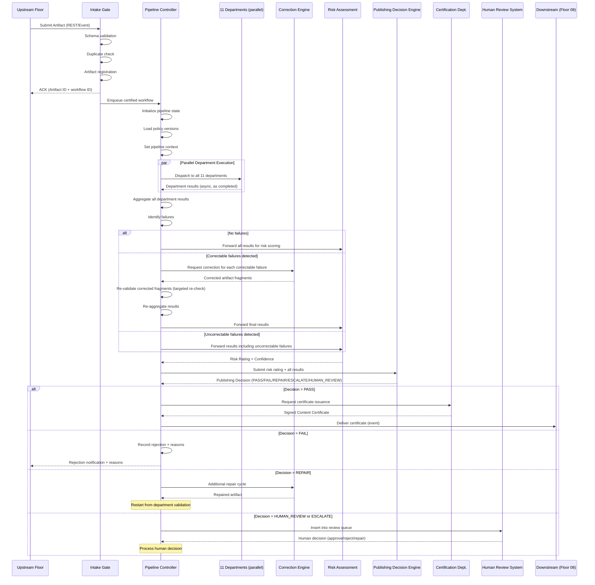
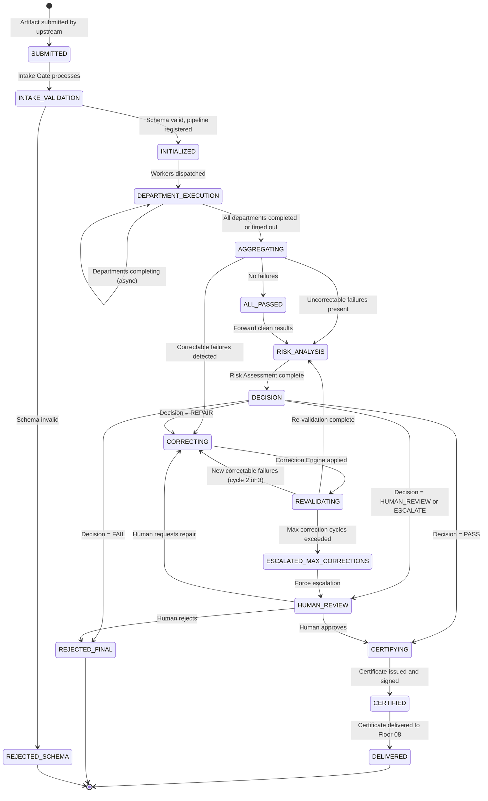
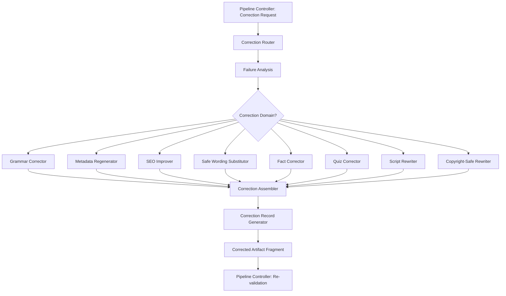
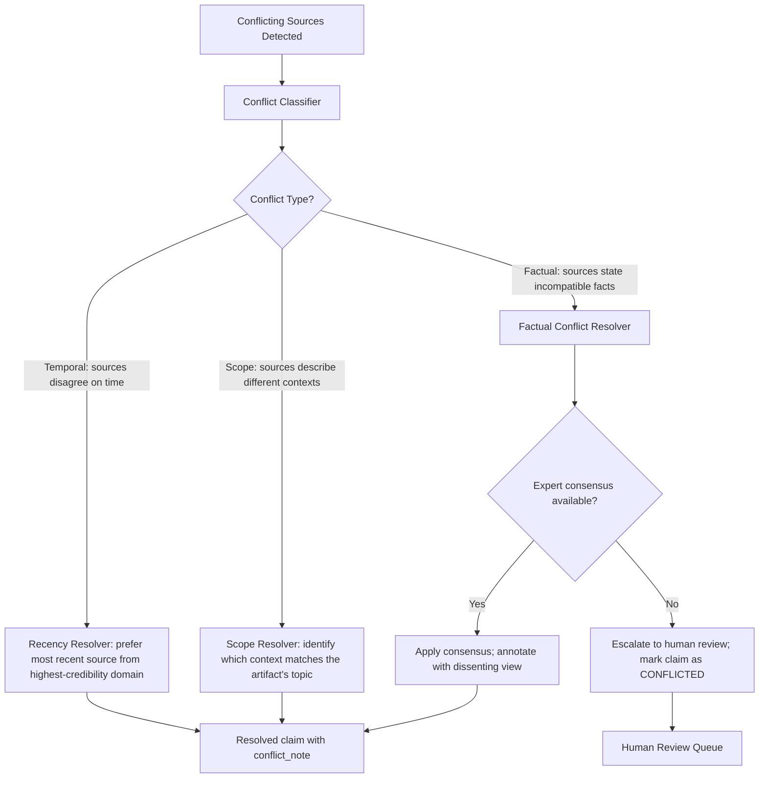
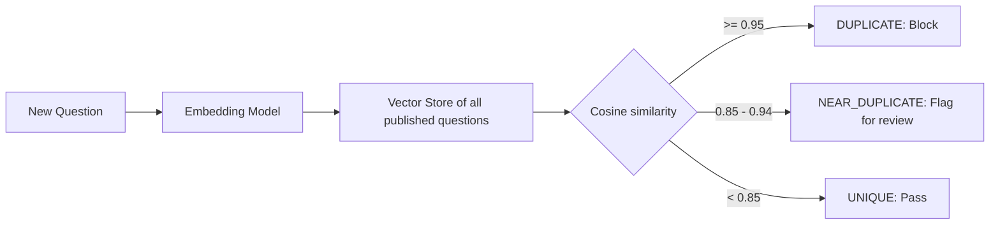

# RA-007 — Content Integrity & Compliance Floor (Floor 07)
## Package C — Certification Pipeline, Correction Engine & Verification Systems

> **Classification:** Reference Architecture
> **Status:** Draft for ARB Review
> **Review:** Architecture Review Board (ARB)
> **Version:** 0.1
> **Owner:** Chief Platform Architect
> **Reviewers:** ARB, AI Safety Engineer, Platform Governance Architect, Distinguished Software Architect
> **Approvers:** Chief Architect, CTO, ARB Chair
> **Confidentiality:** Internal
> **Lifecycle:** Living Document
> **Supersedes:** None
> **Superseded By:** None
> **Maturity:** Concept
> **Document Type:** RA
> **Floor:** 07

---

## Change History

| Version | Date | Author | Summary | Reviewer | Approver |
|---|---|---|---|---|---|
| 0.1 | 2026-07-19 | Architecture Review Board (Panel) | Initial draft — Package C: Certification Pipeline, Correction Engine, Fact Verification, Quiz Verification, Platform Compliance. | ARB | Pending |

---

## Table of Contents

13. Content Certification Pipeline
14. Correction Engine
15. Fact Verification System
16. Quiz Verification System
17. Platform Compliance System

---

## 13. Content Certification Pipeline

> **Viewpoint:** VP-Platform, VP-Developer, VP-Operations
> **Quality Attributes Influenced:**

| Attribute | Rating | Rationale |
|---|---|---|
| Reliability | ★★★★★ | The pipeline is the backbone of every certification; durability is critical. |
| Performance | ★★★★★ | Pipeline latency determines the overall P99 certification time. |
| Governance | ★★★★★ | The pipeline enforces the gate contract at every stage. |
| Observability | ★★★★☆ | Every stage emits telemetry; pipeline state is fully observable. |

> **Why This Exists:**
> | Question | Answer |
> |---|---|
> | Why does this section exist? | To define the complete state machine and sequence of a Content Certification Pipeline from artifact intake to certificate issuance. |
> | What decision does it support? | Pipeline implementation, durable execution substrate selection, and failure recovery design. |
> | Who reads it? | Platform Engineers, SRE Architect, AI Infrastructure Architect. |

### 13.1 Pipeline Philosophy

The Content Certification Pipeline is modeled on a **compiler pipeline with CI/CD quality gates**:

- Each stage is a discrete, auditable pass over the artifact.
- Failures at any stage trigger defined corrective actions, not immediate rejection.
- Every stage result is checkpointed — the pipeline never re-runs passed stages.
- The pipeline is **durable**: it survives worker crashes, cloud reboots, and network partitions.

### 13.2 Pipeline Stages (Complete Sequence)



### 13.3 Pipeline Stages — Detailed Specification

#### Stage 1: Intake Gate

| Property | Value |
|---|---|
| **Purpose** | First defensive layer. Validates that the artifact is well-formed and registerable before entering the pipeline. |
| **Checks** | Schema validation (all required fields present), payload size limits (max 100MB), artifact type validation, duplicate detection (content hash), upstream floor authentication |
| **On pass** | Artifact registered in Artifact Store; workflow initiated; ACK returned to upstream. |
| **On fail** | Synchronous rejection with error code and reason; no pipeline initiated; upstream retries with corrected submission. |
| **Latency** | P99 <= 2 seconds |
| **Idempotency** | Duplicate artifact submissions (same content hash) return existing workflow ID; no duplicate pipeline created. |

#### Stage 2: Pipeline Initialization

| Property | Value |
|---|---|
| **Purpose** | Set up durable pipeline state, load active policy versions, assign worker slots, set SLA deadline. |
| **Actions** | Create pipeline state record, load current policy version for each target platform, set pipeline deadline (intake_time + 150s for P99 budget), assign department worker pools. |
| **Durability** | Pipeline state is checkpointed before department dispatch. A crashed controller can resume from this checkpoint. |
| **Latency** | P99 <= 3 seconds |

#### Stage 3: Parallel Department Execution

| Property | Value |
|---|---|
| **Purpose** | Execute all 11 departments simultaneously to minimize pipeline latency. Departments that are independent of each other run in parallel. |
| **Execution model** | Fan-out: Pipeline Controller dispatches to all departments simultaneously. Results stream back asynchronously as departments complete. |
| **Ordering constraints** | Risk Assessment (Dept. 10) must execute AFTER all other departments. Certification (Dept. 11) must execute AFTER Risk Assessment. |
| **Timeout** | Each department has a maximum execution budget: 60 seconds. Departments that exceed their budget are retried once; if they still fail, the result is TIMEOUT with low confidence, triggering escalation. |
| **Partial results** | If most departments complete and one is slow, the controller does not block. It waits for all departments up to the aggregate timeout. |
| **Checkpoint** | Each department result is checkpointed as it arrives. If the controller crashes mid-execution, recovered pipelines skip completed departments. |

#### Stage 4: Result Aggregation & Failure Identification

| Property | Value |
|---|---|
| **Purpose** | Combine all department results into a unified result set; classify each failure as correctable or uncorrectable. |
| **Correctable failures** | Grammar errors, metadata format violations, SEO improvements, safe wording substitutions, missing chapters, suboptimal title length. |
| **Uncorrectable failures** | Confirmed copyright violation (BLOCKED status), CRITICAL fact hallucination, CRITICAL platform policy violation, Adult content (UNSAFE). |
| **Classification source** | Each rule in the Rule Engine is tagged `auto_fixable: bool`. Correctable failures are those where all violated rules are auto-fixable. |

#### Stage 5: Correction Engine (if needed)

See Section 14 (Correction Engine) for detailed specification.

#### Stage 6: Re-validation

| Property | Value |
|---|---|
| **Purpose** | After correction, re-run only the specific checks that failed. Full re-run of all departments is avoided for cost and latency reasons. |
| **Scope** | Targeted re-check: only the corrected artifact fields are re-submitted to the affected workers. |
| **Maximum correction cycles** | 3 cycles maximum. If failures persist after 3 cycles, escalate to human review. |
| **Checkpoint** | Re-validation results are checkpointed alongside original results. |

#### Stage 7: Risk Assessment

See Section 20 in Package D for detailed specification.

#### Stage 8: Publishing Decision

See Section 22 in Package D for detailed specification.

#### Stage 9: Certificate Issuance or Rejection/Escalation

See Sections 21-23 in Package D for detailed specification.

### 13.4 Pipeline State Machine



### 13.5 Pipeline Durability Model

The pipeline uses a **durable execution substrate** (e.g., Temporal.io or equivalent) to guarantee:

| Guarantee | Mechanism |
|---|---|
| **No artifact loss** | Every pipeline step is journaled before execution |
| **Exactly-once completion** | Workflow engine deduplicates retried tasks |
| **Resume on crash** | Controller resumes from last checkpoint after restart |
| **Timeout enforcement** | Pipeline-level SLA timer enforced by execution engine |
| **Visibility** | All workflow states visible in observability dashboard |

---

## 14. Correction Engine

> **Viewpoint:** VP-Platform, VP-Developer
> **Quality Attributes Influenced:**

| Attribute | Rating | Rationale |
|---|---|---|
| Governance | ★★★★★ | The Correction Engine is the primary mechanism for reducing rejection rates and maximizing publication rates within policy. |
| Performance | ★★★★☆ | Correction adds latency; it must stay within pipeline budget. |
| Cost Efficiency | ★★★★☆ | Automated correction eliminates the human review cost for correctable issues. |

> **Why This Exists:**
> | Question | Answer |
> |---|---|
> | Why does this section exist? | To define the complete architecture of the Correction Engine — the component that auto-repairs correctable failures before a second validation pass. |
> | What decision does it support? | The architecture principle AG-12 (Correction Before Rejection) and business goal BO-05 (Operational Efficiency). |
> | Who reads it? | Platform Engineers, AI Infrastructure Architect, Distinguished Software Architect. |

### 14.1 Correction Engine Philosophy

The Correction Engine is inspired by a **compiler's error recovery** model:

1. It identifies which specific artifact properties caused failures.
2. It applies targeted corrections to those properties only.
3. It does not rewrite the entire artifact (which would invalidate completed validations).
4. It produces a **correction record** documenting every change made and why.
5. All corrections are subject to re-validation.

### 14.2 Correction Domains

| Domain | Correction Types | Technique | Auto-Fixable Rate |
|---|---|---|---|
| **Grammar** | Spelling errors, punctuation, sentence fragments, agreement errors | Grammar correction LLM + rule-based checker | ~95% |
| **Metadata** | Missing fields, format violations, character limit violations | Schema-based regeneration; template fill | ~99% |
| **SEO** | Suboptimal title, missing tags, weak description, missing chapters | SEO improvement LLM with keyword injection | ~80% |
| **Safe wording** | Policy-violating phrases, copyright-adjacent phrases | Safe synonym substitution; platform-safe paraphrase | ~85% |
| **Educational improvements** | Clarity issues, passive constructions, overly complex vocabulary | Readability improvement LLM | ~75% |
| **Fact correction** | Minor factual imprecision where correct value is unambiguous | Fact replacement from verified source | ~60% |
| **Quiz correction** | Wrong answer label, distractor quality, explanation clarity | Quiz regeneration for specific question | ~70% |
| **Prompt regeneration** | If the source prompt is identified as the root cause of the failure | Prompt improvement suggestions (not auto-applied to content; fed back to upstream) | N/A (advisory) |
| **Script rewriting** | Passages that are uncorrectable at the field level | Targeted passage rewrite; must pass re-validation | ~50% |
| **Platform-safe wording** | Terms flagged by platform compliance rules | Terminology substitution from approved vocabulary | ~90% |
| **Copyright-safe wording** | Verbatim or near-verbatim copyrighted phrases | Paraphrase + rephrase with attribution check | ~80% |

### 14.3 Correction Engine Architecture



### 14.4 Correction Record Schema

Every correction made by the Correction Engine is documented in a Correction Record:

```
CorrectionRecord {
    correction_id:       UUID
    artifact_id:         UUID
    pipeline_run_id:     UUID
    correction_cycle:    integer (1-3)
    timestamp:           ISO8601
    corrections: [
        {
            field_path:          string   // e.g., "metadata.title"
            original_value:      string
            corrected_value:     string
            correction_domain:   enum
            correction_reason:   string   // human-readable
            rule_violated:       rule_id
            confidence:          float    // confidence this correction is valid
            correction_engine:   string   // which sub-engine applied this
            model_used:          string   // if LLM was used
        }
    ]
    overall_confidence:  float
    requires_human_review: bool
}
```

### 14.5 Correction Engine Limits

| Limit | Value | Rationale |
|---|---|---|
| Maximum correction cycles | 3 | Prevents infinite correction loops |
| Maximum fields corrected per cycle | 20 | Prevents over-correction that invalidates prior validations |
| Maximum script rewrite length | 30% of original | Rewrites > 30% create a fundamentally new artifact requiring full re-validation |
| Minimum correction confidence | 0.75 | Corrections below 0.75 confidence are flagged for human review rather than auto-applied |
| Fact corrections | Only applied when source confidence >= 0.95 | Avoids replacing one error with another |

---

## 15. Fact Verification System

> **Viewpoint:** VP-Platform, VP-AI, VP-Security
> **Quality Attributes Influenced:**

| Attribute | Rating | Rationale |
|---|---|---|
| Reliability | ★★★★★ | Fact accuracy is the core educational promise of FactoryOS. |
| Governance | ★★★★★ | Fact failures are the most consequential quality failures. |
| Performance | ★★★★☆ | Fact verification must complete within department budget (60s). |

> **Why This Exists:**
> | Question | Answer |
> |---|---|
> | Why does this section exist? | To design the complete Fact Verification System as an independent, multi-source, confidence-scored verification platform. |
> | What decision does it support? | How factual accuracy is achieved at scale without human review of every claim. |
> | Who reads it? | AI Safety Engineer, AI Infrastructure Architect, Knowledge Graph Architect. |

### 15.1 Subject Domains Supported

| Domain | Primary Sources | Secondary Sources |
|---|---|---|
| **Science** | arXiv, PubMed, NIST, Wikipedia | WolframAlpha, Britannica |
| **Programming** | MDN, official language docs, Stack Overflow accepted answers | GitHub README corpus, official changelogs |
| **History** | Wikipedia, Britannica, academic history databases | Wikidata, Library of Congress metadata |
| **Mathematics** | WolframAlpha, Wolfram MathWorld, OEIS | Wikipedia, academic math papers |
| **Medicine** | PubMed, CDC, WHO, MedlinePlus | Mayo Clinic, WebMD (secondary only) |
| **Finance** | SEC EDGAR, Federal Reserve, FRED, Investopedia (secondary) | Bloomberg snippets (if licensed) |
| **Geography** | Wikidata, Wikipedia, UN statistics | CIA World Factbook, GeoNames |
| **Technology** | Official vendor documentation, Wikipedia, IEEE Xplore | Tech news corpora (recency signals) |
| **General Knowledge** | Wikipedia, Wikidata | Britannica, Google Knowledge Graph API |

### 15.2 Confidence Scoring Model

Confidence is computed as a weighted function of:

| Signal | Weight | Description |
|---|---|---|
| **Source agreement rate** | 0.35 | What fraction of queried sources agree with the claim? |
| **Source credibility score** | 0.25 | How authoritative are the agreeing sources? (Peer-reviewed = 1.0; Wikipedia = 0.7; news = 0.4) |
| **Evidence specificity** | 0.20 | Does the source specifically state the claim, or is agreement inferred? |
| **Source recency** | 0.10 | For time-sensitive claims (technology, medicine, finance): how recent is the source? |
| **Claim verifiability** | 0.10 | Is the claim objectively verifiable, or is it a matter of opinion/interpretation? |

**Formula:**
```
confidence = (source_agreement_rate * 0.35) +
             (avg_source_credibility * 0.25) +
             (evidence_specificity * 0.20) +
             (source_recency_score * 0.10) +
             (claim_verifiability * 0.10)
```

**Confidence thresholds:**

| Confidence | Status | Action |
|---|---|---|
| >= 0.92 | VERIFIED | Pass |
| 0.85 - 0.91 | VERIFIED (low confidence) | Pass with advisory; flagged for review if content is high-stakes |
| 0.70 - 0.84 | UNVERIFIED | Trigger Correction Engine (fact correction attempt) |
| 0.50 - 0.69 | CONFLICTED | Escalate to human review |
| < 0.50 | HALLUCINATED | Block; escalate to human review; trigger upstream feedback |

### 15.3 Conflict Resolution

When multiple authoritative sources disagree about a claim:



### 15.4 Hallucination Detection Strategy

Hallucinations are a distinct failure mode from factual inaccuracy. A hallucination is a claim that is **confidently stated** in the artifact but has **no verifiable basis** in any authoritative source.

| Detection Strategy | Description |
|---|---|
| **Zero-source detection** | Claim returns no results from any source query → presumed hallucination |
| **Confidence deflation** | Source synthesis LLM trained to be calibrated; overconfident summaries of weak evidence are detected |
| **Entity grounding** | Named entities (people, places, organizations) are grounded against entity databases; unresolvable entities flagged |
| **Temporal anchoring** | Claims about specific dates/events are verified against historical records |
| **Cross-model disagreement** | Same claim submitted to two independent models; disagreement signals potential hallucination |
| **Known hallucination pattern detection** | Regex and embedding patterns known to correlate with LLM hallucination (e.g., fictional citations, non-existent books) |

---

## 16. Quiz Verification System

> **Viewpoint:** VP-Platform, VP-AI
> **Quality Attributes Influenced:**

| Attribute | Rating | Rationale |
|---|---|---|
| Governance | ★★★★★ | Incorrect quiz answers are an educational failure; the system must catch them. |
| Reliability | ★★★★★ | Multi-model solving and consensus ensure high reliability. |

> **Why This Exists:**
> | Question | Answer |
> |---|---|
> | Why does this section exist? | To define how the Quiz Verification System independently validates every quiz question produced by FactoryOS. |
> | What decision does it support? | How to achieve quiz accuracy without human review of every question at scale. |
> | Who reads it? | AI Safety Engineer, AI Infrastructure Architect, Distinguished Software Architect. |

### 16.1 Independent Solving

The Quiz Verification System treats each quiz question as an **exam problem** submitted to independent solvers.

**Design principle:** No solver may see the artifact's stated correct answer before solving.

```mermaid
sequenceDiagram
    participant CTRL as Pipeline Controller
    participant QS as QuizSolver
    participant MA as Model A (e.g., GPT-4o)
    participant MB as Model B (e.g., Claude 3.5)
    participant MC as Model C (Tiebreaker)
    participant KB as Knowledge Base

    CTRL->>QS: Question (without stated answer)
    QS->>MA: Solve independently
    QS->>MB: Solve independently
    par
        MA-->>QS: Answer A + rationale
        MB-->>QS: Answer B + rationale
    end

    QS->>QS: Compare answers
    alt A == B
        QS->>QS: Compare against artifact's stated answer
        alt Both == stated answer
            QS-->>CTRL: PASS (high confidence)
        else Both != stated answer
            QS-->>CTRL: INCORRECT (artifact answer wrong)
        end
    else A != B (disagreement)
        QS->>MC: Tiebreaker solve
        MC-->>QS: Answer C + rationale
        QS->>KB: Cross-reference correct answer
        QS-->>CTRL: Result with lower confidence; flag for review
    end
```

### 16.2 Distractor Validation

A well-formed multiple-choice question must have distractors (wrong answers) that are:

| Criterion | Requirement |
|---|---|
| **Plausible** | Distractors should be believable to a learner who doesn't know the answer |
| **Incorrect** | Distractors must be definitively wrong (no partial credit ambiguity) |
| **Non-trivial** | Distractors should not be obviously wrong to any reasonably informed person |
| **Distinct** | Distractors should not overlap semantically with each other or the correct answer |
| **Domain-appropriate** | Distractors should be from the same domain as the correct answer |

**Distractor validation workers:**
- DistractorValidator: checks each distractor for the above criteria using a combination of LLM evaluation and knowledge base grounding.
- AmbiguityDetector: submits the question to multiple models without context to detect if more than one option could be reasonably argued as correct.

### 16.3 Bloom's Taxonomy Classification

Every quiz question is classified against Bloom's Taxonomy to ensure educational depth diversity:

| Level | Label | Description | Example indicator phrases |
|---|---|---|---|
| 1 | **Remember** | Recall of facts | "What is...", "Name the...", "List..." |
| 2 | **Understand** | Comprehension | "Explain...", "Describe...", "Summarize..." |
| 3 | **Apply** | Use knowledge in new situation | "Calculate...", "Solve...", "Use..." |
| 4 | **Analyze** | Break into parts, identify relationships | "Compare...", "Differentiate...", "Examine..." |
| 5 | **Evaluate** | Make judgments, defend positions | "Assess...", "Justify...", "Critique..." |
| 6 | **Create** | Produce something new | "Design...", "Formulate...", "Construct..." |

**Quality requirement:** A quiz set should not consist entirely of Level 1 questions. The system scores quiz sets for Bloom's depth distribution and flags single-level-dominated sets.

### 16.4 Difficulty Estimation

Difficulty is estimated using:

| Method | Description |
|---|---|
| **Model confidence** | How confident was the solving model? Low confidence = harder question |
| **Distractor quality score** | High-quality distractors typically indicate higher difficulty |
| **Vocabulary complexity** | Flesch-Kincaid grade level of question text |
| **Domain depth** | Questions requiring deep domain knowledge are harder |
| **Historical calibration** | If similar questions have been published before, use engagement/answer data |

**Output:** Difficulty label: BEGINNER / INTERMEDIATE / ADVANCED / EXPERT

### 16.5 Duplicate Detection



### 16.6 Educational Value Scoring

Each question is scored for educational value:

| Dimension | Weight |
|---|---|
| Bloom's Level (higher = more valuable) | 30% |
| Distractor quality | 25% |
| Explanation quality | 20% |
| Curriculum alignment | 15% |
| Difficulty appropriateness | 10% |

**Minimum educational value score:** 0.65 to pass.

---

## 17. Platform Compliance System

> **Viewpoint:** VP-Platform, VP-Developer, VP-Security
> **Quality Attributes Influenced:**

| Attribute | Rating | Rationale |
|---|---|---|
| Governance | ★★★★★ | Platform compliance determines whether content stays published. |
| Evolvability | ★★★★★ | Platform abstraction enables new platforms without code changes. |
| Reliability | ★★★★★ | Compliance failures have immediate operational consequences. |

> **Why This Exists:**
> | Question | Answer |
> |---|---|
> | Why does this section exist? | To design the Platform Compliance System that checks every artifact against every target platform's policies, with a pluggable, versioned architecture. |
> | What decision does it support? | How to achieve multi-platform compliance without hardcoding any platform's rules. |
> | Who reads it? | Platform Governance Architect, Distinguished Software Architect, SRE Architect. |

### 17.1 Policy Abstraction Layer

The fundamental design principle of the Platform Compliance System is **policy abstraction**: no platform's rules are hardcoded in worker code. All rules live in the Policy Intelligence System (Section 12).

```mermaid
classDiagram
    class PlatformProfile {
        +platform_id: string
        +display_name: string
        +supported_content_types: ContentType[]
        +active_policy_version: string
        +rule_sets: RuleSetReference[]
        +metadata_schema: MetadataSchema
        +thumbnail_spec: ThumbnailSpec
    }

    class RuleSet {
        +ruleset_id: string
        +platform_id: string
        +version: string
        +rules: Rule[]
        +effective_date: datetime
        +deprecated_date: datetime
    }

    class Rule {
        +rule_id: string
        +rule_name: string
        +rule_type: DETERMINISTIC|REGEX|SEMANTIC|CONDITIONAL
        +evaluation_strategy: string
        +severity: LOW|MEDIUM|HIGH|CRITICAL
        +auto_fixable: bool
        +parameters: object
        +parent_rule_id: string
    }

    class PlatformProfile --> RuleSet
    class RuleSet --> Rule
    class Rule --> Rule : inherits_from (parent_rule_id)
```

### 17.2 Versioning

Every platform profile and every rule set carries a semantic version:

| Field | Format | Example |
|---|---|---|
| Policy version | `{platform}-{major}.{minor}.{patch}` | `youtube-14.2.1` |
| Effective date | ISO8601 | `2026-07-15T00:00:00Z` |
| Deprecated date | ISO8601 or null | null (still active) |

**Versioning guarantees:**
- Every certification result records the exact policy version used.
- In-flight pipelines are not disrupted by policy version changes (they use the version pinned at pipeline start).
- Any certification decision can be re-evaluated against a historical policy version for audit.

### 17.3 Rule Inheritance

The rule system supports **inheritance** to prevent duplication across platforms:

```
BaseContentPolicy (abstract)
├── VideoContentPolicy (abstract: inherits BaseContentPolicy)
│   ├── YouTubeVideoPolicy (extends VideoContentPolicy)
│   ├── TikTokVideoPolicy (extends VideoContentPolicy)
│   └── InstagramReelPolicy (extends VideoContentPolicy)
├── ShortFormContentPolicy (abstract: inherits VideoContentPolicy)
│   ├── YouTubeShortsPolicy (extends ShortFormContentPolicy)
│   └── TikTokShortsPolicy (extends ShortFormContentPolicy)
└── ProfessionalContentPolicy (abstract: inherits BaseContentPolicy)
    └── LinkedInVideoPolicy (extends ProfessionalContentPolicy)
```

**Inheritance behavior:**
- A rule defined in a parent policy is automatically inherited by all children.
- A child policy may override a parent rule with a stricter (but not more permissive) version.
- Rule Engine resolves inheritance at rule evaluation time; workers see the flattened effective rule set.

### 17.4 Platform Profiles

#### YouTube Profile

| Field | Value |
|---|---|
| **Content types** | Standard Video, YouTube Shorts, YouTube Live |
| **Key policies** | Community Guidelines, Advertiser-Friendly Content Guidelines, Spam & Deceptive Practices Policy, Copyright Policy, Monetization Policy |
| **Critical rules** | No violent/graphic content; no misleading metadata; no repetitive/unoriginal content; no made-for-kids misclassification; no medical misinformation; no age-restricted content without proper labeling |
| **Metadata constraints** | Title: <= 100 chars; Description: <= 5000 chars; Tags: <= 500 chars total, up to 500 individual tags; Chapters: >= 3 segments, minimum 10s each |
| **Thumbnail constraints** | No clickbait thumbnails (policy: "misleading thumbnails"); no adult content; minimum resolution 1280x720; max file size 2MB |
| **Compliance gate level** | CRITICAL — YouTube is the primary distribution platform |

#### TikTok Profile

| Field | Value |
|---|---|
| **Content types** | TikTok Short Video, TikTok LIVE |
| **Key policies** | Community Guidelines, Advertising Policies, Intellectual Property Policy |
| **Critical rules** | No dangerous activities; no misleading content; no adult content without restricted mode; no coordinated inauthentic behavior |
| **Metadata constraints** | Caption: <= 2200 chars; Hashtags: <= 30 |
| **Compliance gate level** | HIGH |

#### Instagram Profile

| Field | Value |
|---|---|
| **Content types** | Reels, IGTV, Stories |
| **Key policies** | Community Guidelines, Branded Content Policy, Intellectual Property |
| **Critical rules** | No nudity; no graphic violence; no hate speech; no misinformation |
| **Compliance gate level** | HIGH |

#### LinkedIn Profile

| Field | Value |
|---|---|
| **Content types** | LinkedIn Video, LinkedIn Articles |
| **Key policies** | Professional Community Policies, Advertising Policies |
| **Critical rules** | Professional tone required; no defamatory content; no spam |
| **Compliance gate level** | MEDIUM |

#### Facebook Profile

| Field | Value |
|---|---|
| **Content types** | Facebook Watch, Facebook Reels |
| **Key policies** | Community Standards, Monetization Policies |
| **Critical rules** | No hate speech; no violence; no misinformation |
| **Compliance gate level** | HIGH |

#### X (Twitter) Profile

| Field | Value |
|---|---|
| **Content types** | X Video, X Posts with media |
| **Key policies** | Rules and Policies, Sensitive Media Policy |
| **Critical rules** | No graphic violence; no hateful conduct; no synthetic media without disclosure |
| **Compliance gate level** | MEDIUM |

### 17.5 Future Platform Onboarding

New platforms can be added in <= 2 weeks (QA-MAINT-02) without code changes:

| Step | Description | Effort |
|---|---|---|
| 1. Platform Policy Crawl | Add new platform's policy pages to Policy Crawler targets | 4 hours |
| 2. Policy Parse & Compile | Policy Parser and Rule Compiler process new platform's policy | 1-2 days |
| 3. Platform Profile Creation | Create PlatformProfile record in Policy KB | 4 hours |
| 4. Rule Inheritance Mapping | Map new platform's rules to existing base policies where applicable | 1-2 days |
| 5. Regression Test Suite | Write test cases for new platform's unique rules | 2-3 days |
| 6. Deployment Gate | Regression tests pass; human sign-off | 1 day |
| 7. Activation | New platform profile activated; workers automatically begin checking against it | 2 hours |

---

## Package C — End

**Previous:** Package B — Floor Architecture, Departments, Workers & Policy Intelligence
**Next:** Package D — Advertiser Safety, Originality Engine, Risk Assessment, Content Certificate, Publishing Decision Engine, Human Review System

---

*Document: RA-007, Package C — Certification Pipeline, Correction Engine & Verification Systems*
*FactoryOS Architecture Knowledge Base*
*Classification: Reference Architecture | Status: Draft for ARB Review | Version: 0.1*
