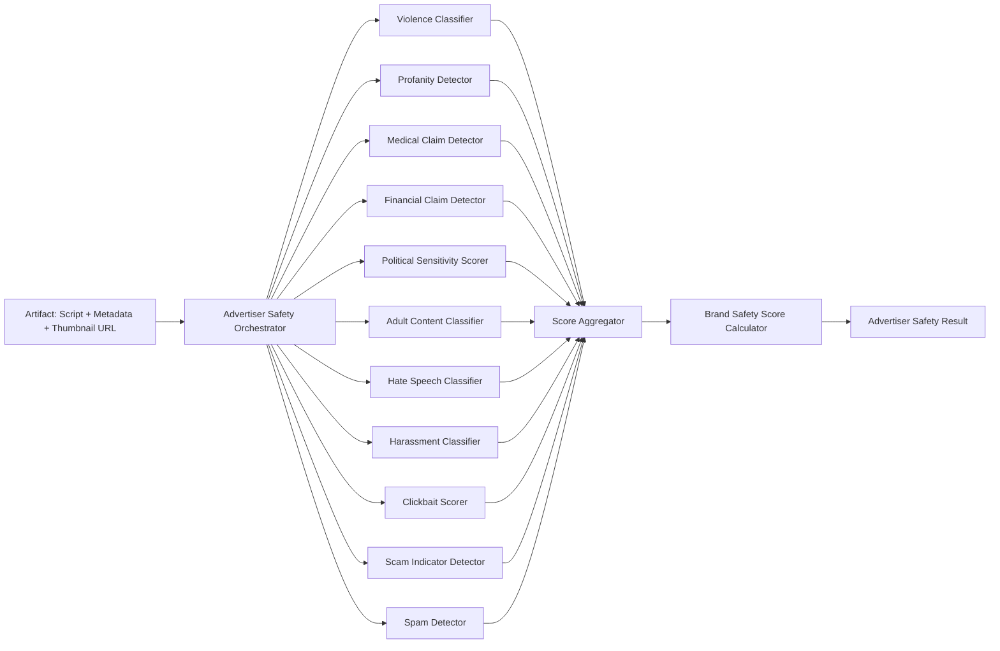
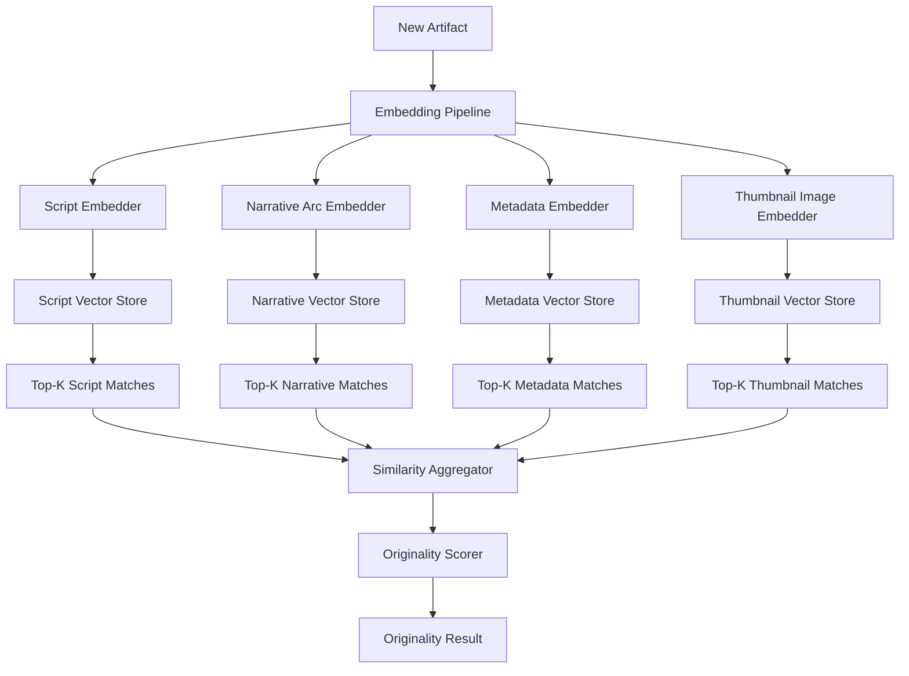
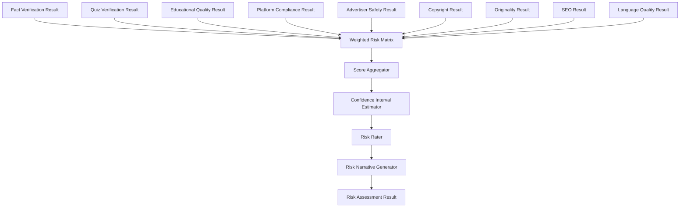
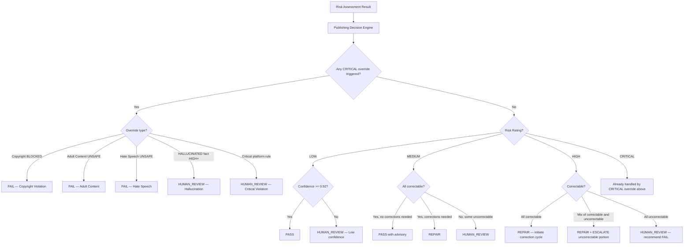
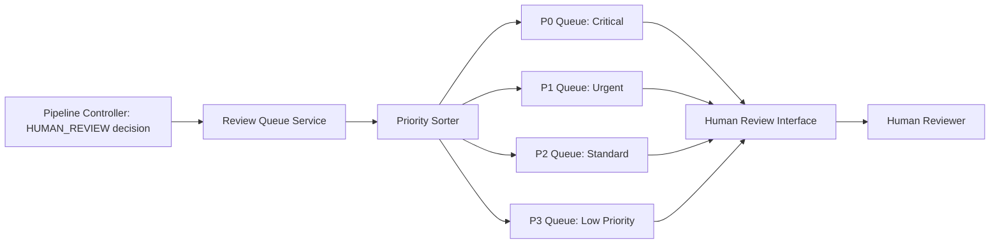

# RA-007 — Content Integrity & Compliance Floor (Floor 07)
## Package D — Advertiser Safety, Originality, Risk, Certificates & Human Review

> **Classification:** Reference Architecture
> **Status:** Draft for ARB Review
> **Review:** Architecture Review Board (ARB)
> **Version:** 0.1
> **Owner:** Chief Platform Architect
> **Reviewers:** ARB, AI Safety Engineer, Platform Governance Architect, Security Architect, Distinguished Software Architect
> **Approvers:** Chief Architect, CTO, ARB Chair
> **Confidentiality:** Internal
> **Lifecycle:** Living Document
> **Supersedes:** None
> **Superseded By:** None
> **Maturity:** Concept
> **Document Type:** RA
> **Floor:** 07

---

## Change History

| Version | Date | Author | Summary | Reviewer | Approver |
|---|---|---|---|---|---|
| 0.1 | 2026-07-19 | Architecture Review Board (Panel) | Initial draft — Package D: Advertiser Safety, Originality Engine, Risk Assessment, Content Certificate, Publishing Decision Engine, Human Review System. | ARB | Pending |

---

## Table of Contents

18. Advertiser Safety System
19. Originality Engine
20. Risk Assessment Engine
21. Content Certificate
22. Publishing Decision Engine
23. Human Review System

---

## 18. Advertiser Safety System

> **Viewpoint:** VP-Platform, VP-Security, VP-Executive
> **Quality Attributes Influenced:**

| Attribute | Rating | Rationale |
|---|---|---|
| Governance | ★★★★★ | Advertiser safety directly determines commercial viability. |
| Reliability | ★★★★★ | A missed unsafe signal destroys commercial relationships. |
| Security | ★★★★☆ | Sensitive content detection is a reputational and legal security concern. |

> **Why This Exists:**
> | Question | Answer |
> |---|---|
> | Why does this section exist? | To design a complete Advertiser Safety system that comprehensively detects all content categories that disqualify content from advertiser support. |
> | What decision does it support? | How to achieve consistent advertiser safety at scale without reviewing every video manually. |
> | Who reads it? | Platform Governance Architect, AI Safety Engineer, Chief Platform Architect. |

### 18.1 Detection Categories

| Category | ID | Severity | Description |
|---|---|---|---|
| **Violence** | AS-01 | CRITICAL | Graphic violence, blood, injury, death. Includes scripted depictions that appear realistic. |
| **Profanity** | AS-02 | HIGH | Explicit language, slurs, offensive terms. |
| **Medical claims** | AS-03 | HIGH | Unverified medical advice, miracle cure claims, vaccine misinformation, dosage recommendations. |
| **Financial claims** | AS-04 | HIGH | Get-rich-quick claims, unverified investment advice, guaranteed returns. |
| **Political sensitivity** | AS-05 | MEDIUM | Electoral content, partisan political content, political advertising. |
| **Adult content** | AS-06 | CRITICAL | Sexual content, nudity, suggestive material. |
| **Hate speech** | AS-07 | CRITICAL | Content targeting groups based on protected characteristics. |
| **Harassment** | AS-08 | HIGH | Personal attacks, doxxing, targeted harassment. |
| **Clickbait** | AS-09 | MEDIUM | Misleading titles/thumbnails, sensationalized claims that are not delivered in content. |
| **Spam** | AS-10 | MEDIUM | Repetitive content, artificial engagement signals, coordinated inauthentic behavior. |
| **Scam indicators** | AS-11 | HIGH | Phishing signals, too-good-to-be-true offers, impersonation of legitimate entities. |
| **Controversial topics** | AS-12 | LOW-MEDIUM | Drugs (non-educational), weapons (non-educational), extreme sports with safety risks. |

### 18.2 Brand Safety Scoring Model

The Brand Safety Score is a **composite weighted score** across all categories:

```
BrandSafetyScore = 1.0 - weighted_penalty_sum

Where weighted_penalty_sum =
    (Violence_score * 0.25) +
    (Adult_content_score * 0.25) +
    (Hate_speech_score * 0.20) +
    (Harassment_score * 0.10) +
    (Medical_claims_score * 0.05) +
    (Financial_claims_score * 0.05) +
    (Scam_indicators_score * 0.05) +
    (Political_sensitivity_score * 0.03) +
    (Profanity_score * 0.02) +
    (sum(other categories) * 0.00) [remaining weight distributed]
```

**Score thresholds:**

| Score | Classification | Action |
|---|---|---|
| >= 0.95 | BRAND_SAFE | Pass without restriction |
| 0.80 - 0.94 | LIMITED_ADS | Pass with limitation advisory; some ad categories may not run |
| 0.60 - 0.79 | REVIEW_REQUIRED | Escalate to human review before passing |
| < 0.60 | UNSAFE | Block; do not certify |

### 18.3 Detection Architecture



### 18.4 Detection Techniques by Category

| Category | Primary Technique | Secondary Technique |
|---|---|---|
| Violence | Multimodal classifier (text + image) | LLM zero-shot evaluation |
| Profanity | Lexicon-based detection | LLM context-aware evaluation |
| Medical claims | Claim extraction + medical claim classifier | Regulatory phrase detection (FDA, WHO prohibited phrases) |
| Financial claims | Claim extraction + financial claim classifier | Regulatory phrase detection (SEC prohibited phrases) |
| Political sensitivity | LLM classification + entity detection | Keyword patterns + entity lists |
| Adult content | Image classifier + text classifier | LLM zero-shot |
| Hate speech | Fine-tuned hate speech model | LLM with constitutional AI |
| Harassment | LLM classification + target entity detection | Regex patterns |
| Clickbait | Title-content alignment score + sensationalism classifier | Engagement bait pattern detection |
| Scam indicators | Scam phrase lexicon + LLM evaluation | Domain reputation check |
| Spam | Content uniqueness check + repetition score | Publishing pattern analysis |

### 18.5 Evidence Fragments

Every detection produces evidence fragments — the specific text, timestamps, or image regions that triggered the detection. These are:
- Stored in the certification result.
- Included in the Content Certificate (summary).
- Presented to human reviewers on escalation.
- Included in rejection notifications to upstream floors.

---

## 19. Originality Engine

> **Viewpoint:** VP-Platform, VP-Developer
> **Quality Attributes Influenced:**

| Attribute | Rating | Rationale |
|---|---|---|
| Governance | ★★★★☆ | Originality protects channel health and avoids algorithmic suppression. |
| Scalability | ★★★★☆ | Similarity search across millions of published artifacts requires efficient vector search. |

> **Why This Exists:**
> | Question | Answer |
> |---|---|
> | Why does this section exist? | To design an Originality Engine that measures content uniqueness across all production dimensions and protects channel health. |
> | What decision does it support? | How to prevent channel-wide repetitiveness without manual review of every video. |
> | Who reads it? | Distinguished Software Architect, Knowledge Graph Architect, AI Infrastructure Architect. |

### 19.1 Originality Dimensions

| Dimension | Measurement | Technique |
|---|---|---|
| **Script similarity** | How similar is the script to previously published scripts? | Embedding cosine similarity against script vector store |
| **Narrative similarity** | Does the video follow the same narrative arc/structure as previous videos? | Narrative arc embedding; structural template matching |
| **Template similarity** | Is this video built on the same structural template as recent videos? | Template fingerprinting; template registry lookup |
| **Metadata similarity** | Are the title, description, and tags too similar to recent publications? | Text embedding similarity of metadata fields |
| **Thumbnail similarity** | Is the thumbnail composition too similar to recent thumbnails? | Image embedding similarity (CLIP or equivalent) |
| **Publishing diversity** | Is this video being published too close in time/topic to similar videos? | Temporal clustering analysis |
| **Repeated structures** | Are the same hooks, transitions, CTAs being overused? | Pattern detection in script structure |
| **Channel-wide uniqueness** | Is this video sufficiently distinct from the full published catalog? | Full-catalog vector search |

### 19.2 Originality Scoring

```
OriginalityScore = 1.0 - max_similarity_across_dimensions

Where max_similarity = maximum of:
    (script_cosine_similarity)
    (narrative_similarity_score)
    (template_similarity_score)
    (metadata_similarity_score * 0.5)    [lower weight; metadata naturally repeats]
    (thumbnail_similarity_score)
```

**Thresholds:**

| Score | Classification | Action |
|---|---|---|
| >= 0.75 | HIGHLY_ORIGINAL | Pass |
| 0.60 - 0.74 | SUFFICIENTLY_ORIGINAL | Pass with advisory |
| 0.40 - 0.59 | LOW_ORIGINALITY | Trigger Correction Engine (title/metadata diversification); advisory to upstream |
| < 0.40 | DUPLICATE_RISK | Block if above 0.90 similarity to any single artifact; otherwise escalate |

### 19.3 Similarity Detection Architecture



### 19.4 Publishing Diversity Analysis

The Originality Engine also monitors **publishing patterns** across the channel:

| Signal | Description | Threshold |
|---|---|---|
| **Topic concentration** | Are too many videos on the same narrow topic? | > 3 videos on same sub-topic in same 7-day window = flag |
| **Format repetition** | Is the same video format (quiz, explainer, top-5) dominating? | > 60% of last 20 videos in same format = advisory |
| **Keyword saturation** | Are the same keywords appearing in every title? | > 70% keyword overlap in title across 10 consecutive videos = advisory |

---

## 20. Risk Assessment Engine

> **Viewpoint:** VP-Platform, VP-Executive, VP-Operations
> **Quality Attributes Influenced:**

| Attribute | Rating | Rationale |
|---|---|---|
| Governance | ★★★★★ | Risk Assessment produces the single decision signal that drives publishing. |
| Reliability | ★★★★★ | Risk miscalculation leads to either over-blocking (revenue loss) or under-blocking (compliance failure). |

> **Why This Exists:**
> | Question | Answer |
> |---|---|
> | Why does this section exist? | To define how all department scores are aggregated into a single, actionable risk rating with a clear, auditable rationale. |
> | What decision does it support? | The publishing decision (PASS/FAIL/REPAIR/ESCALATE/HUMAN_REVIEW). |
> | Who reads it? | Chief Platform Architect, Platform Governance Architect, SRE Architect. |

### 20.1 Risk Rating Scale

| Rating | Meaning | Typical Action |
|---|---|---|
| **LOW** | All departments pass; scores well above thresholds; high aggregate confidence. | PASS |
| **MEDIUM** | All departments pass; some scores near thresholds; some low-confidence results. | PASS with advisory; may trigger SEO/Correction improvements |
| **HIGH** | One or more departments fail; correctable failures present; or aggregate confidence < 0.80. | REPAIR (if correctable) or HUMAN_REVIEW |
| **CRITICAL** | Critical department failure (copyright BLOCKED, Adult content UNSAFE, HALLUCINATED fact); or uncorrectable failure. | FAIL or HUMAN_REVIEW (with recommendation to FAIL) |

### 20.2 Risk Aggregation Model



### 20.3 Department Weights in Risk Aggregation

| Department | Weight | Rationale |
|---|---|---|
| Platform Compliance | 0.25 | Compliance failures have immediate operational impact. |
| Advertiser Safety | 0.20 | Advertiser safety failures destroy commercial viability. |
| Fact Verification | 0.20 | Factual errors are the core educational failure. |
| Copyright | 0.15 | Copyright violations have legal consequences. |
| Quiz Verification | 0.10 | Quiz errors are a specific educational trust failure. |
| Originality | 0.05 | Originality affects channel health over time. |
| Educational Quality | 0.02 | Important but less immediately consequential. |
| Language Quality | 0.01 | Primarily correctable; low operational impact. |
| SEO | 0.01 | Advisory only; not a compliance concern. |
| Risk Assessment (self) | 0.01 | Aggregate confidence signal. |

### 20.4 CRITICAL Override Logic

**Any of the following conditions independently escalates the risk rating to CRITICAL, regardless of other scores:**

| Condition | Rationale |
|---|---|
| Copyright status = BLOCKED | Legal consequence is immediate and severe. |
| Advertiser Safety: Adult Content = UNSAFE | Platform consequence is immediate removal. |
| Advertiser Safety: Hate Speech = UNSAFE | Platform consequence and reputational damage. |
| Fact Verification: any claim = HALLUCINATED with severity >= HIGH | Educational harm to potentially millions of learners. |
| Platform Compliance: any rule with severity = CRITICAL violated | Account strike risk. |

### 20.5 Confidence Interval Estimation

Risk assessment outputs are accompanied by a **confidence interval** that reflects the uncertainty in the risk rating:

| Confidence Range | Meaning | Impact on Decision |
|---|---|---|
| >= 0.92 | High confidence — rating is reliable | Decision proceeds automatically |
| 0.80 - 0.91 | Medium confidence — rating is mostly reliable | Decision proceeds; advisory added to certificate |
| 0.60 - 0.79 | Low confidence — rating may be wrong | Escalate to HUMAN_REVIEW regardless of rating |
| < 0.60 | Very low confidence — rating is unreliable | Always HUMAN_REVIEW |

### 20.6 Risk Narrative

The Risk Narrative Generator produces a human-readable summary of the risk assessment:

```
RiskNarrative {
    risk_rating: "HIGH"
    confidence: 0.87
    summary: "Content has 2 correctable platform compliance violations
              (YouTube title length; missing chapters) and 1 low-confidence
              fact claim requiring manual review. Brand Safety Score is 0.83
              (LIMITED_ADS band). Originality score is 0.72 (sufficient).
              No CRITICAL overrides triggered."
    primary_risk_factor: "Platform compliance violations"
    correctable_issues: ["title_length", "missing_chapters"]
    uncorrectable_issues: []
    review_required_issues: ["fact_claim_id_002"]
    recommended_action: "REPAIR (auto-correct title and chapters; review fact claim)"
}
```

### 20.7 Risk Trade-off Transparency

The Risk Assessment Engine is **opinionated but transparent**:

| Trade-off | Decision | Rationale |
|---|---|---|
| Over-blocking vs. under-blocking | Prefer over-blocking for CRITICAL categories | Legal and reputational cost of under-blocking exceeds the cost of over-blocking. |
| Speed vs. accuracy | Accuracy wins for HIGH/CRITICAL; speed acceptable for LOW/MEDIUM | The cost of a fast wrong decision on critical content is unacceptable. |
| Confidence threshold | 0.92 for auto-PASS; 0.80 for auto-PASS-with-advisory | Conservative thresholds prevent false passes. |

---

## 21. Content Certificate

> **Viewpoint:** VP-Executive, VP-Security, VP-Platform
> **Quality Attributes Influenced:**

| Attribute | Rating | Rationale |
|---|---|---|
| Security | ★★★★★ | The certificate's cryptographic integrity is the trust anchor of the entire system. |
| Governance | ★★★★★ | The certificate is the auditable record of every compliance decision. |
| Reliability | ★★★★★ | Certificate issuance and storage must be infallible. |

> **Why This Exists:**
> | Question | Answer |
> |---|---|
> | Why does this section exist? | To define the Content Certificate — the signed, tamper-evident attestation that an artifact has passed Floor 07. |
> | What decision does it support? | The publishing layer's decision to accept or reject an artifact; the audit layer's ability to reconstruct compliance history. |
> | Who reads it? | Security Architect, Chief Platform Architect, ARB. |

### 21.1 Certificate Schema

```
ContentCertificate {
    // Identity
    certificate_id:          UUID (v4)
    artifact_id:             UUID
    pipeline_run_id:         UUID
    guardian_version:        semver (e.g., "1.4.2")

    // Timestamps
    issued_at:               ISO8601 UTC
    expires_at:              ISO8601 UTC (issued_at + 90 days default)
    revoked_at:              ISO8601 UTC | null

    // Policy Context
    policy_versions: {
        youtube:             "14.2.1"
        tiktok:              "8.1.0"
        instagram:           "5.3.2"
        linkedin:            "3.1.0"
        facebook:            "9.4.1"
        x_twitter:           "2.2.0"
    }

    // Results Summary
    departments_evaluated:   integer (11)
    checks_passed:           integer
    checks_failed_corrected: integer
    checks_failed_uncorrected: integer
    correction_cycles:       integer (0-3)

    // Department Scores
    department_results: {
        fact_verification: {
            status:          PASS|FAIL|PARTIAL
            confidence:      float
            claims_verified: integer
            claims_failed:   integer
        }
        quiz_verification: {
            status:          PASS|FAIL|PARTIAL|SKIPPED
            questions_total: integer
            questions_correct: integer
        }
        educational_quality: {
            status:          PASS|FAIL
            score:           float
            bloom_level_distribution: object
        }
        platform_compliance: {
            youtube:         COMPLIANT|NON_COMPLIANT|MARGINAL
            tiktok:          COMPLIANT|NON_COMPLIANT|MARGINAL|NOT_CHECKED
            instagram:       COMPLIANT|NON_COMPLIANT|MARGINAL|NOT_CHECKED
            linkedin:        COMPLIANT|NON_COMPLIANT|MARGINAL|NOT_CHECKED
            facebook:        COMPLIANT|NON_COMPLIANT|MARGINAL|NOT_CHECKED
            x_twitter:       COMPLIANT|NON_COMPLIANT|MARGINAL|NOT_CHECKED
        }
        advertiser_safety: {
            brand_safety_score: float
            classification: BRAND_SAFE|LIMITED_ADS|REVIEW_REQUIRED|UNSAFE
            category_results: object
        }
        copyright: {
            status:          CLEAR|AT_RISK|BLOCKED
            risk_score:      float
            matches_found:   integer
        }
        originality: {
            score:           float
            classification:  HIGHLY_ORIGINAL|SUFFICIENTLY_ORIGINAL|LOW_ORIGINALITY|DUPLICATE_RISK
            closest_match_artifact_id: UUID | null
        }
        seo: {
            score:           float
            improvements_applied: boolean
        }
        language_quality: {
            score:           float
            corrections_applied: boolean
        }
    }

    // Risk Summary
    risk_rating:             LOW|MEDIUM|HIGH|CRITICAL
    risk_confidence:         float
    risk_narrative:          string (max 500 chars)

    // Publishing Decision
    certification_status:    CERTIFIED|REJECTED|PENDING_HUMAN_REVIEW
    publishing_decision:     PASS|FAIL|HUMAN_REVIEW_REQUIRED
    publishing_restrictions: string[] (e.g., ["youtube:limited_ads", "tiktok:restricted_mode"])
    rejection_reasons:       string[] | null
    human_review: {
        required:            boolean
        reviewer_id:         UUID | null
        reviewed_at:         ISO8601 | null
        override_reason:     string | null
    }

    // Integrity
    payload_hash:            sha256(canonical_json(all fields above))
    signature:               base64(ed25519_sign(payload_hash))
    signing_key_id:          string (identifies which HSM key was used)
    signature_algorithm:     "Ed25519"
}
```

### 21.2 Certificate Lifecycle

```mermaid
stateDiagram-v2
    [*] --> GENERATING : All departments complete; Risk assessed
    GENERATING --> SIGNING : CertificateGenerator creates payload
    SIGNING --> ISSUED : CertificateSigner signs with HSM key
    ISSUED --> DELIVERED : Published to downstream + certificate event
    DELIVERED --> ACTIVE : In use by publishing layer
    ACTIVE --> EXPIRED : expires_at timestamp passed
    ACTIVE --> REVOKED : Revocation triggered (security event, policy recall)
    REVOKED --> [*] : Revocation recorded in Certificate Store
    EXPIRED --> RENEWED : Content re-submitted for re-certification
    RENEWED --> GENERATING : New pipeline initiated
    EXPIRED --> [*] : Content not re-submitted
```



### 21.3 Certificate Verification

Any consumer of a certificate can verify its integrity:

1. Retrieve certificate from Certificate Store (by `certificate_id` or `artifact_id`).
2. Serialize certificate payload to canonical JSON (excluding `signature` and `signing_key_id` fields).
3. Compute SHA-256 hash of canonical JSON.
4. Verify Ed25519 signature against the hash using the public key identified by `signing_key_id`.
5. Verify `expires_at` has not passed.
6. Verify `revoked_at` is null.

If all checks pass: certificate is valid and trustworthy.

### 21.4 Certificate Revocation

Certificates may be revoked for:

| Reason | Trigger | Response Time |
|---|---|---|
| Policy violation discovered post-issuance | External report, automated re-scan | < 60 seconds from trigger |
| Copyright claim received | DMCA notice | < 60 seconds |
| Factual error discovered post-publication | External report | < 5 minutes (human review involved) |
| Security compromise of signing key | Security incident | Immediate; all certificates signed with compromised key revoked in batch |

---

## 22. Publishing Decision Engine

> **Viewpoint:** VP-Platform, VP-Executive
> **Quality Attributes Influenced:**

| Attribute | Rating | Rationale |
|---|---|---|
| Governance | ★★★★★ | The Publishing Decision Engine is the final authority on whether content can leave FactoryOS. |
| Reliability | ★★★★★ | Decision logic must be deterministic, auditable, and consistent. |

> **Why This Exists:**
> | Question | Answer |
> |---|---|
> | Why does this section exist? | To define the complete decision logic of the Publishing Decision Engine, including every possible decision path and its rationale. |
> | What decision does it support? | The PASS / FAIL / REPAIR / ESCALATE / HUMAN_REVIEW decision for every artifact. |
> | Who reads it? | Chief Platform Architect, Platform Governance Architect, all engineers. |

### 22.1 Decision Taxonomy

| Decision | Code | Meaning |
|---|---|---|
| **PASS** | 200 | Artifact meets all requirements; certificate issued; publishing permitted. |
| **FAIL** | 400 | Artifact has uncorrectable violations; certificate denied; publishing blocked. |
| **REPAIR** | 202 | Artifact has correctable violations; Correction Engine applied; re-validation triggered. |
| **ESCALATE** | 300 | Artifact has violations of uncertain severity or ambiguous nature; requires policy engineer review before decision. |
| **HUMAN_REVIEW** | 301 | Artifact requires human reviewer inspection and override decision. |

### 22.2 Decision Flow



### 22.3 Decision Path Specifications

#### PASS Decision

**Conditions:**
- Risk rating = LOW with confidence >= 0.92, OR
- Risk rating = MEDIUM with all failures corrected and re-validation passed, AND
- No CRITICAL override conditions present, AND
- No human review flags outstanding.

**Outcome:** Certificate issued. Publishing permitted. Event dispatched to Floor 08.

**Why this is correct:** An artifact that passes all 11 departments at the required confidence thresholds has met the mission of Floor 07. No additional gatekeeping is appropriate.

#### FAIL Decision

**Conditions:**
- Copyright status = BLOCKED (absolute; no override path for automated systems).
- Adult Content = UNSAFE (absolute; no automated override).
- Hate Speech = UNSAFE (absolute; no automated override).
- Any uncorrectable failure in a CRITICAL severity rule where risk confidence >= 0.80 (high confidence the failure is real).

**Outcome:** No certificate issued. Rejection notification with specific failure reasons dispatched to upstream floor. Artifact cannot be republished without modification.

**Why this is correct:** Some failures are non-negotiable. Publishing copyright-infringing, adult, or hate content would result in immediate legal and platform consequences that no business case can justify.

#### REPAIR Decision

**Conditions:**
- Risk rating = HIGH or MEDIUM, AND
- All failures are tagged `auto_fixable: true`, AND
- Correction cycles remaining > 0.

**Outcome:** Correction Engine invoked. Corrected artifact re-submitted to validation. If re-validation passes: PASS. If re-validation introduces new failures: new REPAIR or HUMAN_REVIEW.

**Why this is correct:** Rejection is expensive (content is discarded; upstream re-runs production). Where correction is safe and automated, it is always preferable to rejection.

#### ESCALATE Decision

**Conditions:**
- Risk rating = HIGH, AND
- Failure is in a policy domain where the rule is newly added or has changed within the last 7 days (policy engineer review warranted), OR
- The failure is ambiguous (two rule interpretations could apply), OR
- Correction cycle 3 completed with failures still present.

**Outcome:** Artifact placed in ESCALATE queue, reviewed by Policy Engineer or Platform Governance Architect. Decision made within 4 hours SLA.

**Why this is correct:** Policy ambiguity should not auto-fail content — the policy may be wrong or mis-parsed. An ESCALATE provides a safety valve that avoids both incorrect publishing and incorrect rejection.

#### HUMAN_REVIEW Decision

**Conditions:**
- Risk confidence < 0.80 (automated system is uncertain), OR
- Risk rating = HIGH with uncorrectable failures, OR
- Hallucinated fact detected (HUMAN_REVIEW preferred over auto-FAIL for educational content), OR
- Content involves sensitive domains (medicine, finance, law) where AI confidence is not sufficient, OR
- Maximum correction cycles exceeded, OR
- Explicit policy exception requested by upstream floor.

**Outcome:** Artifact placed in Human Review Queue. Human reviewer receives full risk assessment, department results, and evidence fragments. Reviewer makes APPROVE / REJECT / REPAIR decision.

**Why this is correct:** Human judgment is irreplaceable for genuinely ambiguous situations. The system is designed to minimize HUMAN_REVIEW occurrences (target <= 2%), but when it occurs, it must be expedient and well-informed.

---

## 23. Human Review System

> **Viewpoint:** VP-Operations, VP-Executive, VP-Security
> **Quality Attributes Influenced:**

| Attribute | Rating | Rationale |
|---|---|---|
| Governance | ★★★★★ | Human overrides are the most consequential governance actions. |
| Security | ★★★★★ | Human overrides must be authenticated, attributed, and immutably logged. |
| Observability | ★★★★☆ | Human review metrics inform system improvement. |

> **Why This Exists:**
> | Question | Answer |
> |---|---|
> | Why does this section exist? | To design a complete Human Review System that is efficient, accountable, and auditable. |
> | What decision does it support? | How to manage the <= 2% of workflows that require human judgment without becoming a bottleneck. |
> | Who reads it? | Platform Governance Architect, SRE Architect, ARB. |

### 23.1 Escalation

| Escalation Source | Priority | SLA |
|---|---|---|
| Risk rating = CRITICAL | P0 | <= 30 minutes |
| Hallucination detected | P1 | <= 1 hour |
| Policy ambiguity (ESCALATE path) | P1 | <= 4 hours |
| Low confidence (< 0.80) | P2 | <= 4 hours |
| Max correction cycles exceeded | P2 | <= 8 hours |
| Reviewer-requested additional review | P3 | <= 24 hours |

### 23.2 Review Queue



**Queue properties:**
- Durable (persisted; survives restarts).
- Priority-ordered.
- Claimed by a single reviewer at a time (prevent duplicate review).
- Unclaimed items auto-escalate after 80% of SLA elapsed.
- All queue operations logged to Audit Log Service.

### 23.3 Review Interface

The Human Review Interface presents the reviewer with:

| Section | Content |
|---|---|
| **Artifact preview** | Embedded video preview, script, metadata, thumbnail |
| **Risk assessment summary** | Risk rating, confidence, risk narrative |
| **Department results** | Per-department result with evidence fragments |
| **Violated rules** | List of rule IDs, rule text, evidence |
| **Correction history** | What corrections were attempted and their results |
| **Policy version** | Active policy version used in assessment |
| **Recommended action** | System recommendation (non-binding) |
| **Decision buttons** | APPROVE / REJECT / REQUEST_REPAIR / ESCALATE_TO_POLICY_ENGINEER |

### 23.4 Override Mechanism

Every human decision is an **override** of the automated system's recommendation:

```
HumanOverrideRecord {
    override_id:           UUID
    pipeline_run_id:       UUID
    artifact_id:           UUID
    reviewer_id:           UUID
    reviewer_role:         "content_reviewer" | "policy_engineer" | "platform_architect"
    review_started_at:     ISO8601
    decision_made_at:      ISO8601
    automated_recommendation: Decision enum
    human_decision:        APPROVE | REJECT | REQUEST_REPAIR | ESCALATE
    override_reason:       string (required; min 50 chars; max 1000 chars)
    policy_exception_granted: bool
    policy_exception_basis: string | null
    reviewed_rules:        rule_id[]
    signature:             base64(ed25519_sign(override_record_hash))
}
```

**Override signing:** Human override records are signed using the reviewer's identity key, producing a non-repudiable attestation. This prevents a reviewer from denying having approved problematic content.

### 23.5 Audit

Every human review action is:
- Logged to the Audit Log Service (append-only, tamper-evident).
- Included in the Content Certificate.
- Included in the monthly Human Review Audit Report.
- Available for reconstruction and replay at any future audit.

### 23.6 Versioning

If platform policies change after a human override decision, the override record retains the policy version that was active at the time of review. The artifact's certificate retains the original override decision; a re-certification may be requested if the policy change affects the override basis.

### 23.7 Appeals

A content producer (upstream floor or human editor) may request an appeal of a FAIL or HUMAN_REVIEW decision:

| Step | Action | SLA |
|---|---|---|
| 1. Appeal submitted | Content producer submits appeal with supplementary evidence | N/A |
| 2. Appeal queued | Appeal enters P2 queue with original review record | N/A |
| 3. Senior review | Senior reviewer (Platform Architect or above) reviews original decision + appeal evidence | <= 24 hours |
| 4. Appeal decision | UPHOLD / OVERTURN | N/A |
| 5. If OVERTURN | New certificate issued; original certificate updated with appeal outcome | N/A |
| 6. Audit | All appeal records logged immutably | Continuous |

---

## Package D — End

**Previous:** Package C — Certification Pipeline, Correction Engine & Verification Systems
**Next:** Package E — Observability, Data Model, APIs, Failure Recovery, Security, Scalability, Future Roadmap, ARB Checklist, Glossary, Cross-References

---

*Document: RA-007, Package D — Advertiser Safety, Originality, Risk, Certificates & Human Review*
*FactoryOS Architecture Knowledge Base*
*Classification: Reference Architecture | Status: Draft for ARB Review | Version: 0.1*
