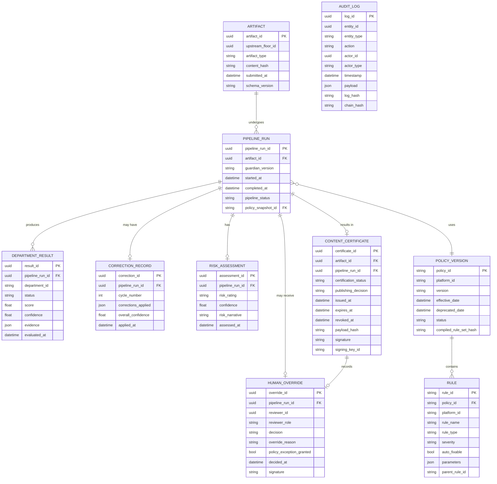
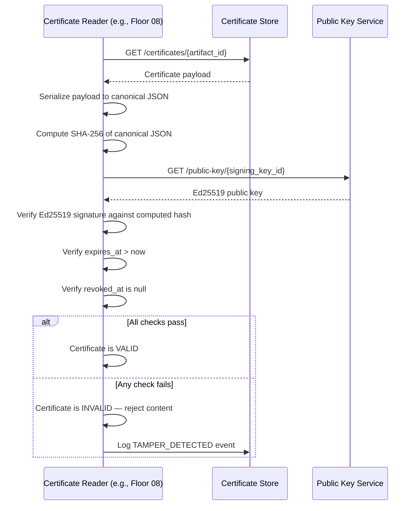
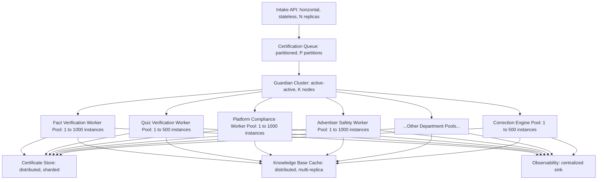

# RA-007 — Content Integrity & Compliance Floor (Floor 07)
## Package E — Observability, Data Model, APIs, Security, Scalability, Roadmap & ARB Review

> **Classification:** Reference Architecture
> **Status:** Draft for ARB Review
> **Review:** Architecture Review Board (ARB)
> **Version:** 0.1
> **Owner:** Chief Platform Architect
> **Reviewers:** ARB, SRE Architect, Security Architect, Knowledge Graph Architect, Technical Writer
> **Approvers:** Chief Architect, CTO, ARB Chair
> **Confidentiality:** Internal
> **Lifecycle:** Living Document
> **Supersedes:** None
> **Superseded By:** None
> **Maturity:** Concept
> **Document Type:** RA
> **Floor:** 07

---

## Change History

| Version | Date | Author | Summary | Reviewer | Approver |
|---|---|---|---|---|---|
| 0.1 | 2026-07-19 | Architecture Review Board (Panel) | Initial draft — Package E: Observability, Data Model, APIs, Failure Recovery, Security, Scalability, Future Roadmap, ARB Checklist, Glossary, Cross-References. | ARB | Pending |

---

## Table of Contents

24. Observability
25. Data Model
26. APIs
27. Failure Recovery
28. Security
29. Scalability
30. Future Roadmap
31. Architecture Decision Candidates
32. RFC Candidates
33. Open Questions
34. Fitness Function Registry
35. Risk Matrix
36. Traceability Matrix
37. Architecture Review Checklist
38. Definition of Done
39. Glossary
40. Cross-References

---

## 24. Observability

> **Viewpoint:** VP-Operations, VP-Platform
> **Quality Attributes Influenced:**

| Attribute | Rating | Rationale |
|---|---|---|
| Observability | ★★★★★ | This section defines the complete observability architecture. |
| Reliability | ★★★★☆ | Observability enables rapid incident detection and resolution. |
| Governance | ★★★★☆ | Compliance dashboards are a governance requirement. |

> **Why This Exists:**
> | Question | Answer |
> |---|---|
> | Why does this section exist? | To define how Floor 07 is monitored, alerted, and made debuggable. |
> | What decision does it support? | SLO definitions, dashboard design, and on-call alerting decisions. |
> | Who reads it? | SRE Architect, Platform Engineers, on-call engineers. |

### 24.1 Observability Stack

| Layer | Technology Choice (reference; vendor-neutral) | Purpose |
|---|---|---|
| **Structured Logs** | OpenTelemetry Logs + central log aggregation | Machine-readable event records per worker action |
| **Metrics** | OpenTelemetry Metrics + time-series database | Time-series signals for SLOs and alerting |
| **Distributed Traces** | OpenTelemetry Traces + distributed tracing backend | End-to-end pipeline trace per artifact |
| **Dashboards** | Visualization platform (e.g., Grafana or equivalent) | Real-time and historical operational visibility |
| **Alerting** | Alerting engine with PagerDuty/equivalent integration | SLO violation and critical event notification |

### 24.2 Log Specification

Every worker emits structured logs conforming to the Floor 07 Log Schema:

```json
{
  "timestamp": "2026-07-19T21:54:40Z",
  "level": "INFO|WARN|ERROR|CRITICAL",
  "service": "claim-verifier",
  "department": "fact-verification",
  "floor": "07",
  "artifact_id": "uuid",
  "pipeline_run_id": "uuid",
  "worker_instance_id": "uuid",
  "trace_id": "otel-trace-id",
  "span_id": "otel-span-id",
  "event": "claim_verified",
  "claim_id": "uuid",
  "claim_status": "VERIFIED",
  "confidence": 0.94,
  "sources_queried": 3,
  "latency_ms": 342,
  "model_used": "gpt-4o",
  "policy_version": "youtube-14.2.1"
}
```

**Log retention:** 90 days hot, 365 days cold storage, 7 years archive (compliance requirement).

### 24.3 Key Metrics

| Metric | Type | Labels | SLO |
|---|---|---|---|
| `floor07_pipeline_duration_seconds` | Histogram | department, artifact_type | P99 <= 120s |
| `floor07_certification_decisions_total` | Counter | decision, artifact_type | N/A |
| `floor07_correction_cycles_total` | Counter | department, cycle_number | N/A |
| `floor07_human_review_queue_depth` | Gauge | priority | Alert if P0 > 5 items |
| `floor07_policy_version_in_use` | Gauge | platform | Freshness check |
| `floor07_department_result_total` | Counter | department, status | N/A |
| `floor07_brand_safety_score_distribution` | Histogram | — | P5 >= 0.80 |
| `floor07_originality_score_distribution` | Histogram | — | P5 >= 0.60 |
| `floor07_fact_verification_confidence` | Histogram | domain | P5 >= 0.85 |
| `floor07_hsm_signing_latency_ms` | Histogram | — | P99 <= 100ms |
| `floor07_policy_crawl_last_success_timestamp` | Gauge | platform | Stale if > 2h |
| `floor07_worker_restart_total` | Counter | worker_type | Alert if > 5/hour |
| `floor07_dlq_depth` | Gauge | — | Alert if > 100 |
| `floor07_error_rate` | Gauge | department | Alert if > 1% |
| `floor07_throughput_artifacts_per_second` | Gauge | — | Target >= 12/s |

### 24.4 Dashboards

#### Certification Operations Dashboard

| Panel | Metric | Purpose |
|---|---|---|
| Pipeline Throughput | `floor07_throughput_artifacts_per_second` | Real-time pipeline health |
| P99 Latency | `floor07_pipeline_duration_seconds` p99 | SLO tracking |
| Decision Distribution | `floor07_certification_decisions_total` | Publishing funnel health |
| Correction Rate | `floor07_correction_cycles_total` | Correction Engine effectiveness |
| Human Review Queue | `floor07_human_review_queue_depth` | Reviewer workload |
| Worker Health | `floor07_worker_restart_total` | Infrastructure stability |
| DLQ Depth | `floor07_dlq_depth` | Failure accumulation |

#### Compliance Dashboard

| Panel | Metric | Purpose |
|---|---|---|
| Brand Safety Score Distribution | histogram | Advertiser safety health |
| Platform Compliance Rate by Platform | per-platform compliance counter | Policy violation tracking |
| Copyright Risk Score Distribution | histogram | Copyright risk health |
| Fact Verification Confidence | histogram by domain | Factual quality health |

#### Policy Intelligence Dashboard

| Panel | Metric | Purpose |
|---|---|---|
| Policy Freshness by Platform | `floor07_policy_crawl_last_success_timestamp` | Policy currency |
| Active Policy Version | `floor07_policy_version_in_use` | Version tracking |
| Policy Changes Deployed (7d) | deployment event counter | Change velocity |
| Breaking Changes Pending Human Review | escalation counter | Governance health |

#### Certification Dashboard

| Panel | Metric | Purpose |
|---|---|---|
| Certificates Issued Today | daily certificate counter | Production volume |
| Certificates by Decision | PASS/FAIL/HUMAN_REVIEW breakdown | Quality distribution |
| Certificate Revocations | revocation counter | Integrity health |
| HSM Signing Latency | p99 signing latency | Certificate issuance health |

### 24.5 Alerting

| Alert | Condition | Severity | Routing |
|---|---|---|---|
| Pipeline P99 latency breached | p99 > 120s for 5 consecutive minutes | P1 | SRE on-call |
| Throughput collapse | < 1 artifact/s for > 2 minutes | P0 | SRE on-call + Platform Arch |
| HSM unavailable | HSM health check fails | P0 | Security Architect + SRE |
| Policy stale (> 48h) | any platform policy not crawled in 48h | P1 | Platform Governance Arch |
| DLQ depth critical | DLQ > 500 items | P1 | SRE on-call |
| Human review queue P0 aging | P0 item not claimed within 20 minutes | P0 | Platform Governance Arch |
| Copyright BLOCKED rate spike | > 5 BLOCKED in 1 hour | P1 | Platform Governance Arch |
| Worker restart loop | single worker restarts > 10 times in 30 minutes | P1 | SRE on-call |
| Audit log write failure | audit log reject event | P0 | Security Architect |

---

## 25. Data Model

> **Viewpoint:** VP-Platform, VP-Developer
> **Quality Attributes Influenced:**

| Attribute | Rating | Rationale |
|---|---|---|
| Governance | ★★★★★ | The data model is the persistence layer for all certification decisions and audit records. |
| Reliability | ★★★★★ | Append-only stores ensure data durability. |

> **Why This Exists:**
> | Question | Answer |
> |---|---|
> | Why does this section exist? | To define the entities, relationships, and schemas of the Floor 07 data layer. |
> | What decision does it support? | Storage technology selection, schema evolution, and data access pattern design. |
> | Who reads it? | Knowledge Graph Architect, Platform Engineers, Security Architect. |

### 25.1 Core Entities



### 25.2 Knowledge Graph

The Floor 07 Knowledge Graph connects:

| Node Type | Examples | Relationships |
|---|---|---|
| **Artifact** | Video, Script, Quiz, Thumbnail | SUBMITTED_FOR certification; CERTIFIED_BY certificate; PUBLISHED_ON platform |
| **Certificate** | ContentCertificate | CERTIFIES artifact; ISSUED_BY guardian; USES policy_version |
| **Rule** | YouTubeRule-001 | PART_OF policy_version; INHERITED_BY child_rule; VIOLATED_BY department_result |
| **Policy Version** | youtube-14.2.1 | ACTIVE_ON platform; REPLACES previous_version; TESTED_BY regression_suite |
| **Platform** | YouTube, TikTok | HAS_POLICY policy_version; REQUIRES rule |
| **Claim** | Factual claim in script | VERIFIED_BY source; EXTRACTED_FROM artifact; PART_OF department_result |
| **Human Override** | Review decision | OVERRIDES automated_decision; MADE_BY reviewer |

### 25.3 Storage Patterns

| Store | Model | Rationale |
|---|---|---|
| **Certificate Store** | Append-only document store | Certificates are immutable once issued |
| **Audit Log** | Append-only event log with hash chaining | Tamper-evident audit trail |
| **Policy KB** | Versioned document store | Supports time-travel and version pinning |
| **Vector Stores** | Approximate nearest-neighbor index | High-performance similarity search |
| **Pipeline State** | Durable workflow engine journal | Crash recovery and pipeline durability |
| **Knowledge Base Cache** | Distributed in-memory cache | Sub-millisecond rule lookup |

---

## 26. APIs

> **Viewpoint:** VP-Developer, VP-Platform
> **Quality Attributes Influenced:**

| Attribute | Rating | Rationale |
|---|---|---|
| Evolvability | ★★★★★ | API contracts define inter-floor integration points that must be versioned. |
| Security | ★★★★★ | All APIs are authenticated and authorized. |

> **Why This Exists:**
> | Question | Answer |
> |---|---|
> | Why does this section exist? | To define all Floor 07 API contracts for inter-floor communication and external integration. |
> | What decision does it support? | API versioning, authentication scheme, and consumer integration design. |
> | Who reads it? | Platform Engineers, API consumers (other floors), integrators. |

### 26.1 REST API

**Base URL:** `https://floor07.factoryos.internal/v1`

**Authentication:** Service-to-service: mTLS + service token. Human-facing (review UI): OAuth2 + MFA.

| Method | Path | Purpose | Auth |
|---|---|---|---|
| POST | `/certify` | Submit artifact for certification | Service token |
| GET | `/certify/{pipeline_run_id}` | Get pipeline status | Service token |
| GET | `/certificates/{artifact_id}` | Get certificate for artifact | Service token |
| GET | `/certificates/{certificate_id}/verify` | Verify certificate integrity | Public |
| POST | `/certificates/{certificate_id}/revoke` | Revoke a certificate | Admin |
| GET | `/policies/{platform_id}/current` | Get current policy for platform | Service token |
| GET | `/policies/{platform_id}/version/{v}` | Get specific policy version | Service token |
| GET | `/policies/{platform_id}/diff` | Get policy diff | Service token |
| GET | `/reviews/queue` | Get human review queue | Reviewer role |
| POST | `/reviews/{pipeline_run_id}/decision` | Submit human review decision | Reviewer role |
| GET | `/health` | Floor health check | None |
| GET | `/metrics` | Prometheus metrics endpoint | Internal |

### 26.2 Event Contracts

Events are published on the Floor 07 event bus:

| Event | Topic | Trigger | Consumers |
|---|---|---|---|
| `artifact.submitted` | `floor07.intake` | Artifact received by Intake API | Pipeline Controller |
| `pipeline.started` | `floor07.pipelines` | Pipeline initialized | Observability, Audit |
| `pipeline.completed` | `floor07.pipelines` | Pipeline finished (any outcome) | Floor 08, Observability |
| `certificate.issued` | `floor07.certificates` | Certificate signed and stored | Floor 08, Audit |
| `certificate.revoked` | `floor07.certificates` | Certificate revoked | Floor 08, Audit, Alerting |
| `human_review.required` | `floor07.reviews` | Artifact escalated to human review | Human Review UI, Alerting |
| `policy.changed` | `floor07.policies` | New policy version activated | Workers, Observability |
| `policy.breaking_change` | `floor07.policies` | Breaking policy change detected | Platform Governance Arch, Alerting |

### 26.3 MCP (Model Context Protocol) API

Floor 07 exposes an MCP interface for AI orchestrators that need to query certification status:

| MCP Tool | Description | Parameters |
|---|---|---|
| `floor07_certify_artifact` | Initiate certification pipeline for an artifact | artifact_id, target_platforms[] |
| `floor07_get_certificate` | Retrieve certificate for an artifact | artifact_id |
| `floor07_verify_certificate` | Verify certificate integrity | certificate_id |
| `floor07_get_policy` | Get current policy rules for a platform | platform_id |
| `floor07_get_risk_assessment` | Get risk assessment for a pipeline run | pipeline_run_id |

### 26.4 API Versioning

- API version is in the URL path: `/v1/`, `/v2/`.
- Breaking changes require a new major version.
- Old versions are supported for 6 months after a new version is released.
- Version sunset events are published 90 days before deprecation.

---

## 27. Failure Recovery

> **Viewpoint:** VP-Operations, VP-Platform
> **Quality Attributes Influenced:**

| Attribute | Rating | Rationale |
|---|---|---|
| Reliability | ★★★★★ | Failure recovery defines the floor's resilience. |
| Availability | ★★★★★ | Self-healing behavior keeps the floor operational during failures. |

> **Why This Exists:**
> | Question | Answer |
> |---|---|
> | Why does this section exist? | To define how Floor 07 recovers from every category of failure without operator intervention. |
> | What decision does it support? | Circuit breaker configuration, retry policies, and degraded mode behavior. |
> | Who reads it? | SRE Architect, Platform Engineers, on-call engineers. |

### 27.1 Failure Categories and Recovery

| Failure Category | Examples | Recovery Mechanism |
|---|---|---|
| **Worker crash** | OOM, panic, process termination | Durable execution engine auto-restarts worker; resumes from last checkpoint |
| **AI provider unavailable** | OpenAI API down, Anthropic rate limit | Provider fallback chain: primary -> secondary -> tertiary -> local model |
| **Knowledge source unavailable** | Wikidata API down, Wikipedia rate limit | Source exclusion: proceed with remaining sources; adjust confidence downward |
| **Policy cache miss** | Cache node failure | Fall back to Policy KB direct read; alert cache SRE |
| **HSM unavailable** | Network partition to HSM | Certificate issuance paused; pipeline queued; immediate P0 alert |
| **Database unavailable** | Certificate Store write failure | Retry with exponential backoff; DLQ after 3 failures; P0 alert |
| **Queue partition** | Message queue node failure | Rebalancing to healthy partitions; no message loss |
| **Pipeline timeout** | Department executes too long | Department marked TIMEOUT; confidence reduced; escalate to human review |
| **Schema validation failure** | Upstream floor sends malformed artifact | Synchronous rejection; no pipeline initiated; upstream retried |
| **Correction loop** | Correction Engine introduces new failures | Max cycle limit (3) prevents infinite loop; escalate after max cycles |

### 27.2 Retry Policies

| Situation | Max Retries | Backoff | On Exhaustion |
|---|---|---|---|
| AI provider call | 3 | 5s, 15s, 30s | Switch to next provider in chain |
| Knowledge source API | 2 | 5s, 15s | Exclude source; adjust confidence |
| Database write | 5 | 1s, 2s, 4s, 8s, 16s | DLQ; P1 alert |
| Policy cache read | 2 | 100ms, 500ms | Direct KB read fallback |
| HSM signing | 3 | 1s, 5s, 15s | P0 alert; pause certificate issuance |
| Worker startup | 5 | 10s, 30s, 60s, 120s, 300s | P1 alert; dead worker alert |

### 27.3 Circuit Breakers

| Circuit | Open Condition | Half-Open Probe | Close Condition |
|---|---|---|---|
| AI provider | >= 5 failures in 30s | 1 request every 30s | 3 consecutive successes |
| Knowledge source | >= 3 failures in 60s | 1 request every 60s | 3 consecutive successes |
| Database | >= 3 failures in 10s | 1 request every 30s | 3 consecutive successes |
| Policy cache | >= 2 failures in 10s | 1 request every 5s | 1 success |

### 27.4 Dead Letter Queue

The DLQ receives items that have exhausted all retries:

| DLQ Entry | Contents |
|---|---|
| Artifact submission that failed Intake | artifact payload + error reason |
| Pipeline run that failed all retries | pipeline_run_id + last checkpoint + error chain |
| Certificate store write failure | certificate payload + signing result |
| Human review queue insertion failure | pipeline_run_id + escalation reason |

**DLQ drain:** SRE on-call is alerted on DLQ growth. DLQ items are replayed manually or automatically based on type. DLQ items older than 24 hours trigger a P1 incident.

### 27.5 Graceful Degradation

Under AI provider outage, Floor 07 enters **Degraded Mode**:

| Capability | Normal Mode | Degraded Mode |
|---|---|---|
| Fact verification | Full multi-source, LLM synthesis | Rule-based + cached Fact KB only; confidence capped at 0.70 |
| Quiz solving | Multi-model consensus | Single local model; confidence capped at 0.65 |
| Platform compliance | Full semantic + deterministic | Deterministic rules only; semantic rules marked UNCERTAIN |
| Advertiser safety | Multimodal classification | Text-only classification; image checks skipped |
| Throughput | 100% | >= 60% (QA-AVAIL-03) |
| Certificate annotation | None | Certificate notes: `"degraded_mode": true, "degraded_reason": "..."` |

---

## 28. Security

> **Viewpoint:** VP-Security, VP-Platform
> **Quality Attributes Influenced:**

| Attribute | Rating | Rationale |
|---|---|---|
| Security | ★★★★★ | Floor 07 handles sensitive content, cryptographic keys, and audit records. |
| Governance | ★★★★★ | Security failures compromise the trust anchor of the entire system. |

> **Why This Exists:**
> | Question | Answer |
> |---|---|
> | Why does this section exist? | To define the complete security architecture of Floor 07. |
> | What decision does it support? | Zero-trust network design, secret management, audit log integrity, and certificate security decisions. |
> | Who reads it? | Security Architect, ARB, Platform Engineers. |

### 28.1 Zero-Trust Model

| Principle | Implementation |
|---|---|
| **Never trust, always verify** | All service-to-service calls use mTLS + service token; no implicit trust within the floor. |
| **Least privilege** | Every service has a dedicated IAM role with exactly the permissions it requires; no shared service accounts. |
| **Micro-segmentation** | Each department is in a network segment; cross-department communication passes through the Pipeline Controller only. |
| **Assume breach** | All internal traffic is encrypted; audit logs are append-only and tamper-evident. |

### 28.2 Secret Isolation

| Secret | Storage | Access |
|---|---|---|
| HSM private keys | Hardware Security Module | CertificateSigner only; keys never leave HSM |
| Service tokens | Secret Manager (Vault-equivalent) | Individual service identities; rotated daily |
| AI provider API keys | Secret Manager | AI Provider Router only; never embedded in worker code or logs |
| Database credentials | Secret Manager | Per-service credentials; rotated daily |
| Human reviewer tokens | OAuth2 provider | Per-reviewer; expiry 8 hours |

### 28.3 Audit Log Integrity

The Audit Log uses **hash chaining** to make tampering detectable:

```
AuditLogEntry {
    log_id:         UUID
    timestamp:      ISO8601
    ...payload...
    log_hash:       sha256(log_id + timestamp + payload)
    chain_hash:     sha256(log_hash + previous_chain_hash)
}
```

Any modification to a log entry changes its `log_hash`, which invalidates all subsequent `chain_hash` values, making the tampering immediately detectable on any integrity verification scan.

### 28.4 Tamper Detection for Certificates



### 28.5 Security Events

| Event | Trigger | Response |
|---|---|---|
| Certificate tamper detected | Signature verification fails on read | P0 alert; certificate revoked; Security Architect notified |
| HSM signing failure | HSM returns error | P0 alert; certificate issuance paused |
| Audit log chain break | Chain hash mismatch detected | P0 alert; forensic investigation initiated |
| Unauthorized API access | Service token validation fails | Request rejected; rate limit escalation; Security Architect notified |
| Secret accessed outside expected service | Secret audit detects unexpected accessor | P0 alert; secret rotated immediately |

---

## 29. Scalability

> **Viewpoint:** VP-Platform, VP-Operations
> **Quality Attributes Influenced:**

| Attribute | Rating | Rationale |
|---|---|---|
| Scalability | ★★★★★ | Scalability is a primary design objective (QA-SCALE-01 through 05). |
| Performance | ★★★★★ | Scalability architecture directly impacts throughput and latency. |

> **Why This Exists:**
> | Question | Answer |
> |---|---|
> | Why does this section exist? | To define how Floor 07 scales to handle millions of certification workflows per day. |
> | What decision does it support? | Infrastructure sizing, autoscaling policy, and queue partitioning decisions. |
> | Who reads it? | SRE Architect, Platform Engineers, Google Infrastructure Engineer. |

### 29.1 Scalability Architecture



### 29.2 Horizontal Scaling Design

| Component | Scaling Trigger | Scale-Out Unit |
|---|---|---|
| Intake API | CPU > 70% or request latency > 50ms | +2 replicas |
| Guardian Cluster | Queue depth > 10,000 or active pipeline count > 8,000 | +1 node |
| Department Worker Pools | Queue depth for department > 500 or worker CPU > 75% | +10 instances |
| Correction Engine | Request queue depth > 200 | +5 instances |
| Policy Intelligence Crawler | Schedule-based | Fixed size (low frequency task) |
| Human Review System | Queue depth > 50 (any priority) | Alert only; human-scaled |

### 29.3 Queue Partitioning

The Certification Queue is partitioned by:
- **Artifact type** (video, quiz, metadata) — different artifact types have different processing costs.
- **Priority** (standard, expedited, background) — expedited artifacts (e.g., time-sensitive publications) get dedicated partitions.
- **Platform** (YouTube, TikTok) — allows platform-specific throttling.

**Partition count:** Minimum 12 partitions (configurable; increase without restart).

### 29.4 Caching Strategy

| Cache | Content | Eviction | Size |
|---|---|---|---|
| Policy Rule Cache | Active rule sets for all platforms | Version-based (replaced on new deploy) | ~100MB per platform |
| Fact KB Cache | Common facts, entity data | LRU + TTL 24h | ~10GB |
| Certificate Read Cache | Recently requested certificates | LRU + TTL 5m | ~1GB |
| Embedding Model Cache | Precomputed embeddings for common artifacts | LRU | ~5GB |

### 29.5 Scale Projections

| Scale Level | Artifacts/Day | Concurrent Pipelines | Infrastructure |
|---|---|---|---|
| v1 (launch) | 10,000 | 100 | 10 worker nodes, 3 Guardian nodes |
| v1.5 (growth) | 100,000 | 1,000 | 50 worker nodes, 5 Guardian nodes |
| v2 (scale target) | 1,000,000 | 10,000 | 200+ worker nodes, 10+ Guardian nodes |
| v3 (global) | 10,000,000 | 100,000 | Multi-region, multi-cluster |

---

## 30. Future Roadmap

> **Viewpoint:** VP-Executive, VP-Platform
> **Quality Attributes Influenced:**

| Attribute | Rating | Rationale |
|---|---|---|
| Evolvability | ★★★★★ | The roadmap defines the architecture evolution path. |
| Governance | ★★★★☆ | Roadmap enables proactive governance planning. |

> **Why This Exists:**
> | Question | Answer |
> |---|---|
> | Why does this section exist? | To define the planned evolution of Floor 07 over three versions. |
> | What decision does it support? | Investment planning, team roadmap alignment, and architectural evolution decisions. |
> | Who reads it? | CTO, VP Engineering, Chief Architect, ARB. |

### 30.1 v1 — Foundation (Months 1-6)

**Milestone:** Floor 07 is operational for primary platform (YouTube) with all 11 departments.

| Deliverable | Priority |
|---|---|
| All 11 departments implemented with basic workers | P0 |
| YouTube compliance complete | P0 |
| Fact Verification (Science, History, General Knowledge domains) | P0 |
| Quiz Verification (multi-model solving) | P0 |
| Basic Correction Engine (grammar, metadata, SEO) | P0 |
| Content Certificate (basic schema, Ed25519 signing) | P0 |
| Human Review System (basic queue + UI) | P0 |
| Policy Intelligence (YouTube crawl + manual rule compilation) | P0 |
| Observability (basic dashboards, alerts) | P0 |
| REST API v1 | P0 |

### 30.2 v2 — Scale & Multi-Platform (Months 7-18)

**Milestone:** Floor 07 supports all six target platforms at 1M artifacts/day.

| Deliverable | Priority |
|---|---|
| All six platform compliance profiles | P0 |
| Automated Policy Compiler (LLM-assisted rule generation) | P0 |
| Full Correction Engine (all domains) | P0 |
| Offline/local model fallback (Degraded Mode) | P0 |
| Advanced Fact Verification (all 9 domains + Medicine + Finance) | P0 |
| Multi-region deployment | P0 |
| Worker autoscaling to 1M/day throughput | P0 |
| Advanced Human Review UI (evidence highlighting, AI-assisted review) | P1 |
| Appeals system | P1 |
| Certificate revocation at scale | P1 |
| MCP API | P1 |
| Policy Diff Engine with automated breaking change detection | P1 |
| Cost per artifact tracking (target <= $0.05) | P1 |

### 30.3 v3 — Intelligence & Global (Months 19-36)

**Milestone:** Floor 07 is a globally distributed, self-improving certification platform.

| Deliverable | Priority |
|---|---|
| Self-improving confidence calibration (feedback from published content performance) | P1 |
| Multi-region active-active deployment | P0 |
| Real-time platform policy monitoring (< 1 hour policy freshness) | P0 |
| Regulatory compliance extensions (GDPR, COPPA, DSA) | P1 |
| AI model fine-tuning on FactoryOS-specific content patterns | P2 |
| Predictive risk scoring (predict likely violations before production) | P2 |
| Cross-channel originality (originality across FactoryOS's entire content catalog, not per-channel) | P2 |
| Certificate interoperability (partner platforms can verify FactoryOS certificates) | P3 |

### 30.4 Research Directions

| Direction | Description |
|---|---|
| **Causal compliance explanation** | Generate causal, human-readable explanations of why specific policy rules were triggered, beyond evidence fragments. |
| **Adversarial robustness** | Research how adversarial content (content designed to evade detection) can be caught. |
| **Zero-shot policy transfer** | Transfer rules learned from one platform's policy to new platforms without explicit crawl/parse cycle. |
| **Constitutional AI integration** | Use Constitutional AI principles as a base layer for advertiser safety and hallucination detection. |
| **Federated fact verification** | Distribute fact verification across multiple independent verification agents with weighted consensus. |

---

## 31. Architecture Decision Candidates

These decisions require formal ADRs. Each is assigned a future ADR number:

| ID | Decision | Owner | Future ADR | Target |
|---|---|---|---|---|
| ADC-01 | Select durable execution engine (Temporal, Conductor, custom) | Distinguished Software Architect | ADR-035 | v1 |
| ADC-02 | Select vector database for originality/similarity search | Knowledge Graph Architect | ADR-036 | v1 |
| ADC-03 | Select HSM provider and key management approach | Security Architect | ADR-037 | v1 |
| ADC-04 | Determine AI provider routing strategy (latency vs. capability vs. cost) | AI Infrastructure Architect | ADR-038 | v1 |
| ADC-05 | Select Policy Knowledge Base storage technology | Knowledge Graph Architect | ADR-039 | v1 |
| ADC-06 | Determine certificate expiry policy (90 days? 1 year? Event-driven?) | Platform Governance Architect | ADR-040 | v1 |
| ADC-07 | Select fact verification source priority ordering by domain | AI Safety Engineer | ADR-041 | v1 |
| ADC-08 | Define confidence calibration methodology for multi-source fact synthesis | AI Safety Engineer | ADR-042 | v2 |
| ADC-09 | Multi-region certificate store consistency model (strong vs. eventual) | SRE Architect | ADR-043 | v2 |
| ADC-10 | Policy cache invalidation vs. TTL strategy | Platform Governance Architect | ADR-044 | v1 |

---

## 32. RFC Candidates

These design proposals are not yet decided and require RFC review:

| ID | Proposal | Author | Scope |
|---|---|---|---|
| RFC-002 | Policy Diff Engine: automatic breaking change severity scoring | Platform Governance Architect | Policy Intelligence System |
| RFC-003 | Multi-channel originality: cross-channel uniqueness measurement | Distinguished Software Architect | Originality Engine |
| RFC-004 | Certificate interoperability schema for external platform verification | Security Architect | Content Certificate |
| RFC-005 | Predictive risk scoring: pre-production violation prediction | AI Safety Engineer | Risk Assessment Engine |
| RFC-006 | Federated fact verification: multi-agent consensus protocol | AI Infrastructure Architect | Fact Verification System |
| RFC-007 | Constitutional AI integration as base advertiser safety layer | AI Safety Engineer | Advertiser Safety System |

---

## 33. Open Questions

| ID | Question | Owner | Resolution Path | Future ADR | Target |
|---|---|---|---|---|---|
| OQ-01 | What is the correct confidence threshold for auto-PASS vs. HUMAN_REVIEW? Should it be configurable per artifact type? | AI Safety Engineer | Data analysis + experiment | ADR-042 | v1 |
| OQ-02 | How do we handle platform policies that contradict each other (e.g., YouTube permits content that TikTok prohibits)? | Platform Governance Architect | Policy profile isolation + per-platform certification | None (design decision) | v1 |
| OQ-03 | Should the Correction Engine apply corrections atomically or field-by-field with intermediate checkpoints? | Distinguished Software Architect | Architecture analysis | ADR-035 | v1 |
| OQ-04 | How do we handle the case where a platform removes a policy (relaxing rules)? Should previously-failing content be automatically re-evaluated? | Platform Governance Architect | Policy diff engine + optional re-scan | RFC-002 | v2 |
| OQ-05 | What is the correct maximum correction cycle count? Is 3 always right, or should it vary by artifact type? | Chief Platform Architect | Empirical calibration post-v1 | None | v2 |
| OQ-06 | How do we validate that the Policy Parser has correctly interpreted a policy change? | Platform Governance Architect | Regression test suite design | ADR-039 | v1 |
| OQ-07 | Should fact verification source priority be static or dynamically updated based on source reliability history? | AI Safety Engineer | Research | ADR-042 | v2 |
| OQ-08 | How should Floor 07 handle content produced by FactoryOS in non-English languages? | Distinguished Software Architect | Multi-language department design | RFC-TBD | v2 |

---

## 34. Fitness Function Registry

| ID | Name | Verifies | Type | Trigger | Pass Condition | Fail Action | Owner | Maturity |
|---|---|---|---|---|---|---|---|---|
| FF-01 | Pipeline Latency SLO | QA-PERF-01 (P99 <= 120s) | Runtime Check | Continuous | P99 certification latency <= 120s | P1 alert; SRE paged | SRE Architect | Concept |
| FF-02 | Certificate Tamper Detection | QA-SEC-01, QA-REL-03 | Runtime Check | Every certificate read | Ed25519 signature valid; not expired; not revoked | INVALID certificate rejected; P0 alert | Security Architect | Concept |
| FF-03 | Policy Freshness | BO-06, QA-MAINT-03 | Runtime Check | Hourly | All platform policies crawled within 48h | P1 alert | Platform Governance Arch | Concept |
| FF-04 | Worker Provider Independence | AG-03, AP-05 | Static Analysis | On PR | No AI provider SDK directly imported in worker code (only through provider abstraction) | Block PR | Platform Eng Lead | Concept |
| FF-05 | Audit Log Chain Integrity | QA-SEC-04 | Architecture Test | Daily | All audit log chain hashes valid | P0 alert; forensic investigation | Security Architect | Concept |
| FF-06 | Department Coverage | P-01, S-01 through S-11 | Architecture Test | On PR | All 11 departments registered in department registry | Block PR | Platform Eng Lead | Concept |
| FF-07 | Human Review Rate | AG-08, BO-05 | Runtime Check | Weekly | Human review rate <= 2% of all workflows | Advisory alert; CI/correction improvements | AI Safety Engineer | Concept |
| FF-08 | Certificate Store Append-Only | QA-SEC-04 | Architecture Test | On PR | No UPDATE or DELETE SQL/API calls present in CertificateStorer code | Block PR | Security Architect | Concept |
| FF-09 | Worker Horizontal Scale | AG-06, QA-SCALE-03 | Load Test | Nightly | Any single worker type can scale from 1 to 100 instances without errors | P1 alert | SRE Architect | Concept |
| FF-10 | Degraded Mode Throughput | QA-AVAIL-03, AG-07 | Architecture Test | Monthly | Floor processes >= 60% of normal throughput with all cloud AI providers disabled | P1 alert | AI Infrastructure Arch | Concept |

---

## 35. Risk Matrix

| ID | Risk | Probability | Impact | Severity | Mitigation |
|---|---|---|---|---|---|
| R-01 | AI hallucination in fact verification not detected | MEDIUM | HIGH | HIGH | Multi-source verification; HallucinationDetector; conservative confidence thresholds |
| R-02 | Platform policy changes faster than crawl frequency | MEDIUM | HIGH | HIGH | Hourly crawl; breaking change alerts; 24h SLA |
| R-03 | HSM failure blocks all certificate issuance | LOW | CRITICAL | HIGH | HSM HA cluster; backup HSM; P0 alert + SLA |
| R-04 | False positive rate too high (over-blocking good content) | MEDIUM | MEDIUM | MEDIUM | Calibrated confidence thresholds; ESCALATE path; appeals system |
| R-05 | False negative rate too high (under-blocking bad content) | LOW | HIGH | HIGH | Conservative thresholds; multi-layer defense; independent department design |
| R-06 | Correction Engine introduces new violations during repair | MEDIUM | MEDIUM | MEDIUM | Max correction cycle limit (3); correction confidence threshold (0.75); re-validation |
| R-07 | Human review becomes a bottleneck (queue overflow) | MEDIUM | HIGH | HIGH | Autoscaling; SLA alerts; targeted AI improvement to reduce escalation rate |
| R-08 | Copyright database is stale or incomplete | MEDIUM | HIGH | HIGH | Multiple copyright databases; conservative threshold; legal team advisory |
| R-09 | Vector similarity search performance degradation at scale | LOW | MEDIUM | MEDIUM | Index optimization; pre-computed embeddings; dedicated vector nodes |
| R-10 | Policy Parser misinterprets a policy change | MEDIUM | HIGH | HIGH | Human review gate on breaking changes; regression test suite |
| R-11 | Certificate revocation propagation delay | LOW | HIGH | MEDIUM | Real-time revocation events; consumer-side freshness check |
| R-12 | Multi-region consistency issues in Certificate Store | LOW | MEDIUM | MEDIUM | Eventual consistency with conflict resolution; certificate revocation as compensating action |

---

## 36. Traceability Matrix

| Business Goal | Architecture Goal | Quality Attribute | Department | Worker | Fitness Function |
|---|---|---|---|---|---|
| BO-03 (Factual accuracy >= 99.9%) | AG-04 (Durable workflows) | QA-REL-01 | Fact Verification (Dept 01) | ClaimVerifier, HallucinationDetector | FF-01, FF-07 |
| BO-02 (Advertiser safety >= 99.5%) | AG-12 (Correction before rejection) | QA-GOV-01 | Advertiser Safety (Dept 05) | ViolenceClassifier, HateSpeechClassifier | FF-07 |
| BO-01 (Zero account strikes) | AG-02 (Policy-as-Data) | QA-EVOL-02 | Platform Compliance (Dept 04) | PolicyRuleEvaluator | FF-03, FF-04 |
| BO-04 (Zero copyright claims) | AG-05 (Signed certificate chain) | QA-SEC-01 | Copyright (Dept 06) | TextFingerprintChecker | FF-02 |
| BO-07 (Audit readiness) | AG-09 (Zero-trust) | QA-GOV-02, QA-GOV-03 | Certification (Dept 11) | CertificateSigner | FF-02, FF-05, FF-08 |
| BO-05 (Escalation <= 2%) | AG-12 (Correction before rejection) | QA-COST-03 | All departments | Correction Engine | FF-07 |
| BO-08 (Scale to 1M/day) | AG-06 (Horizontal scaling) | QA-SCALE-01 | All departments | All workers | FF-09 |
| BO-06 (Policy agility <= 24h) | AG-02 (Policy-as-Data) | QA-MAINT-03 | Platform Compliance | PolicyRuleEvaluator | FF-03 |

---

## 37. Architecture Review Checklist

ARB reviewers use this checklist when reviewing RA-007:

### 37.1 Mission & Scope

- [ ] Is the mission statement unambiguous and achievable?
- [ ] Is the scope boundary complete (covers all required quality dimensions)?
- [ ] Is the non-scope boundary complete (no inadvertent scope creep)?
- [ ] Are all responsibility assignments clear and non-overlapping?

### 37.2 Architecture Design

- [ ] Does the C4 Level 2 container diagram accurately represent all components?
- [ ] Are all 11 departments justified by the "Why it exists" rationale?
- [ ] Is the pipeline state machine complete (all paths covered)?
- [ ] Is the Policy Intelligence System sufficient to meet BO-06 (24h policy agility)?
- [ ] Is the Correction Engine sufficient to meet BO-05 (2% escalation rate)?
- [ ] Is the Certificate schema complete and tamper-evident?
- [ ] Does the Publishing Decision Engine cover all 5 decision paths?

### 37.3 Quality Attributes

- [ ] Are all 10 quality attribute groups addressed with measurable targets?
- [ ] Are the performance targets achievable with the proposed architecture?
- [ ] Is the 99.9% availability target achievable with the proposed redundancy?
- [ ] Is the Zero-trust model consistently applied?
- [ ] Is the scalability model sufficient for 1M/day target?

### 37.4 Failure Recovery

- [ ] Are all failure categories covered in the recovery table?
- [ ] Is the Degraded Mode sufficient (>= 60% throughput)?
- [ ] Are circuit breaker configurations appropriate?
- [ ] Is the DLQ strategy adequate?

### 37.5 Security

- [ ] Is HSM key management appropriate?
- [ ] Is audit log integrity (hash chaining) sufficient?
- [ ] Is secret isolation complete?
- [ ] Are all human overrides signed and non-repudiable?

### 37.6 Governance

- [ ] Is every decision traceable to a business goal?
- [ ] Are all open questions assigned to ADRs?
- [ ] Is the traceability matrix complete?
- [ ] Are fitness functions defined for all major constraints?

### 37.7 Completeness

- [ ] All 30 required sections are present.
- [ ] All Mermaid diagrams are valid syntax.
- [ ] All identifiers are unique within the document.
- [ ] Change history is complete.
- [ ] Glossary covers all domain-specific terms.

---

## 38. Definition of Done

RA-007 is complete when:

- [ ] All 5 packages are authored and internally consistent.
- [ ] All 30 sections from the requirements are addressed.
- [ ] All Mermaid diagrams render correctly.
- [ ] All open questions have owners and resolution paths.
- [ ] All ADR candidates have been logged as future ADRs.
- [ ] ARB review checklist has been completed by at least 3 ARB members.
- [ ] Security Architect has reviewed and signed off Package E §28.
- [ ] SRE Architect has reviewed and signed off Package E §24 and §27.
- [ ] At least one Principal Engineer has reviewed Package B §11.
- [ ] The document is committed to the `factoryos-akb/RA-007-Content-Integrity-Compliance-Floor/` folder.
- [ ] The AKB README.md has been updated to include RA-007 in the Document Index.

---

## 39. Glossary

| Term | Definition |
|---|---|
| **AKB** | Architecture Knowledge Base — the authoritative repository of FactoryOS architecture specifications. |
| **ARB** | Architecture Review Board — the governance body that reviews and approves architecture documents. |
| **Artifact** | Any piece of content produced by FactoryOS (video, script, quiz, thumbnail, metadata, etc.). |
| **Brand Safety Score** | A composite 0.0-1.0 score measuring an artifact's suitability for advertiser support. |
| **Bloom's Taxonomy** | A hierarchical model of cognitive complexity in educational objectives (Remember through Create). |
| **Certificate** | A signed, tamper-evident document attesting that an artifact has been certified by Floor 07. |
| **Certification** | The process of evaluating an artifact across all 11 departments and issuing a Content Certificate. |
| **CLIP** | A multimodal embedding model capable of computing image similarity in the same embedding space as text. |
| **Correction Cycle** | One iteration of the Correction Engine + re-validation loop. Maximum 3 cycles. |
| **Department** | One of the 11 independent certification departments on Floor 07. |
| **Degraded Mode** | Floor 07's operational mode when cloud AI providers are unavailable; uses local models at reduced accuracy. |
| **DLQ** | Dead Letter Queue — a queue for items that have failed all retries and require manual intervention. |
| **Ed25519** | An elliptic curve digital signature algorithm used to sign Content Certificates. |
| **Floor** | A functional layer of FactoryOS, analogous to a floor in a building. |
| **Floor Guardian** | The autonomous orchestrating agent that manages all certification pipelines on Floor 07. |
| **Hallucination** | An AI-generated claim that is stated with apparent confidence but has no verifiable basis in authoritative sources. |
| **HSM** | Hardware Security Module — a physical device that securely stores and uses cryptographic keys. |
| **mTLS** | Mutual TLS — a form of TLS where both the client and server authenticate each other. |
| **P99** | The 99th percentile latency — the latency below which 99% of requests complete. |
| **PIS** | Policy Intelligence System — the subsystem that monitors, parses, versions, and deploys platform policies. |
| **Policy Version** | A specific, immutable snapshot of a platform's content policy with a semantic version identifier. |
| **Publishing Decision** | The final output of the Publishing Decision Engine: PASS, FAIL, REPAIR, ESCALATE, or HUMAN_REVIEW. |
| **RACI** | Responsible, Accountable, Consulted, Informed — a responsibility assignment matrix. |
| **Rule Engine** | The component that evaluates artifact properties against compiled policy rules. |
| **SEO** | Search Engine Optimization — the practice of optimizing content for discovery by search and recommendation algorithms. |
| **SLO** | Service Level Objective — a measurable target for a service's performance or availability. |
| **Tamper-Evident** | A property of a data structure where any modification is detectable by cryptographic verification. |
| **Vectorstore** | A specialized database for storing and querying vector embeddings (high-dimensional numerical representations of content). |
| **Worker** | An autonomous process within a department that performs a specific validation, detection, or scoring task. |
| **Zero-Trust** | A security model that assumes no implicit trust; every access is authenticated and authorized. |

---

## 40. Cross-References

| Reference | Relationship |
|---|---|
| [AKB-000] | RA-007 conforms to the documentation standards defined in AKB-000. |
| [EA-001] | RA-007 implements the FactoryOS mission defined in EA-001. All architectural decisions trace to EA-001 strategic objectives. |
| [ADR-035] (future) | Durable execution engine selection — impacts Pipeline Controller and worker lifecycle design. |
| [ADR-036] (future) | Vector database selection — impacts Originality Engine and similarity search architecture. |
| [ADR-037] (future) | HSM provider selection — impacts CertificateSigner and key management. |
| [ADR-038] (future) | AI provider routing strategy — impacts all AI-dependent workers. |
| [ADR-039] (future) | Policy KB storage technology — impacts Policy Intelligence System. |
| [ADR-040] (future) | Certificate expiry policy — impacts Certificate lifecycle management. |
| [RFC-002] (future) | Policy Diff Engine automatic severity scoring — impacts Policy Deployment Engine. |
| [RFC-003] (future) | Multi-channel originality measurement — impacts Originality Engine. |
| Floor 08 (Publishing & Distribution) | Primary consumer of Content Certificates issued by Floor 07. |
| Floor 01-06 (Content Production) | Primary submitters of artifacts to Floor 07 for certification. |
| Floor 09 (Analytics) | Consumer of certification metadata for post-publication analysis. |

---

## Package E — End

---

# RA-007 — Complete Architecture Specification

**All five packages of RA-007 — Content Integrity & Compliance Floor (Floor 07) are complete.**

| Package | File | Status |
|---|---|---|
| A — Executive Foundation | `Package-A-Executive-Foundation.md` | Draft |
| B — Floor Architecture, Departments, Workers & Policy Intelligence | `Package-B-Floor-Architecture.md` | Draft |
| C — Certification Pipeline, Correction Engine & Verification Systems | `Package-C-Pipelines-and-Verification.md` | Draft |
| D — Advertiser Safety, Originality, Risk, Certificates & Human Review | `Package-D-Safety-Risk-Certificates.md` | Draft |
| E — Observability, Data Model, APIs, Security, Scalability, Roadmap & ARB Review | `Package-E-Observability-Security-Roadmap.md` | Draft |

**Next steps:**
1. Submit to ARB for review using the checklist in §37.
2. Open ADRs for all ADC candidates in §31.
3. Open RFCs for all RFC candidates in §32.
4. Resolve open questions in §33.
5. Update README.md to index RA-007.

---

*Document: RA-007, Package E — Observability, Data Model, APIs, Security, Scalability, Roadmap & ARB Review*
*FactoryOS Architecture Knowledge Base*
*Classification: Reference Architecture | Status: Draft for ARB Review | Version: 0.1*
